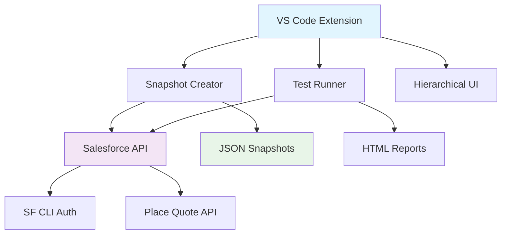
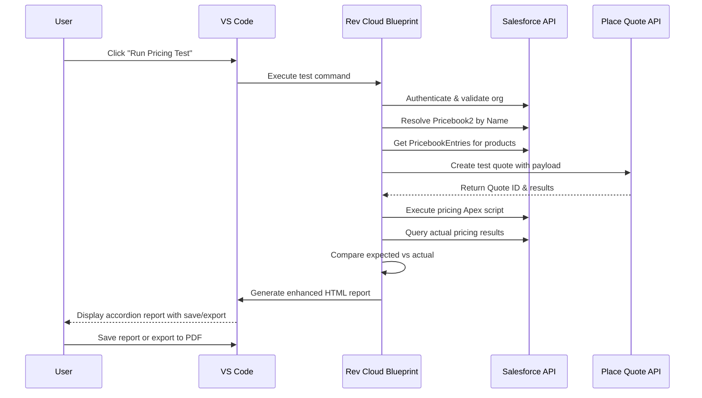
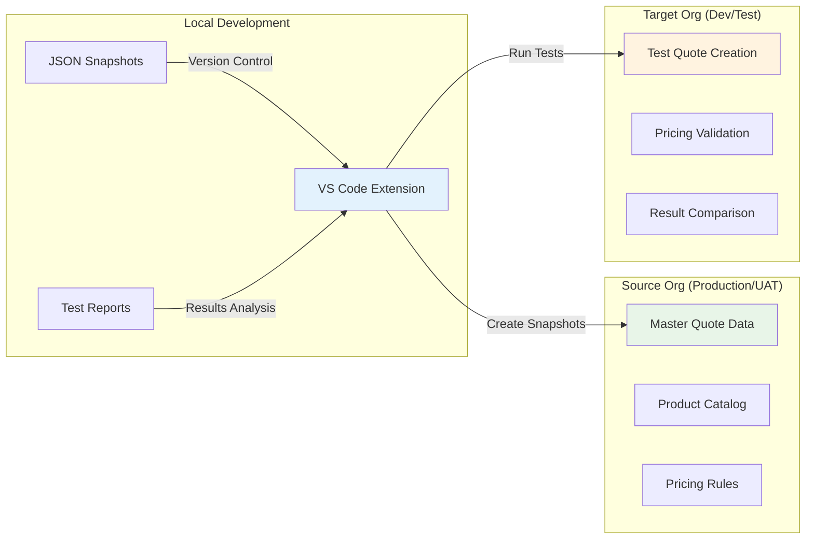
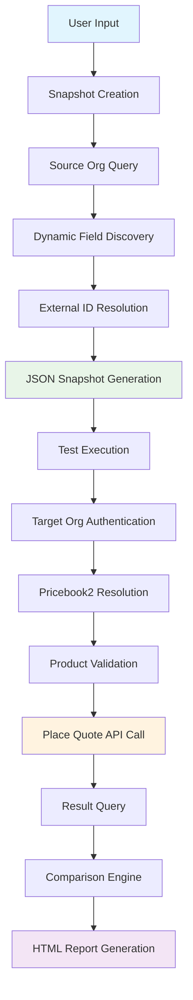
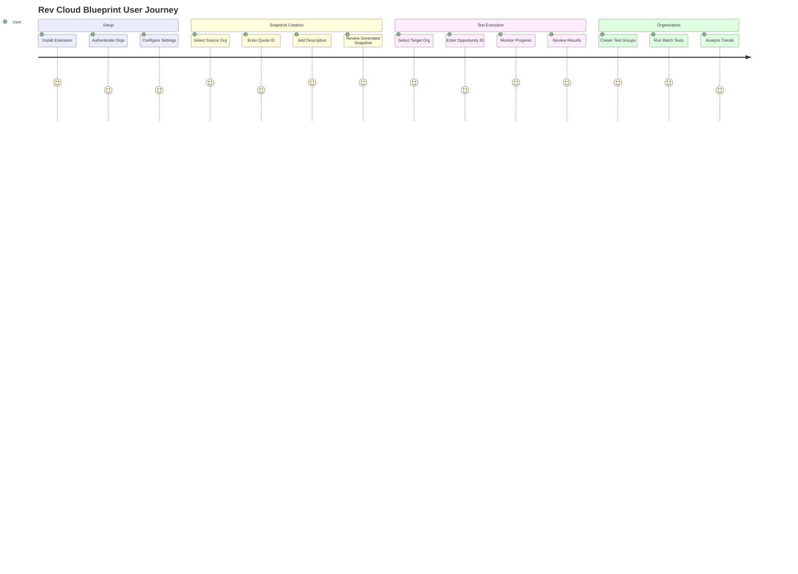
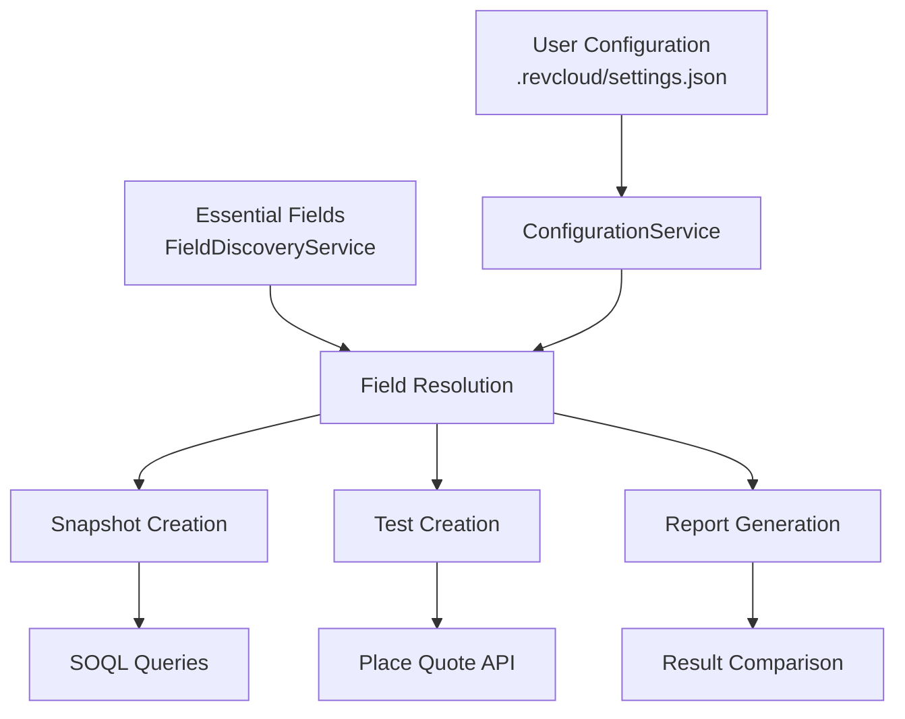

# **Rev Cloud Blueprint - Comprehensive Testing Framework for Salesforce Revenue Cloud**

## **🎯 Vision & Overview**

Rev Cloud Blueprint is a production-ready VS Code extension that revolutionizes testing for Salesforce Revenue Cloud by providing:

- ✅ **Automated Pricing Testing** with cross-org validation
- 🏗️ **Hierarchical Test Organization** with custom grouping
- 🔄 **Snapshot-Based Regression Testing** with Git version control
- 🌐 **Multi-Org Authentication** via Salesforce CLI integration
- 📊 **Enhanced HTML Reports** with accordion layout, save/export functionality
- 💾 **Report Management** with HTML save and PDF export capabilities
- 🔄 **Automated Apex Execution** for pricing recalculation
- 🚀 **Revenue Cloud Place Sales Transaction API** integration
- 🎨 **Beautiful User Experience** with progress tracking and validation


## **📖 Table of Contents**

1. [🏗️ Architecture Overview](#%EF%B8%8F-architecture-overview)
2. [📁 Project Structure](#-project-structure)
3. [🔧 Technical Design](#-technical-design)
4. [💡 Solution Design](#-solution-design)
5. [🚀 Getting Started](#-getting-started)
6. [📋 How to Use](#-how-to-use)
7. [⚙️ Configuration](#️-configuration)
8. [🧪 Testing](#-testing)
9. [🗺️ Roadmap](#️-roadmap)

---

## **🏗️ Architecture Overview**

Rev Cloud Blueprint follows a modular, extensible architecture designed for the complete Revenue Cloud testing ecosystem:

### **🎨 High-Level Architecture**



### **🔄 Test Execution Flow**



### **🏢 Multi-Org Architecture**



---

## **📁 Project Structure**

```
revcloud-blueprint-extension/
├── 📄 README.md                     # This comprehensive guide
├── 📄 package.json                  # Extension manifest & dependencies
├── 📄 CHANGELOG.md                  # Version history
├── 📄 LICENSE                       # EULA
├── 📄 tsconfig.json                 # TypeScript configuration
├── 📄 .gitignore                    # Git ignore rules
├── 📄 sonar-project.properties      # SonarCloud configuration
├── 
├── 📁 src/                          # Source code
│   ├── 📄 extension.ts              # Main extension activation
│   ├── 📁 salesforce/               # Salesforce integration layer
│   │   ├── 📄 auth.ts               # Multi-org authentication
│   │   └── 📄 api.ts                # SOQL queries & Place Quote API
│   ├── 📁 snapshot/                 # Snapshot creation & management
│   │   └── 📄 creator.ts            # Quote data extraction & JSON generation
│   ├── 📁 test/                     # Test execution engine
│   │   ├── 📄 runner.ts             # Test orchestration & API payload
│   │   └── 📄 comparator.ts         # Enhanced result comparison with accordion reports
│   ├── 📁 apex/                     # Apex execution engine
│   │   └── 📄 executor.ts           # Pricing Apex script execution via REST API
│   └── 📁 ui/                       # User interface components
│       ├── 📄 sidebarProvider.ts    # Legacy tree view (maintained for compatibility)
│       ├── 📄 hierarchicalTreeProvider.ts # New hierarchical test organization
│       ├── 📄 groupingModels.ts     # Test groups & categories data models
│       └── 📄 reportView.ts         # Enhanced report generation with save/export
├── 
├── 📁 revcloud_blueprint/           # Generated test artifacts
│   └── 📁 snapshot/                 # Organized snapshot storage
│       └── 📁 pricing/              # Pricing test snapshots
│           ├── 📄 snapshot_org1_quote1_description.json
│           ├── 📄 snapshot_org2_quote2_description.json
│           └── 📁 results/          # Generated HTML test reports
│               ├── 📄 snapshot_myentdev_0Q0XX000001_test1.html
│               └── 📄 snapshot_myentdev_0Q0XX000002_test2_pdf.html
├── 
├── 📁 __tests__/                    # Comprehensive test suite
│   ├── 📁 salesforce/               # API & authentication tests
│   ├── 📁 snapshot/                 # Snapshot creation tests
│   ├── 📁 test/                     # Test runner & comparator tests
│   └── 📁 integration/              # End-to-end integration tests
├── 
├── 📁 .github/workflows/            # CI/CD automation
│   └── 📄 ci.yml                    # GitHub Actions workflow
├── 📁 coverage/                     # Test coverage reports
├── 📁 out/                          # Compiled JavaScript output
├── 
├── 📄 test-place-quote-api.sh       # API testing utility script
├── 📄 schema-check.sh               # Salesforce schema validation script
├── 📄 auth-org.sh                   # Quick Salesforce authentication script
└── 📁 docs/                         # Additional documentation
    ├── 📄 SCHEMA_DISCOVERY.md       # Salesforce schema troubleshooting
    ├── 📄 QUICK_START_TESTING.md    # Development testing guide
    ├── 📄 TESTING.md                # Comprehensive testing strategies
    └── 📄 *_ANALYSIS.md             # Technical implementation notes
```

---

## **🔧 Technical Design**

### **🎭 Core Components**

#### **1. Snapshot Creator (`src/snapshot/creator.ts`)**
- **Purpose**: Extracts quote data from source orgs and creates JSON test artifacts
- **Key Features**:
  - Dynamic SOQL field discovery (currency, quantity, pricing fields)
  - Cross-org external ID resolution for products
  - Pricebook2 name capture for cross-org matching
  - QuoteLineItemAttribute support with configurable external ID fields
  - Comprehensive error handling with detailed logging

```typescript
interface PricingSnapshot {
    metadata: SnapshotMetadata;
    expectedResults: ExpectedResults;
    recreationPayload: RecreationPayload;
}
```

#### **2. Test Runner (`src/test/runner.ts`)**
- **Purpose**: Orchestrates test execution using Place Sales Transaction API
- **Key Features**:
  - OpportunityId-based quote creation workflow
  - Pricebook2 resolution by name across orgs
  - PricebookEntry validation for currency consistency
  - Product external ID to Salesforce ID resolution
  - Attribute definition and picklist value resolution
  - Graph-based API payload construction

#### **3. Salesforce API Layer (`src/salesforce/api.ts`)**
- **Purpose**: Provides unified interface to Salesforce APIs
- **Key Features**:
  - Multi-org authentication management
  - **Dynamic schema discovery** using `sf sobject describe`
  - **Revenue Cloud field pattern matching** (no hardcoded SBQQ__ assumptions)
  - **Currency-aware PricebookEntry resolution**
  - SOQL query execution with error handling
  - Place Sales Transaction API integration with graph payload
  - Configurable API version support
  - Comprehensive debug logging with emoji indicators

#### **4. Hierarchical UI (`src/ui/hierarchicalTreeProvider.ts`)**
- **Purpose**: Modern test organization with categories and custom groups
- **Key Features**:
  - Categories: Pricing, Configurator, Order Decomposition, Billing
  - Custom test groups with right-click context menus
  - Batch test execution with progress tracking
  - Beautiful tree view with icons and status indicators

### **🔄 Data Flow Architecture**



### **🚀 Revenue Cloud Compatibility Engine**

Rev Cloud Blueprint includes a sophisticated compatibility layer for seamless Revenue Cloud integration:

#### **🔍 Dynamic Schema Discovery**
- **Automatic Object Detection**: Detects `QuoteLineItem`, `QuoteLine`, or `SBQQ__QuoteLine__c`
- **Field Pattern Matching**: Uses intelligent regex patterns to find Revenue Cloud fields
- **No Hardcoded Assumptions**: Adapts to any org configuration (CPQ legacy or Revenue Cloud core)
- **Real-time Validation**: Uses `sf sobject describe` to verify field availability

```typescript
// Example: Dynamic field discovery patterns
const revCloudPatterns = [
    /^.*SubscriptionTerm.*$/i,     // Subscription terms
    /^.*PeriodBoundary.*$/i,       // Billing periods
    /^.*EndDate.*$/i,              // Date fields
    /^.*BillingFrequency.*$/i      // Billing cycles
];
```

#### **💰 Currency Matching System** 
- **CurrencyIsoCode Capture**: Automatically captures Quote currency from source org
- **PricebookEntry Filtering**: Filters by Product2Id + Pricebook2Id + CurrencyIsoCode
- **Cross-Org Consistency**: Prevents FIELD_INTEGRITY_EXCEPTION currency mismatches
- **Multi-Currency Support**: Works with USD, EUR, GBP, and other currencies

#### **🏷️ Advanced Attribute Support**
- **QuoteLineItemAttribute Capture**: Full attribute data in snapshots
- **Dynamic ID Resolution**: Resolves AttributeDefinition and AttributePicklistValue IDs
- **Configurable External Fields**: User-configurable external ID fields for attribute objects
- **Cross-Org Mapping**: Maps attribute external IDs between source and target orgs

#### **📋 Intelligent Field Defaults**
When source data is missing, extension provides intelligent defaults:
- **PeriodBoundary**: 'Anniversary' (most common Revenue Cloud default)
- **Date Fields**: 12-month terms starting from current date
- **Subscription Fields**: Sensible values for pricing calculations

#### **🔧 Error Resolution System**
Automatically prevents and resolves common Revenue Cloud API errors:

| Error Type | Auto-Resolution | Method |
|------------|----------------|---------|
| `INVALID_FIELD` | ✅ **Fixed** | Dynamic schema discovery instead of hardcoded SBQQ__ fields |
| `END_DATE_MISSING` | ✅ **Fixed** | Captures subscription/date fields with intelligent defaults |
| `INVALID_PERIOD_BOUNDARY` | ✅ **Fixed** | Provides PeriodBoundary field with 'Anniversary' default |
| `FIELD_INTEGRITY_EXCEPTION` | ✅ **Fixed** | Currency-aware PricebookEntry matching |

### **🏗️ Modular Architecture**

The extension is designed for future expansion across the Revenue Cloud ecosystem:

```typescript
// Current Implementation (v1.0)
src/
  pricing/           # ✅ Pricing testing (COMPLETE)
    snapshot/
    test/
    ui/

// Planned Modules  
  configurator/      # 🔄 Product configurator testing (v2.0)
  billing/           # 🔄 Billing schedule testing (v3.0)
  orders/            # 🔄 Order decomposition testing (v4.0)
```

---

## **💡 Solution Design**

### **🎯 Problem Statement**

Revenue Cloud testing faces significant challenges:
- **Manual Testing**: Time-intensive manual validation of pricing logic
- **Cross-Org Complexity**: Products, pricing rules, and configurations vary across environments
- **Regression Risk**: Configuration changes can break pricing unexpectedly
- **Scale Issues**: Complex quotes with hundreds of line items are difficult to validate
- **Knowledge Silos**: Business rules locked in individual minds rather than automated tests

### **💡 Solution Approach**

Rev Cloud Blueprint solves these challenges through:

#### **1. Snapshot-Based Testing**
- Capture "golden master" pricing results from production/UAT
- Store as version-controlled JSON artifacts
- Enable repeatable regression testing across environments

#### **2. Cross-Org Intelligence**
- Smart external ID resolution for products across orgs
- Pricebook2 name-based matching with currency validation
- Attribute definition resolution with configurable external IDs
- Opportunity-based quote creation for proper data relationships

#### **3. Revenue Cloud API Integration**
- Direct integration with Place Sales Transaction API
- Proper graph-based payload construction
- OpportunityId-driven quote creation workflow
- PricebookEntry validation for currency consistency

#### **4. Developer Experience**
- Native VS Code integration with beautiful UI
- Hierarchical test organization with custom grouping
- Rich HTML reports with detailed variance analysis
- Comprehensive error handling and debugging support

### **🎨 User Experience Design**



---

## **🚀 Getting Started**

### **📋 Prerequisites**

- **VS Code**: Version 1.74.0 or higher
- **Salesforce CLI**: Latest version (`npm install -g @salesforce/cli`)
- **Revenue Cloud**: Enabled in your Salesforce orgs
- **Node.js**: Version 18.x or higher (for development)

### **⚡ Quick Installation**

1. **Install from VS Code Marketplace**:
   - Open VS Code → Extensions (Ctrl+Shift+X)
   - Search "Rev Cloud Blueprint"
   - Click Install

2. **Authenticate Salesforce Orgs**:
   ```bash
   # Production (source)
   sfdx auth:web:login -a ProductionOrg
   
   # Development/Test (target)
   sfdx auth:web:login -a DevOrg
   
   # Verify authentication
   sfdx org:list
   ```

3. **Verify Installation**:
   - Open any workspace in VS Code
   - Look for "Rev Cloud Blueprint" in the Explorer sidebar
   - Click the ➕ button to test functionality

---

## **📋 How to Use**

### **1. 📸 Creating Pricing Snapshots**

#### **Step 1: Initiate Snapshot Creation**
1. In VS Code Explorer, find **"Rev Cloud Blueprint"**
2. Click the **➕ "Create Pricing Snapshot"** button
3. Extension will load available Salesforce orgs

#### **Step 2: Select Source Org**
- Choose your **source org** (Production, UAT, or reference environment)
- Extension validates authentication and Revenue Cloud access
- Progress bar shows org loading status

#### **Step 3: Enter Quote Details**
- **Quote ID**: Enter the Salesforce Quote ID (15 or 18 character format)
- **Description**: Provide meaningful test description (e.g., "Annual discount with multi-year terms")

#### **Step 4: Review Generated Snapshot**
- Extension creates JSON file: `revcloud_blueprint/pricing/snapshots/snapshot_<orgalias>_<quoteid>_<description>.json`
- Contains:
  ```json
  {
    "metadata": { 
      "sourceOrgId": "00D000000000001",
      "sourceOpportunityId": "006000000000001",
      /* Source org, quote ID, timestamp */ 
    },
    "expectedResults": { /* Pricing totals, line-level results */ },
    "recreationPayload": { 
      "sourceOpportunity": {
        "Id": "006000000000001",
        "Name": "Enterprise Deal Q4",
        "Account": { "Id": "001000000000001", "Name": "Acme Corp" }
      },
      /* Products, quantities, Pricebook2 name */ 
    }
  }
  ```

### **2. 🧪 Running Pricing Tests**

#### **Method 1: Individual Test**
1. **Locate Snapshot**: In the Rev Cloud Blueprint tree view, find your snapshot
2. **Click Play Button**: Click ▶️ "Run Pricing Test"
3. **Select Target Org**: Choose destination org for testing
4. **Smart Opportunity Selection**: Extension intelligently handles opportunity selection (see below)
5. **Monitor Progress**: Watch real-time progress indicators
6. **Review Results**: HTML report opens automatically with detailed comparison

#### **🎯 Smart Opportunity Management**

The extension includes **intelligent opportunity management** that adapts based on your testing scenario:

##### **When Testing in the Same Org (Source = Target)**

When you select the **same org** as both source and target, the extension presents you with smart options:

1. **"Use same opportunity"** - Uses the opportunity from the original snapshot
   - **When to choose**: Testing pricing configuration changes without data dependencies
   - **Benefit**: Ensures consistent account, currency, and relationship context
   - **Display**: Shows opportunity name and ID for easy identification

2. **"Use different opportunity"** - Enter a different opportunity ID  
   - **When to choose**: Testing same products/pricing with different account context
   - **Benefit**: Validates pricing logic across different customer scenarios
   - **Prompt**: "Enter different OpportunityId for this test"

##### **When Testing in Different Org (Source ≠ Target)**

When testing across orgs, the extension **automatically prompts for opportunity ID**:
- **Reason**: Opportunities are org-specific and cannot be reused across orgs
- **Prompt**: "Enter OpportunityId for [target-org-name]"
- **Validation**: 15 or 18 character Salesforce ID format verification

### **3. 🏗️ Organizing Tests (Future Release)**

#### **Hierarchical Structure**
```
Rev Cloud Blueprint
├── 📁 Pricing
│   ├── 📁 Basic Pricing Tests
│   │   ├── 📄 Simple Quote Test
│   │   └── 📄 Multi-Line Test
│   ├── 📁 Complex Scenarios
│   │   ├── 📄 Bundle Pricing
│   │   └── 📄 Multi-Year Discounts
│   └── 📄 Individual Test Files
├── 📁 Configurator (Planned v2.0)
├── 📁 Order Decomposition (Planned v3.0)
└── 📁 Billing (Planned v4.0)
```

#### **Group Management**
- **Create Group**: Right-click "Pricing" → "Create Group"
- **Add to Group**: Right-click snapshot → "Add to Group"  
- **Remove from Group**: Right-click snapshot → "Remove from Group"
- **Delete Group**: Right-click group → "Delete Group"

### **4. 📊 Understanding Enhanced Test Results**

#### **New Enhanced Report Features**
- ✅ **Accordion Layout**: Collapsible line items for handling 100+ line items efficiently
- 💾 **Save Report**: Save HTML reports to `revcloud_blueprint/pricing/results/`
- 📄 **PDF Export**: Export reports to PDF with all accordions expanded
- 📋 **Expand/Collapse All**: Quick control for accordion management
- 📊 **Comprehensive Summary**: Detailed test metadata and execution information

#### **Report Layout**
```
[Test Name - e.g., "FTI"]                    [💾 Save] [📄 Export to PDF]

✅ PASSED

Test Summary:
─────────────────────────────────────────────────────────
Source Quote ID: 0Q0UD000001KCFZ0AW      Created Quote: Regression Test (0Q0XX...)
Source Org: myentdev                     Test Date: 26/08/2025, 12:52:43
Target Org: myentdev                     Overall Status: ✅ Passed
─────────────────────────────────────────────────────────
Success Rate: 100.0% (34/34 fields)     Execution Time: 25.16s
Line Items: 7/7 matching

Quote-Level Comparison
[Comparison table with Expected/Actual/Status/Variance columns]

Line Items Comparison                     [📋 Expand/Collapse All]
└── ▶ Line Item 1: TT Plus-1502 Product  ✅ Passed
└── ▶ Line Item 2: Advanced Suite        ✅ Passed
└── ▼ Line Item 3: Failed Product        ❌ Failed
    [Detailed field comparison table when expanded]
```

#### **Action Buttons**
- **💾 Save Report**: Creates HTML file in results directory for permanent storage
- **📄 Export to PDF**: Opens expanded version in browser for PDF printing
- **📋 Expand/Collapse All**: Controls all accordion states simultaneously

---

## **⚙️ Configuration**

### **🔧 Extension Settings**

Access via: `Ctrl+Shift+P` → "Preferences: Open Settings" → Search "Rev Cloud Blueprint"

#### **Core Configuration**
```json
{
  "revCloudBlueprint.pricing.productExternalIdField": "ProductCode",
  "revCloudBlueprint.pricing.attributeDefinitionExternalIdField": "Code",
  "revCloudBlueprint.pricing.attributePicklistValueExternalIdField": "Code", 
  "revCloudBlueprint.api.version": "v64.0",
  "revCloudBlueprint.verboseLogging": true,
  "revCloudBlueprint.pricing.snapshotDirectory": "revcloud_blueprint/pricing/snapshots"
}
```

#### **Setting Details**

| Setting | Default | Description |
|---------|---------|-------------|
| `productExternalIdField` | `"ProductCode"` | External ID field on Product2 for cross-org matching |
| `attributeDefinitionExternalIdField` | `"Code"` | External ID field on AttributeDefinition |
| `attributePicklistValueExternalIdField` | `"Code"` | External ID field on AttributePicklistValue |
| `api.version` | `"v64.0"` | Salesforce API version for Connect APIs |
| `verboseLogging` | `false` | Enable detailed debug logging |
| `pricing.snapshotDirectory` | `"revcloud_blueprint/pricing/snapshots"` | Directory for snapshot storage |

### **🏗️ Project-Specific Field Configuration**

Each project requires custom field configuration via `.revcloud/settings.json` in your workspace root. This defines which fields are captured from source quotes and which fields are compared in test reports.

#### **Configuration Structure**

The configuration defines **two types of fields** for both Quote and QuoteLineItem objects:

1. **📥 Snap Fields** (Input) - Fields captured in snapshots and used for quote recreation
2. **📊 Report Fields** (Output) - Fields captured in snapshots and compared in test reports

#### **Example Configuration** (`.revcloud/settings.json`)

```json
{
  "pricing": {
    "snapFields": {
      "description": "Input fields captured and used for pricing test recreation",
      "quote": {
        "description": "Custom Quote fields required for pricing calculation",
        "fields": [
          "ContractTerm__c",
          "Custom_Quote_Field__c"
        ]
      },
      "quoteLineItem": {
        "description": "Custom QuoteLineItem fields required for pricing calculation", 
        "fields": [
          "Custom_LineItem_Field__c"
        ]
      }
    },
    "reportFields": {
      "description": "Output fields captured and compared in test reports",
      "quote": {
        "description": "Quote-level pricing outputs to verify",
        "fields": [
          "NetAmount",
          "GrandTotal"
        ]
      },
      "quoteLineItem": {
        "description": "QuoteLineItem-level pricing outputs to verify",
        "fields": [
          "NetUnitPrice",
          "NetTotalPrice" 
        ]
      }
    }
  }
}
```

#### **How It Works**

1. **Snapshot Creation**: 
   - Captures **Snap Field values** (inputs) from source Quote/QuoteLineItems for recreation
   - Captures **Report Field values** (outputs) from source Quote/QuoteLineItems for comparison
2. **Test Recreation**: Snap field values are applied to newly created Quote/QuoteLineItems
3. **Pricing Engine**: Your pricing procedures receive the required field values and calculate fresh outputs
4. **Test Report**: Compares expected vs actual values for all configured report fields

#### **Field Configuration Process**

1. **Identify Snap Fields (Input)**: Review your pricing procedures to determine which custom fields they reference as inputs
2. **Identify Report Fields (Output)**: Determine which pricing output fields you want to verify in test reports  
3. **Update Configuration**: Add fields to appropriate sections in `.revcloud/settings.json`
4. **Test**: Create a new snapshot and run a pricing test to verify correct field capture and comparison

#### **Common Field Types**

**Quote Level Fields:**
- Contract/Term fields (e.g., `ContractTerm__c`)
- Business process fields (e.g., `Business_Unit__c`)
- Pricing configuration fields (e.g., `Pricing_Model__c`)

**QuoteLineItem Level Fields:**
- Service type fields (e.g., `ServiceType__c`, `ServiceType__c`)
- Pricing method fields (e.g., `PriceMethod__c`, `PricingMethod__c`)
- Business categorization (e.g., `Product_Category__c`, `Revenue_Type__c`)

---

## **🗺️ Roadmap**

### **✅ Completed (v1.0) - Pricing Module**

- ✅ **Core Pricing Testing**: Complete snapshot-based pricing validation
- ✅ **Cross-Org Intelligence**: External ID resolution, Pricebook2 matching, currency matching
- ✅ **Revenue Cloud Integration**: Place Sales Transaction API with graph-based payload structure
- ✅ **Dynamic Schema Discovery**: Automatic field detection using `sf sobject describe`
- ✅ **Revenue Cloud Compatibility**: INVALID_FIELD, END_DATE_MISSING, PERIOD_BOUNDARY error resolution
- ✅ **Currency Matching**: Automatic PricebookEntry currency validation to prevent FIELD_INTEGRITY_EXCEPTION
- ✅ **QuoteLineItemAttribute Support**: Full attribute capture and API payload generation
- ✅ **Enhanced HTML Reports**: Accordion layout with compact design for handling 100+ line items
- ✅ **Report Management**: Save to HTML and PDF export functionality
- ✅ **Automated Apex Execution**: Built-in pricing recalculation with REST API integration
- ✅ **Progress Indicators**: Real-time progress tracking with smooth animations
- ✅ **Developer Experience**: VS Code integration, comprehensive debug logging, modular architecture

### **🔄 Planned Features**

#### **v1.1 - Enhanced Pricing**
- 🔄 **Advanced Attributes**: Complex QuoteLineItemAttribute scenarios
- 🔄 **Bundle Testing**: Product bundle pricing validation
- 🔄 **Performance Optimization**: Large quote handling (500+ line items)
- 🔄 **Report Enhancements**: Trend analysis, historical comparison

#### **v2.0 - Product Configurator Module**
- 🔄 **Configuration Snapshots**: Capture complex product configurations
- 🔄 **Rule Validation**: Test configuration rules and constraints
- 🔄 **Attribute Testing**: Validate attribute-driven pricing
- 🔄 **Bundle Configurator**: Test bundle selection and pricing

#### **v3.0 - Order Decomposition Module**
- 🔄 **Quote-to-Order Testing**: Validate order creation from quotes
- 🔄 **Order Line Splitting**: Test complex decomposition logic
- 🔄 **Fulfillment Validation**: Validate order fulfillment workflows
- 🔄 **Amendment Testing**: Test order amendments and changes

#### **v4.0 - Billing Module**
- 🔄 **Billing Schedule Testing**: Validate billing schedule generation
- 🔄 **Invoice Validation**: Test invoice creation and calculations
- 🔄 **Payment Processing**: Test payment workflows
- 🔄 **Revenue Recognition**: Validate revenue recognition rules

---

## **🗂️ Field Management System - Technical Architecture**

### **📋 Overview**

The Revenue Cloud Blueprint Extension uses a **configuration-driven field management system** that eliminates pattern matching and provides explicit control over which fields are included in snapshots, test creation, and report comparison.

#### **Key Principles**
- **Configuration-Driven**: All field selection is based on explicit configuration, not pattern matching
- **Essential Fields**: Core Salesforce and Revenue Cloud fields that are always included
- **User Configuration**: Project-specific fields defined in `.revcloud/settings.json`
- **Phase-Specific**: Different field sets for snapshots, creation, and reporting
- **Write Protection**: Calculated and system-managed fields are protected during creation

### **🗂️ Field Categories**

#### **1. Essential Fields**
**Always included** regardless of configuration. These are core Salesforce and Revenue Cloud fields required for basic functionality.

#### **2. Configured Fields**
**User-defined** fields specified in `.revcloud/settings.json`. These are project-specific fields needed for your pricing scenarios.

#### **3. Excluded Fields**
**Automatically filtered out** during certain operations. These include:
- **Calculated Fields**: Fields computed by the pricing engine
- **System-Managed Fields**: Read-only fields managed by Salesforce
- **Write-Protected Fields**: Fields that cannot be written during test creation

### **📊 Quote Field Management**

#### **Essential Quote Fields**
*Always included in snapshots and queries*

| Field | Category | Purpose |
|-------|----------|---------|
| `Id` | Standard | Record identification |
| `Name` | Standard | Quote identification |
| `Status` | Standard | Quote lifecycle state |
| `CreatedDate` | Standard | Audit trail |
| `LastModifiedDate` | Standard | Audit trail |
| `Account.Id` | Relationship | Account association |
| `Account.Name` | Relationship | Account identification |
| `Pricebook2Id` | Standard | Pricing context |
| `OpportunityId` | Standard | Opportunity relationship |
| `ContactId` | Standard | Contact association |
| `StartDate` | Standard | Quote validity period |
| `CurrencyIsoCode` | Standard | Currency context |
| `Tax` | Pricing | Tax calculation |
| `ShippingHandling` | Pricing | Shipping costs |
| `Discount` | Pricing | Discount application |
| `GrandTotal` | Pricing | Final calculated total |
| `TotalPrice` | Pricing | Pre-tax total |
| `Subtotal` | Pricing | Line items subtotal |

#### **Configured Quote Fields**
*Project-specific fields from `.revcloud/settings.json`*

**Example Configuration:**
```json
{
  "pricing": {
    "snapFields": {
      "quote": {
        "fields": [
          "ContractTerm__c",
          "PricingModel__c",
          "Region__c"
        ]
      }
    }
  }
}
```

#### **Quote Calculated Fields** *(Excluded during creation)*
- `GrandTotal` - Calculated by pricing engine
- `TotalPrice` - Calculated by pricing engine  
- `Subtotal` - Calculated by pricing engine

#### **Required Quote Report Fields** *(Always in reports)*
- `GrandTotal` - Verify final pricing
- `Subtotal` - Verify line item totals
- `TotalPrice` - Verify pre-tax pricing

### **📦 QuoteLineItem Field Management**

#### **Essential QuoteLineItem Fields**
*Always included in snapshots and queries*

| Field | Category | Purpose |
|-------|----------|---------|
| `Id` | Standard | Record identification |
| `QuoteId` | Relationship | Parent quote association |
| `Product2Id` | Relationship | Product association |
| `PricebookEntryId` | Relationship | Pricing reference |
| `LineNumber` | Standard | Line ordering |
| `Quantity` | Pricing | Quantity for calculation |
| `UnitPrice` | Pricing | Base unit price |
| `TotalPrice` | Pricing | Line total price |
| `NetUnitPrice` | Pricing | Net unit price after adjustments |
| `NetTotalPrice` | Pricing | Net total price after adjustments |
| `ServiceDate` | Standard | Service delivery date |
| `Discount` | Pricing | Line-level discount |
| `Description` | Standard | Line description |
| `SortOrder` | Standard | Display ordering |
| `Product2.Id` | Relationship | Product details |
| `Product2.Name` | Relationship | Product identification |
| `Product2.ProductCode` | Relationship | Product code reference |
| `PricebookEntry.Id` | Relationship | Entry details |
| `PricebookEntry.Name` | Relationship | Entry identification |
| `PricebookEntry.ProductCode` | Relationship | Entry product code |
| `OpportunityLineItemId` | Relationship | Opportunity line association |
| `CreatedDate` | Standard | Audit trail |
| `LastModifiedDate` | Standard | Audit trail |
| `HasQuantitySchedule` | Standard | Schedule indicator |
| `HasRevenueSchedule` | Standard | Revenue schedule indicator |
| `ParentQuoteLineItemId` | Relationship | Parent line relationship |
| `PartnerUnitPrice` | Pricing | Partner pricing |
| `UnitPriceUplift` | Pricing | Price uplift amount |
| `ListPrice` | Pricing | List price reference |
| `ConstraintEngineNodeStatus__c` | Revenue Cloud | Pricing engine status |
| `PricingTerm` | Revenue Cloud | Subscription pricing term |
| `PricingTermUnit` | Revenue Cloud | Term unit (months/years) |
| `BillingFrequency` | Revenue Cloud | Billing cycle |
| `StartDate` | Revenue Cloud | Subscription start |
| `EndDate` | Revenue Cloud | Subscription end |
| `SubscriptionTerm` | Revenue Cloud | Subscription duration |
| `SubscriptionTermUnit` | Revenue Cloud | Subscription unit |
| `PricingTermCount` | Revenue Cloud | Number of pricing terms |
| `ProrationPolicyId` | Revenue Cloud | Proration rules |
| `PeriodBoundary` | Revenue Cloud | Period alignment |
| `PeriodBoundaryDay` | Revenue Cloud | Boundary day |
| `PeriodBoundaryStartMonth` | Revenue Cloud | Boundary start month |

#### **QuoteLineItem Creation Required Fields**
*Must be present during test creation*

- `QuoteId` - Parent quote reference
- `Product2Id` - Product association  
- `PricebookEntryId` - Pricing entry reference
- `UnitPrice` - Base pricing input
- `Quantity` - Quantity for calculation
- `ConstraintEngineNodeStatus__c` - Revenue Cloud requirement

#### **QuoteLineItem Creation Essential Fields**
*Applied when available in snapshot data*

- `LineNumber` - Line ordering
- `ServiceDate` - Service delivery
- `Discount` - Line-level discount
- `Description` - Line description
- `SortOrder` - Display ordering
- `OpportunityLineItemId` - Opportunity relationship
- `HasQuantitySchedule` - Schedule indicator
- `HasRevenueSchedule` - Revenue schedule indicator
- `ParentQuoteLineItemId` - Parent relationship
- `PartnerUnitPrice` - Partner pricing
- `UnitPriceUplift` - Price adjustments
- `ListPrice` - List price reference
- All Revenue Cloud subscription fields

#### **QuoteLineItem Calculated Fields** *(Excluded during creation)*
- `TotalPrice` - Calculated during pricing
- `PricingTermCount` - Calculated during pricing
- `NetUnitPrice` - Calculated during pricing
- `NetTotalPrice` - Calculated during pricing

#### **Required QuoteLineItem Report Fields** *(Always in reports)*
- `NetUnitPrice` - Verify unit pricing output
- `NetTotalPrice` - Verify total pricing output
- `Quantity` - Verify quantity accuracy

#### **Write-Protected Fields** *(Never written during creation)*
- `ProrationPolicyId` - Read-only Revenue Cloud field
- `CreatedDate` - System managed
- `LastModifiedDate` - System managed
- `Id` - System managed

### **🔧 Technical Implementation**

#### **Architecture Overview**



#### **Core Components**

##### **1. FieldDiscoveryService**
**Location**: `src/services/fieldDiscoveryService.ts`

**Responsibilities**:
- Define essential fields for Quote and QuoteLineItem objects
- Provide field categorization methods
- Handle field exclusion logic
- Support configuration-driven field resolution

**Key Methods**:
```typescript
// Essential fields (always included)
static getEssentialQuoteFields(): string[]
static getEssentialQuoteLineItemFields(): string[]

// Configured fields (from settings.json)
static getConfiguredFields(objectType: 'quote' | 'quoteLineItem', fieldType: 'snapFields' | 'reportFields'): string[]

// Combined field resolution  
static getAllRequiredFields(objectType: 'quote' | 'quoteLineItem'): string[]

// Field categorization
static getRequiredSnapshotFields(objectType: 'quote' | 'quoteLineItem'): string[]
static getQuoteCalculatedFields(): string[]
static getQuoteLineItemCalculatedFields(): string[]
static getWriteProtectedFields(): string[]
```

##### **2. ConfigurationService**  
**Location**: `src/services/configurationService.ts`

**Responsibilities**:
- Load and validate `.revcloud/settings.json`
- Provide configuration templates
- Handle configuration defaults
- Support modular configuration structure

**Configuration Structure**:
```typescript
interface PricingConfiguration {
  snapFields: {
    quote: { fields: string[], description: string }
    quoteLineItem: { fields: string[], description: string }
  }
  reportFields: {
    quote: { fields: string[], description: string }
    quoteLineItem: { fields: string[], description: string }
  }
}
```

##### **3. SalesforceAPI**
**Location**: `src/salesforce/api.ts`

**Responsibilities**:
- Execute SOQL queries with resolved field lists
- Handle Place Quote API calls with proper field filtering
- Manage field validation and error handling
- Apply retry logic for API resilience

**Field Resolution Flow**:
```typescript
// 1. Get all required fields for SOQL
const allFields = FieldDiscoveryService.getAllRequiredFields(objectType);

// 2. Execute SOQL query with complete field list
const query = `SELECT ${allFields.join(', ')} FROM ${objectType} WHERE ...`;

// 3. During creation, filter out calculated fields
const createFields = this.filterCalculatedFields(allFields, objectType);
```

#### **Field Resolution Algorithm**

```typescript
function resolveFieldsForPhase(objectType: 'quote' | 'quoteLineItem', phase: 'snapshot' | 'creation' | 'report'): string[] {
    // Step 1: Start with essential fields
    let fields = FieldDiscoveryService.getEssentialFields(objectType);
    
    // Step 2: Add configured fields
    if (phase === 'snapshot' || phase === 'report') {
        fields.push(...FieldDiscoveryService.getConfiguredFields(objectType, 'snapFields'));
    }
    
    if (phase === 'report') {
        fields.push(...FieldDiscoveryService.getConfiguredFields(objectType, 'reportFields'));
        fields.push(...FieldDiscoveryService.getRequiredReportFields(objectType));
    }
    
    // Step 3: Remove duplicates
    fields = [...new Set(fields)];
    
    // Step 4: Apply phase-specific exclusions
    if (phase === 'creation') {
        const calculatedFields = FieldDiscoveryService.getCalculatedFields(objectType);
        const writeProtectedFields = FieldDiscoveryService.getWriteProtectedFields();
        fields = fields.filter(f => !calculatedFields.includes(f) && !writeProtectedFields.includes(f));
    }
    
    return fields;
}
```

#### **Data Flow**

##### **Snapshot Creation**
1. **Field Resolution**: Essential + Configured Snap + Configured Report
2. **SOQL Execution**: Query with complete field list
3. **Data Storage**: Store all field data in JSON snapshot
4. **Validation**: Verify required fields are present

##### **Test Creation (Place Quote)**
1. **Field Filtering**: Remove calculated and write-protected fields
2. **Data Preparation**: Extract creation-safe fields from snapshot
3. **API Call**: Submit filtered data to Place Quote API
4. **Result Capture**: Store creation results for comparison

##### **Report Generation**
1. **Field Selection**: Essential Report + Configured Report + Required Report
2. **Data Comparison**: Compare expected vs actual values
3. **Validation**: Flag missing or incorrect field values
4. **Report Output**: Generate detailed comparison report

### **🔄 Field Usage by Phase**

#### **Phase 1: Snapshot Creation**

**Purpose**: Capture complete pricing scenario data for test recreation

**Field Sources**:
- ✅ Essential Quote/QuoteLineItem fields
- ✅ Configured snap fields
- ✅ Configured report fields  
- ❌ No exclusions (capture everything needed)

**SOQL Example**:
```sql
SELECT Id, Name, Status, GrandTotal, TotalPrice, Subtotal, Region__c, ContractTerm__c, TotalACV__c 
FROM Quote 
WHERE Id = '0Q0000000000001'
```

**Result**: Complete snapshot JSON with all necessary field data

#### **Phase 2: Test Creation (Place Quote)**

**Purpose**: Recreate pricing scenario in target org using Place Quote API

**Field Sources**:
- ✅ Essential fields (creation-safe only)
- ✅ Configured snap fields  
- ❌ Calculated fields (excluded - pricing engine will compute)
- ❌ Write-protected fields (excluded - system managed)

**API Payload Example**:
```json
{
  "record": {
    "Name": "Test Quote Recreation",
    "OpportunityId": "006000000000001",
    "StartDate": "2024-01-01",
    "Region__c": "North America",
    "ContractTerm__c": "12"
  }
}
```

**Excluded During Creation**:
- `GrandTotal` (calculated by pricing)
- `TotalPrice` (calculated by pricing)
- `CreatedDate` (system managed)
- `Id` (system managed)

#### **Phase 3: Report Generation**

**Purpose**: Compare expected vs actual pricing results

**Field Sources**:
- ✅ Required report fields (always)
- ✅ Configured report fields
- ✅ Essential pricing outputs
- ❌ No exclusions (compare all outputs)

**Comparison Example**:
```json
{
  "quote": {
    "GrandTotal": {
      "expected": 12000.00,
      "actual": 12000.00,
      "match": true
    },
    "TotalACV__c": {
      "expected": 10000.00,
      "actual": 10500.00,
      "match": false,
      "variance": 500.00
    }
  }
}
```

### **📝 Best Practices**

#### **Configuration Management**
1. **Start Simple**: Begin with minimal field configuration and add as needed
2. **Document Purpose**: Use field descriptions to explain why each field is needed
3. **Test Thoroughly**: Validate field configuration with sample snapshots
4. **Version Control**: Track configuration changes in your project repository

#### **Field Selection Guidelines**
1. **Snap Fields**: Include all fields that influence pricing calculations
2. **Report Fields**: Include all fields you want to verify in test results
3. **Avoid Redundancy**: Essential fields are automatically included
4. **Consider Dependencies**: Some fields may be required by others

#### **Troubleshooting**
1. **Missing Fields**: Check if field exists using `sf sobject describe`
2. **SOQL Errors**: Verify field API names and accessibility
3. **Creation Failures**: Ensure fields are writable and not calculated
4. **Report Inconsistencies**: Verify expected vs actual field values

#### **Performance Optimization**
1. **Minimize Fields**: Only configure fields you actually need
2. **Batch Processing**: Use bulk operations for multiple snapshots
3. **Field Validation**: Validate field existence before SOQL execution
4. **Error Handling**: Implement retry logic for transient API failures

### **🏁 Field Management Summary**

The Revenue Cloud Blueprint Extension provides a robust, configuration-driven field management system that:

- **Eliminates Pattern Matching**: No more guesswork about which fields to include
- **Provides Explicit Control**: You decide exactly which fields are used
- **Ensures Consistency**: Same field logic across snapshots, creation, and reporting
- **Protects Data Integrity**: Automatic exclusion of calculated and system fields
- **Supports Scalability**: Easy configuration updates for new requirements

**Key Success Factors**:
- ✅ Configure only the fields you need
- ✅ Test configurations with real pricing scenarios  
- ✅ Document field purposes for team understanding
- ✅ Monitor field usage and performance
- ✅ Keep configurations in version control

This system provides enterprise-grade field management for complex Revenue Cloud pricing scenarios while maintaining simplicity and reliability.

---

## **📚 Additional Resources**

### **📖 Documentation**
- [Testing Strategies](./TESTING.md) - Comprehensive testing approaches
- [Changelog](./CHANGELOG.md) - Version history and changes

### **🔗 External References**
- [Revenue Cloud Developer Documentation](https://developer.salesforce.com/docs/atlas.en-us.revenue_lifecycle_management_dev_guide.meta/revenue_lifecycle_management_dev_guide/rlm_get_started.htm)
- [VS Code Extension Development](https://code.visualstudio.com/api)
- [Salesforce CLI Documentation](https://developer.salesforce.com/tools/sfdxcli)
- [TypeScript Documentation](https://www.typescriptlang.org/docs/)

### **🤝 Contributing**
We welcome contributions! Please:
1. Fork the repository
2. Create feature branch: `git checkout -b feature/amazing-feature`
3. Run tests: `npm test`
4. Commit changes: `git commit -m 'Add amazing feature'`
5. Push to branch: `git push origin feature/amazing-feature`
6. Open Pull Request

---

## **📄 License**

This project is licensed under the EULA - see the [LICENSE](LICENSE) file for details.

---

## **🙏 Acknowledgments**

- **Salesforce Revenue Cloud Team** - For providing comprehensive API documentation and support
- **VS Code Extension Community** - For excellent development tools and resources  
- **TypeScript Team** - For robust type safety and development experience
- **Open Source Community** - For the amazing libraries and tools that make this possible

---

<div align="center">

**🚀 Ready to revolutionize your Revenue Cloud testing? Get started with Rev Cloud Blueprint today! 🚀**

[📥 Install Extension](https://marketplace.visualstudio.com/items?itemName=forceweaver.revcloud-blueprint) | [🐛 Report Issues](https://form.jotform.com/252443148591055)
</div>
