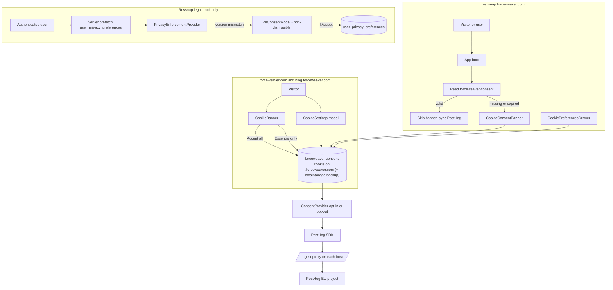

# Cookie consent and PostHog tracking across ForceWeaver properties

This document is the single source of truth for how cookie consent and PostHog product analytics work across the ForceWeaver portfolio. It describes the **implemented** design that ships today across:

| Property | Repo | Hosts | Role |
| -------- | ---- | ----- | ---- |
| **Marketing site + blog** | `forceweaver-web` (this repo) | `forceweaver.com`, `www.forceweaver.com`, `blog.forceweaver.com` | Brand, content marketing, top-of-funnel acquisition |
| **Product app (Revsnap)** | separate repo | `revsnap.forceweaver.com` | Authenticated product, monetization, dashboards |

The two properties run as separate Vercel projects with separate codebases, but they share **one PostHog project**, **one consent decision per browser**, and **one anonymous `distinct_id`** that follows a visitor through the funnel.

There are two complementary tracks. Both are implemented; this doc describes them in detail and shows how the two repos align.

| Track | Audience | Storage | Implemented in |
| ----- | -------- | ------- | -------------- |
| **1. Cookie / analytics consent** | All visitors on any `*.forceweaver.com` host | Browser cookie `forceweaver-consent` on `.forceweaver.com` + localStorage backup | Both `forceweaver-web` and Revsnap |
| **2. Authenticated legal acceptance** | Logged-in Revsnap users only | Postgres `user_privacy_preferences` (per-user row) and `app_legal_publish` (current published version) | Revsnap only — the marketing site has no auth |

The two tracks are independent: bumping `CONSENT_VERSION` (Track 1) does not force users to re-accept the legal policy, and bumping `NEXT_PUBLIC_PRIVACY_VERSION` (Track 2) does not revoke cookie consent. Product and legal decide when to bump one, the other, or both in the same release.

Related references:

- [REVSNAP_CONSENT_INTEGRATION.md](./REVSNAP_CONSENT_INTEGRATION.md) — the handover spec used to align the Revsnap codebase with this design.
- [README.md](../README.md) — env var matrix at the workspace level.
- [apps/web/README.md](../apps/web/README.md) — env vars specific to the marketing Next.js app.

---

## Goals (what we built)

1. **One consent decision per visitor across all properties.** A user who clicks "Accept All" on `forceweaver.com` does not see the banner again on `blog.forceweaver.com` or `revsnap.forceweaver.com`. Withdrawing consent on Revsnap immediately silences PostHog on the marketing site.
2. **Single unified PostHog project.** Both apps initialize the SDK with the same `NEXT_PUBLIC_POSTHOG_PROJECT_TOKEN`, so anonymous browse sessions on the marketing site stitch to identified sessions on Revsnap after login, with no manual aliasing.
3. **Privacy-first SDK initialization.** PostHog starts opted out of capture and persistence; no PostHog cookies are written and no `/ingest` requests are sent until the visitor clicks "Accept All" or toggles Analytics on in Cookie Settings.
4. **First-party ingest proxy.** PostHog requests go through `https://<property>/ingest/...` rewrites, never directly to `*.i.posthog.com`. Ad blockers and third-party-cookie restrictions do not affect data collection.
5. **Autocapture on the marketing site, custom events on Revsnap.** The brand pages rely on PostHog autocapture (`$pageview`, `$autocapture`, `$pageleave`, `$exception`) — no custom event names are defined in `forceweaver-web`. Named product events (signup, paywall, upgrade, etc.) live in Revsnap where the product behavior happens.
6. **Legal policy versioning for Revsnap (SOC2).** Per-user accepted policy version is stored in Postgres with RLS. A non-dismissible re-consent overlay enforces re-acknowledgment when `NEXT_PUBLIC_PRIVACY_VERSION` is bumped to a value that does not match the database.

---

## End-to-end architecture



---

## Track 1: shared cookie / analytics consent

### Cookie contract (must match byte-for-byte in both repos)

| Property | Value |
| -------- | ----- |
| Cookie name | `forceweaver-consent` |
| Domain (production) | `.forceweaver.com` (leading dot — covers `forceweaver.com`, `www.forceweaver.com`, `blog.forceweaver.com`, `revsnap.forceweaver.com`, and any future subdomain) |
| Domain (localhost / preview) | unset (host-only); avoids preview deploys writing cookies to the parent domain |
| Path | `/` |
| `SameSite` | `Lax` |
| `Secure` | `true` in production, `false` in dev |
| `HttpOnly` | `false` (client must read it) |
| Expiry | 395 days (~13 months) from write time |
| Backup | Mirror to `localStorage` under key `forceweaver-consent-backup` |
| Auto-detection | `window.location.hostname.endsWith('forceweaver.com')` returns `.forceweaver.com`; override with `NEXT_PUBLIC_COOKIE_DOMAIN` for staging |

### Cookie payload (JSON, stringified)

```ts
export type ConsentCategory = 'analytics' | 'marketing' | 'preferences';

export interface ConsentState {
  version: string;     // currently '1.0'; mismatched values trigger re-consent
  analytics: boolean;  // PostHog product analytics opt-in
  marketing: boolean;  // reserved (marketing pixels) — currently unused
  preferences: boolean;// reserved (preference cookies) — currently unused
  timestamp: number;   // Date.now() when the decision was saved
  expiresAt: number;   // Date.now() + 395 days (ms)
}
```

Loader semantics (both repos):

1. Read the cookie. If `expiresAt < Date.now()` or `version !== CONSENT_VERSION`, clear and treat as "no decision".
2. If the cookie is missing but the localStorage backup is valid, rehydrate the cookie from localStorage.
3. Re-evaluate on app boot and on every navigation, since cookies do not emit change events. Cross-tab and cross-domain consent updates take effect on the next route change.

### `forceweaver-web` (marketing site) implementation

| Area | File |
| ---- | ---- |
| PostHog browser init | [apps/web/lib/analytics/initPosthogBrowser.ts](../apps/web/lib/analytics/initPosthogBrowser.ts) — single guarded `posthog.init()`; opt out by default; `/ingest` proxy; `cross_subdomain_cookie: true`; session recording off. |
| Consent → PostHog bridge | [apps/web/components/consent/Analytics.tsx](../apps/web/components/consent/Analytics.tsx) — reads `consent.analytics`, calls `opt_in_capturing()` / `opt_out_capturing()`, fires one-shot `analytics_consent_accepted` event after first opt-in. |
| Cookie storage | [apps/web/lib/consent/consentStorage.ts](../apps/web/lib/consent/consentStorage.ts) — exact contract above; domain auto-detect for `.forceweaver.com`; localStorage backup; double-remove on clear (host-only + leading-dot). |
| Types | [apps/web/lib/consent/types.ts](../apps/web/lib/consent/types.ts) |
| Cookie registry / version | [apps/web/lib/consent/cookieRegistry.ts](../apps/web/lib/consent/cookieRegistry.ts) — declares essential cookies (Supabase auth, the consent cookie itself) and the PostHog cookies (`ph_<token>_posthog`, `__ph_opt_in_out_<token>`) that appear only after consent. `CONSENT_VERSION = '1.0'`. |
| Consent manager | [apps/web/lib/consent/consentManager.ts](../apps/web/lib/consent/consentManager.ts) — accept all / decline all / withdraw / change-event bus. |
| Logger stub (no DB) | [apps/web/lib/consent/consentLogger.ts](../apps/web/lib/consent/consentLogger.ts) — deliberate no-op; the marketing site does not persist consent events to a database. |
| Banner UI | [apps/web/components/consent/CookieBanner.tsx](../apps/web/components/consent/CookieBanner.tsx) |
| Settings modal | [apps/web/components/consent/CookieSettings.tsx](../apps/web/components/consent/CookieSettings.tsx) |
| Provider | [apps/web/components/consent/ConsentProvider.tsx](../apps/web/components/consent/ConsentProvider.tsx) |
| Cookie policy page | [apps/web/app/cookie-policy/page.tsx](../apps/web/app/cookie-policy/page.tsx) |
| `/ingest` rewrites | [apps/web/next.config.ts](../apps/web/next.config.ts) |
| Middleware `/ingest` short-circuit | [apps/web/middleware.ts](../apps/web/middleware.ts) |
| Root mount (Provider + Banner + Analytics) | [apps/web/app/layout.tsx](../apps/web/app/layout.tsx) |
| Footer "Cookie Settings" entry | [apps/web/app/components/Footer.tsx](../apps/web/app/components/Footer.tsx) |

Notable design choices in this repo:

- **No engagement scoring, ghost-lead capture, or server-side PostHog.** Those concerns belong to the product app where there is real user-bound behavior to track. The marketing site relies on PostHog autocapture for funnel signals (CTA clicks, blog reads, outbound clicks to the app).
- **No database persistence for consent.** `ConsentLogger.log()` is a no-op stub. The cookie + localStorage backup is the only record.
- **`marketing` and `preferences` toggles are displayed but currently unused.** They are reserved for future marketing pixels and theme/locale preference cookies.

### Revsnap implementation

Revsnap implements the **same** Track 1 contract using its own file layout. The handover spec at [REVSNAP_CONSENT_INTEGRATION.md](./REVSNAP_CONSENT_INTEGRATION.md) is the canonical source for what Revsnap must do; the file index in [File index — Revsnap](#file-index--revsnap) below lists the files that match this contract on that side.

| Area | File (Revsnap repo) |
| ---- | ---- |
| PostHog init | `instrumentation-client.ts`, `src/lib/analytics/init-posthog-browser.ts` |
| Consent UI + opt-in/out | `src/components/analytics/CookieConsentBanner.tsx`, `src/components/analytics/CookiePreferencesDrawer.tsx`, `src/components/analytics/cookie-consent-context.tsx`, `src/components/analytics/CookiePreferencesCard.tsx`, `src/components/analytics/PrivacyCookiePreferencesCta.tsx`, `src/components/analytics/ConsentAndEngagementProvider.tsx`, `src/components/layout/TopBar.tsx` |
| Privacy storage | `src/lib/analytics/privacy-storage.ts`, `src/lib/analytics/consent-constants.ts` |
| Engagement + ghost-lead POST (Revsnap-only) | `src/hooks/useEngagementScorer.ts` |
| Root mount | `src/app/layout.tsx` |
| `/ingest` rewrites | `next.config.ts` |

When the Revsnap app boots and finds a valid `forceweaver-consent` cookie set by the marketing site, it skips the banner entirely and immediately syncs PostHog opt-in. When the user toggles Analytics off inside Revsnap's preferences drawer, the cookie is rewritten with `analytics: false` on `.forceweaver.com`, and the next page load on `forceweaver.com` honors that decision.

---

## Track 2: authenticated legal acceptance (Revsnap only)

The marketing site does not implement this track because it has no authenticated user surface and no Supabase tables. Revsnap implements it as the SOC2-oriented "active preferences" layer: a durable per-user record in Postgres with strict Row-Level Security, plus an enforcement UI that does not rely on middleware redirects.

### Behavior

1. **`NEXT_PUBLIC_PRIVACY_VERSION`** — Public env string (e.g. `v1.0`) naming the currently published Privacy Policy / Terms bundle. Bump it in the same release as legal publishes an update that requires acknowledgment.
2. **Server prefetch** — Dashboard and billing layouts load the user's `user_privacy_preferences` row server-side as early as possible and pass it to the client provider so the UI does not wait on an extra round-trip to decide whether to show the modal.
3. **Client enforcement** — `PrivacyEnforcementProvider` uses TanStack Query (cached key `['privacy-preferences', userId]`) and compares `accepted_policy_version` to `NEXT_PUBLIC_PRIVACY_VERSION` using string equality. Empty env var skips the overlay (dev only).
4. **Modal** — `ReConsentModal`: full-viewport backdrop with `backdrop-blur-md`, non-dismissible (no close control; backdrop click does not complete the flow). The user must click "I Accept"; the client writes `accepted_policy_version` via the Supabase browser client (RLS applies). On success, the query cache updates and the modal unmounts without a full page reload.
5. **Scope** — Wrapped routes: the dashboard layout and the billing layout (which sits outside the dashboard route group and needs its own wrapper).

### Database: `user_privacy_preferences`

| Column | Meaning |
| ------ | ------- |
| `user_id` | PK, FK to `auth.users`. |
| `marketing_opt_in` | Default `false`. |
| `telemetry_opt_in` | Default `true` (align with lawful basis in the privacy notice). |
| `accepted_policy_version` | `text`, nullable — `NULL` means the user has not yet accepted the current in-app required version. |
| `updated_at` | Maintained on update (trigger). |

**Seeding new signups:** `public.handle_new_user()` inserts a row for each new auth user with `accepted_policy_version` copied from `app_legal_publish.privacy_terms_version` (row `id = 1`). That value must match `NEXT_PUBLIC_PRIVACY_VERSION` in the same deploy.

**Historical backfill:** The migration inserted rows for existing `auth.users` with `accepted_policy_version` **NULL**; those users still see the re-consent modal until they accept or you run a grandfathering update (legal permitting).

**RLS:** Authenticated users may **SELECT**, **INSERT**, and **UPDATE** **only** their own row (`auth.uid() = user_id`).

### Database: `app_legal_publish`

| Column | Meaning |
| ------ | ------- |
| `id` | Always `1` (single-row table). |
| `privacy_terms_version` | Published legal bundle id (e.g. `v1.0`); signup copies this into `user_privacy_preferences.accepted_policy_version`. |

**RLS:** `anon` and `authenticated` may **SELECT** only (public read). No client writes; updates happen via migrations or service role. If row `id = 1` is missing or empty, new signups fail (`handle_new_user` raises).

### Legal release process

When legal publishes a new Privacy Policy / Terms bundle that requires in-app acknowledgment:

1. Add a migration that runs `UPDATE public.app_legal_publish SET privacy_terms_version = '<new>' WHERE id = 1`.
2. Set `NEXT_PUBLIC_PRIVACY_VERSION` to that same string on Vercel / `.env.local` in the same release.
3. **Existing users:** enforcement is string equality against the env var. Anyone with an older value (or `NULL`) in `user_privacy_preferences` sees the re-consent modal until they click "I Accept".
4. **New users** created after the migration get the new version from `app_legal_publish` and skip the modal until the next bump.

### Backfill and existing users

| Situation | Behavior |
| --------- | -------- |
| Backfill row with `accepted_policy_version IS NULL` | Still sees legal modal when `NEXT_PUBLIC_PRIVACY_VERSION` is set, until they accept or you grandfather. |
| New signup after `030` | `accepted_policy_version` seeded from `app_legal_publish`; no redundant modal right after cookie consent. |
| Grandfathering (optional, legal sign-off) | One-shot SQL: `UPDATE user_privacy_preferences SET accepted_policy_version = (SELECT privacy_terms_version FROM app_legal_publish WHERE id = 1) WHERE accepted_policy_version IS NULL;` |

### Helper modules (Revsnap)

| Path | Role |
| ---- | ---- |
| `src/lib/privacy/version.ts` | `getRequiredPrivacyVersion()`, `isPrivacyVersionSatisfied()` |
| `src/lib/privacy/server.ts` | Server-only read of the current user's row for layouts |

---

## PostHog configuration (must match across both repos)

| Setting | Value | Set in |
| ------- | ----- | ------ |
| Project token (`NEXT_PUBLIC_POSTHOG_PROJECT_TOKEN`) | Identical between the two Vercel projects. One PostHog project, one anonymous `distinct_id` shared via the `.forceweaver.com` cookie. | `initPosthogBrowser.ts` |
| `api_host` | `/ingest` (same-origin proxy) by default. Override with `NEXT_PUBLIC_POSTHOG_HOST` if you must call PostHog directly. | `initPosthogBrowser.ts` |
| `ui_host` | `https://us.posthog.com` (or `https://eu.posthog.com` if your project lives in EU). Used by the SDK for "View in PostHog" links. | `initPosthogBrowser.ts` (overridable via `NEXT_PUBLIC_POSTHOG_UI_HOST`) |
| `cross_subdomain_cookie` | `true` so the anonymous `distinct_id` cookie is set on the parent domain. | `initPosthogBrowser.ts` |
| `persistence` | `'localStorage+cookie'` | `initPosthogBrowser.ts` |
| `opt_out_capturing_by_default` | `true` | `initPosthogBrowser.ts` |
| `opt_out_persistence_by_default` | `true` | `initPosthogBrowser.ts` |
| `autocapture` | `true` | `initPosthogBrowser.ts` |
| `capture_pageview`, `capture_pageleave` | `true` | `initPosthogBrowser.ts` |
| `disable_session_recording` | `true` | `initPosthogBrowser.ts` |
| `capture_exceptions` | `true` | `initPosthogBrowser.ts` |
| `defaults` | `'2026-01-30'` (PostHog config-defaults date stamp; turns on `person_profiles: 'identified_only'` and other modern defaults) | `initPosthogBrowser.ts` |

After `posthog.init(...)`, the consent bridge synchronizes opt-in/out from the `forceweaver-consent` cookie. See [apps/web/components/consent/Analytics.tsx](../apps/web/components/consent/Analytics.tsx) for the reference implementation.

### Infrastructure: first-party `/ingest` proxy

Both Next.js apps rewrite `/ingest/*` to PostHog ingest and static hosts via `next.config.ts`. The forceweaver-web rewrite block:

```ts
const POSTHOG_INGEST_HOST = (process.env.POSTHOG_INGEST_HOST ?? 'https://us.i.posthog.com').replace(/\/$/, '');
const POSTHOG_ASSETS_HOST = (process.env.POSTHOG_ASSETS_HOST ?? 'https://us-assets.i.posthog.com').replace(/\/$/, '');

const nextConfig: NextConfig = {
  skipTrailingSlashRedirect: true,
  async rewrites() {
    return [
      { source: '/ingest/static/:path*', destination: `${POSTHOG_ASSETS_HOST}/static/:path*` },
      { source: '/ingest/array/:path*',  destination: `${POSTHOG_ASSETS_HOST}/array/:path*` },
      { source: '/ingest/:path*',        destination: `${POSTHOG_INGEST_HOST}/:path*` },
    ];
  },
  // ...
};
```

**Region matters.** PostHog tokens are scoped to a single region. The ForceWeaver project lives on **EU PostHog**, so both Vercel projects set:

```
POSTHOG_INGEST_HOST=https://eu.i.posthog.com
POSTHOG_ASSETS_HOST=https://eu-assets.i.posthog.com
```

If those vars are unset, the proxy defaults to `https://us.i.posthog.com`, which silently 200s every event but drops them because the token is not valid in US PostHog. (We hit this during initial rollout — events looked like they were sending but never appeared in the EU project. Setting the EU env vars on the forceweaver-web Vercel project resolved it.)

If Revsnap has middleware that rewrites or redirects based on host, ensure `/ingest` is short-circuited before any host logic runs. In `forceweaver-web`, that protection lives at [apps/web/middleware.ts](../apps/web/middleware.ts):

```ts
function isAssetOrNext(pathname: string): boolean {
  return (
    pathname.startsWith('/_next') ||
    pathname.startsWith('/api') ||
    pathname.startsWith('/ingest') ||
    // ...
  );
}
```

### What PostHog actually receives

After a visitor opts in on the marketing site, autocapture starts firing. A typical first-touch payload (taken from a real production event after we resolved the EU config) shows:

- `event: $pageview` or `analytics_consent_accepted` or `$autocapture`
- `properties.$current_url = https://www.forceweaver.com/...`
- `properties.$host = www.forceweaver.com`
- `properties.$lib_custom_api_host = /ingest` (proves the proxy path)
- `properties.distinct_id = 019e1c88-90e2-...` (uuid v7; same value stored in `ph_<token>_posthog` cookie on `.forceweaver.com`)
- `properties.$is_identified = false`, `properties.$process_person_profile = false` (anonymous; Person profile is not created until Revsnap calls `posthog.identify()` after login)
- `properties.token = phc_...` (the EU project token)
- `properties.$recording_status = disabled`

When the same browser later signs up on Revsnap, Revsnap calls `posthog.identify(userId)` on the existing `distinct_id`, and PostHog retroactively associates every prior anonymous event (including marketing-site browse history) with the now-identified user. No `alias` is required because the cross-subdomain cookie guarantees the `distinct_id` is already shared.

---

## Environment variables

### `forceweaver-web` (this repo)

| Variable | Required | Value (production) | Purpose |
| -------- | -------- | ------------------ | ------- |
| `NEXT_PUBLIC_SITE_URL` | Yes | `https://forceweaver.com` | Canonical marketing origin |
| `NEXT_PUBLIC_BLOG_URL` | Yes | `https://blog.forceweaver.com` | Canonical blog origin |
| `APEX_HOSTS` | No | `forceweaver.com,www.forceweaver.com` | Hosts that receive `/blog` → blog subdomain redirects |
| `BLOG_HOSTS` | No | `blog.forceweaver.com` | Hosts that rewrite `/` and `/{slug}` to internal blog routes |
| `NEXT_PUBLIC_POSTHOG_PROJECT_TOKEN` | Yes for analytics | `phc_...` (same as Revsnap) | PostHog project API key. Without it the SDK never initializes. |
| `NEXT_PUBLIC_POSTHOG_HOST` | No | unset | If empty, browser uses `/ingest` proxy. Override only if you must call PostHog directly. |
| `NEXT_PUBLIC_POSTHOG_UI_HOST` | No | `https://eu.posthog.com` | PostHog UI host used for "View in PostHog" links. |
| `POSTHOG_INGEST_HOST` | Yes for EU | `https://eu.i.posthog.com` | Server rewrite target for `/ingest/:path*`. |
| `POSTHOG_ASSETS_HOST` | Yes for EU | `https://eu-assets.i.posthog.com` | Server rewrite target for `/ingest/static/:path*` and `/ingest/array/:path*`. |
| `NEXT_PUBLIC_COOKIE_DOMAIN` | Recommended in prod | `.forceweaver.com` | Cookie domain for the consent cookie so the same decision applies to every subdomain. Leave empty for `localhost` and preview deploys. |

### Revsnap (separate Vercel project)

Revsnap requires the **same** PostHog and cookie-domain variables (with identical values) plus the legal-acceptance variable:

| Variable | Required | Notes |
| -------- | -------- | ----- |
| `NEXT_PUBLIC_POSTHOG_PROJECT_TOKEN` | Yes | Identical to forceweaver-web. |
| `POSTHOG_INGEST_HOST` | Yes (EU) | Identical to forceweaver-web. |
| `POSTHOG_ASSETS_HOST` | Yes (EU) | Identical to forceweaver-web. |
| `NEXT_PUBLIC_POSTHOG_UI_HOST` | No | Identical to forceweaver-web if used. |
| `NEXT_PUBLIC_COOKIE_DOMAIN` | Recommended | `.forceweaver.com` in production. |
| `NEXT_PUBLIC_PRIVACY_VERSION` | Yes in prod | Legal bundle id, e.g. `v1.0`. Must match `app_legal_publish.privacy_terms_version` after migration `030`. Unset skips the overlay (dev only). |

---

## End-to-end verification

This is the test sequence we ran against production to confirm the unified design works. It is also the recommended smoke test after any change to either repo.

1. **Open** `https://forceweaver.com` in a fresh incognito window.
2. **Confirm** the cookie banner appears.
3. **Open DevTools → Network** and filter on `ingest`. Confirm there are **no** `/ingest/*` requests yet (PostHog is opted out by default).
4. **Click "Accept All"**. A single `POST /ingest/e/?...` request should appear, with status `200 OK`. The request payload should contain `event: analytics_consent_accepted`, the correct project `token`, `$current_url` on `forceweaver.com`, `$lib_custom_api_host: /ingest`, and `$recording_status: disabled`.
5. **Navigate** to `/cookie-policy`. A new `/ingest/e/` POST appears with `event: $pageview` and the **same `distinct_id`** as in step 4.
6. **In the same browser session, open** `https://blog.forceweaver.com/<any-post>`. Confirm:
   - No cookie banner appears.
   - The next `/ingest/e/` POST carries the **same `distinct_id`** (because the `ph_<token>_posthog` cookie is on `.forceweaver.com`).
7. **In the same browser session, open** `https://revsnap.forceweaver.com`. Confirm:
   - No cookie banner.
   - Revsnap's SDK sends events under the **same `distinct_id`**.
8. **In PostHog → Activity → Live events**, filter `$host icontains forceweaver.com` and verify events from all three hosts arrive in real time, sharing one `distinct_id` per browser.
9. **Open Cookie Settings** on any property, toggle Analytics off, save. Reload another property — `posthog.has_opted_out_capturing()` should return `true` and no further `/ingest` POSTs should occur.

If step 4 produces a `200 OK` but no event appears in PostHog within a minute, the most likely cause is a **region mismatch** between the project token and `POSTHOG_INGEST_HOST` / `POSTHOG_ASSETS_HOST` — see the EU note in the [Infrastructure section](#infrastructure-first-party-ingest-proxy) above.

---

## Operational notes

- **Consent without PostHog token** — The banner still appears and the cookie is still written; PostHog stays inert without a token, so no analytics is collected. This is the safe default for previews and local dev where no token is set.
- **`CONSENT_VERSION` bumps** — Increment `CONSENT_VERSION` ([apps/web/lib/consent/cookieRegistry.ts](../apps/web/lib/consent/cookieRegistry.ts), and the matching constant in Revsnap) when banner copy or analytics scope changes meaningfully. **Both repos must bump together** in the same release; otherwise a user accepting on the lower-version property will be re-prompted on the higher-version property.
- **`NEXT_PUBLIC_PRIVACY_VERSION` bumps** — Drive legal re-consent (Track 2). Bump the env var and `app_legal_publish.privacy_terms_version` in the same release. Track 1 is unaffected.
- **In-app withdraw without clearing site data** — Both repos expose a "Cookie Settings" entry (marketing footer; Revsnap dashboard TopBar / Account settings / Privacy page CTA) so users can withdraw or grant optional analytics without using browser tooling. Writing to the shared cookie automatically propagates the new decision to every property.
- **`posthog.identify` only on Revsnap** — Only Revsnap should call `posthog.identify(userId)` after a successful login. Doing so on the marketing site is unnecessary (no auth) and would conflate marketing distinct_ids with product user_ids. When a user logs out, Revsnap should call `posthog.reset()` to drop the linkage.
- **No custom event names on the marketing site (for now)** — PostHog autocapture covers click and pageview tracking for marketing pages. If you later want named events (e.g. `outbound_link_clicked` with a normalized `destination` property, or `blog_post_read` with scroll depth), add them in a dedicated `apps/web/lib/analytics/events.ts` module so the analytics contract stays centralized.
- **Stripe and other vendor cookies are out of scope of the shared cookie.** Stripe cookies are host-scoped on the property that uses them; they are not affected by `NEXT_PUBLIC_COOKIE_DOMAIN`. Document them in each property's local cookie registry.

---

## File index — `forceweaver-web` (this repo)

| Area | Path |
| ---- | ---- |
| PostHog browser init | [apps/web/lib/analytics/initPosthogBrowser.ts](../apps/web/lib/analytics/initPosthogBrowser.ts) |
| Consent → PostHog bridge | [apps/web/components/consent/Analytics.tsx](../apps/web/components/consent/Analytics.tsx) |
| Cookie storage (+ domain helper) | [apps/web/lib/consent/consentStorage.ts](../apps/web/lib/consent/consentStorage.ts) |
| Types | [apps/web/lib/consent/types.ts](../apps/web/lib/consent/types.ts) |
| Cookie registry + `CONSENT_VERSION` | [apps/web/lib/consent/cookieRegistry.ts](../apps/web/lib/consent/cookieRegistry.ts) |
| Consent manager | [apps/web/lib/consent/consentManager.ts](../apps/web/lib/consent/consentManager.ts) |
| Logger (no-op) | [apps/web/lib/consent/consentLogger.ts](../apps/web/lib/consent/consentLogger.ts) |
| Banner UI | [apps/web/components/consent/CookieBanner.tsx](../apps/web/components/consent/CookieBanner.tsx) |
| Settings modal | [apps/web/components/consent/CookieSettings.tsx](../apps/web/components/consent/CookieSettings.tsx) |
| Provider | [apps/web/components/consent/ConsentProvider.tsx](../apps/web/components/consent/ConsentProvider.tsx) |
| Cookie policy page | [apps/web/app/cookie-policy/page.tsx](../apps/web/app/cookie-policy/page.tsx) |
| `/ingest` rewrites + `skipTrailingSlashRedirect` | [apps/web/next.config.ts](../apps/web/next.config.ts) |
| Middleware `/ingest` short-circuit | [apps/web/middleware.ts](../apps/web/middleware.ts) |
| Root mount | [apps/web/app/layout.tsx](../apps/web/app/layout.tsx) |
| Footer "Cookie Settings" link | [apps/web/app/components/Footer.tsx](../apps/web/app/components/Footer.tsx) |

## File index — Revsnap

| Area | Path |
| ---- | ---- |
| PostHog init | `instrumentation-client.ts`, `src/lib/analytics/init-posthog-browser.ts` |
| Consent UI + opt-in/out | `src/components/analytics/CookieConsentBanner.tsx`, `src/components/analytics/CookiePreferencesDrawer.tsx`, `src/components/analytics/cookie-consent-context.tsx`, `src/components/analytics/CookiePreferencesCard.tsx`, `src/components/analytics/PrivacyCookiePreferencesCta.tsx`, `src/components/analytics/ConsentAndEngagementProvider.tsx`, `src/components/layout/TopBar.tsx` |
| Engagement + client POST | `src/hooks/useEngagementScorer.ts` |
| Privacy storage | `src/lib/analytics/privacy-storage.ts`, `src/lib/analytics/consent-constants.ts` |
| Legal prefs + re-consent | `src/components/privacy/PrivacyEnforcementProvider.tsx`, `src/components/privacy/ReConsentModal.tsx`, `src/lib/privacy/version.ts`, `src/lib/privacy/server.ts` |
| DB migrations (legal) | `supabase/migrations/020_user_privacy_preferences.sql`, `supabase/migrations/030_app_legal_publish.sql` |
| Authenticated layouts | `src/app/(dashboard)/layout.tsx`, `src/app/billing/layout.tsx` |
| API route (ghost lead) | `src/app/api/v1/crm/ghost-lead/route.ts` |
| Rewrites | `next.config.ts` |
| Root mount | `src/app/layout.tsx` |

---

## When the Salesforce org is ready: integrating ghost leads (Revsnap)

Today, **ghost leads are not Salesforce leads**. The endpoint at `src/app/api/v1/crm/ghost-lead/route.ts` in the Revsnap repo is a **stable integration point**. When you are ready to write into Salesforce, treat the following as a checklist (order can overlap with legal/security review).

This whole section is Revsnap-specific; the marketing site does not have an equivalent endpoint and is intentionally not the place to add CRM logic.

### 1. Decide the CRM object and semantics

Pick one primary behavior (document it in a short `docs/CRM_GHOST_LEAD.md` in the Revsnap repo if it grows):

| Option | When to use |
| ------ | ----------- |
| Standard `Lead` | Marketing wants classic Lead queues; you can accept sparse fields and optional "source" text. |
| Custom object (e.g. `Ghost_Lead__c`) | You need fields that do not map cleanly to `Lead`, or want strict separation from human-owned Leads. |
| `CampaignMember` / Task / Platform Event | You mainly want attribution or async processing by another system. |

Anonymous visitors do not supply email, name, or company in the current payload — required Lead fields must be satisfied with placeholders, defaults, or a server-side mapping from a future expanded payload (only after privacy review).

### 2. Choose the Salesforce identity used by the server

The ghost-lead route runs without an end-user session. You need a server-to-Salesforce path that does not reuse an arbitrary visitor's OAuth token.

| Pattern | Description |
| ------- | ----------- |
| Integration user | A dedicated Salesforce user (or Connected App + JWT bearer) whose refresh token or JWT credentials live in Vercel env / Vault; the route uses that identity to insert records. |
| Named credential / External credential | If you later move orchestration to Salesforce-first flows; still server-side secrets. |

Do **not** store integration secrets in the browser or in the ghost-lead JSON body.

### 3. Extend the request contract (if needed) — carefully

If marketing requires email or company, you must:

1. Collect those fields only with appropriate consent and copy (likely separate from analytics consent).
2. Validate with strict Zod bounds (length, format).
3. Never log full PII in plain `console.info`; use redaction or structured logging to a compliant sink.

Prefer minimal additions: e.g. optional `email`, `company`, `utm_source` with strict max lengths.

### 4. Implement Salesforce write in the route (or delegate)

Inside the `POST` handler after validation:

1. Map validated body → Salesforce field set (Lead or custom object).
2. Call Salesforce REST Composite or sObject create using your HTTP client and integration auth.
3. On success: return `200` (optionally include a non-sensitive `salesforce_id` only if the client needs it).
4. On duplicate / idempotency: use a deterministic external id or store `posthog_distinct_id` in a Supabase table to avoid duplicate inserts on retries.
5. On failure: return `502` or `503` with a generic JSON error so the client can retry (today the client only retries if `ghostLeadSent` stays false after a non-OK response).

### 5. Rate limiting and abuse controls

Because the route is public:

- Add per-IP or per-distinct-id rate limits (Upstash Redis is already used elsewhere in Revsnap).
- Consider a lightweight shared secret in a header (rotated) if the endpoint is abused — tradeoff: harder to call from pure browser clients unless injected at build time (usually avoid for anonymous marketing).

### 6. Observability and audit

- Replace or supplement `console.info` with structured logs (Vercel / Axiom / etc.).
- Optionally insert a row into Supabase (`ghost_leads` table) for SOC2-style audit: payload hash, `posthog_distinct_id`, timestamps, Salesforce id, outcome — no raw PII unless policy allows.

### 7. Documentation and versioning

- Update Revsnap's `API_VERSIONING.md` if the request/response contract becomes externally visible beyond the web app.
- If CLI or partners must never call this route, say so explicitly in API docs.

### 8. QA checklist (Salesforce-enabled)

- Sandbox Connected App / integration user can create the chosen object with the mapped fields.
- Duplicate submit with same `posthog_distinct_id` does not create duplicate CRM rows (or is acceptable and documented).
- Failure path leaves `ghostLeadSent` false so the client can retry once fixed.
- Production Vercel env has Salesforce client id/secret or JWT config; never committed to git.

---

## Changelog (doc history)

| Date | Change |
| ---- | ------ |
| 2026-05-12 | Unified design across `forceweaver-web` and Revsnap. PostHog set up on the marketing site with privacy-first defaults, `.forceweaver.com` cookie sharing, `/ingest` proxy, and EU PostHog config (`POSTHOG_INGEST_HOST=https://eu.i.posthog.com`, `POSTHOG_ASSETS_HOST=https://eu-assets.i.posthog.com`). End-to-end verification confirmed `distinct_id` sharing across `forceweaver.com`, `blog.forceweaver.com`, and `revsnap.forceweaver.com`. Doc rewritten as a single source of truth for both repos. |
| 2026-05-10 | `app_legal_publish` + migration 030: signup seeds `accepted_policy_version` from DB; legal release + backfill docs. |
| 2026-05-10 | In-app re-consent: `cookie-consent-context` + `openPreferences({ mode })`, TopBar cookie icon, Account settings card, Privacy page CTA; drawer prefill for `manage` when storage is `settled`. |
| 2026-05-10 | Cookie preference center: left `CookiePreferencesDrawer`, banner Accept all / Cookies settings / dismiss (essential only); `privacy-storage` `settled` + `cookiePreferences.analytics`; `CONSENT_VERSION` `2`. |
| 2026-05-03 | Initial product doc; Salesforce integration checklist. Added SOC2 legal track: `user_privacy_preferences`, `NEXT_PUBLIC_PRIVACY_VERSION`, re-consent UI, dashboard/billing layouts, migration 020. |
