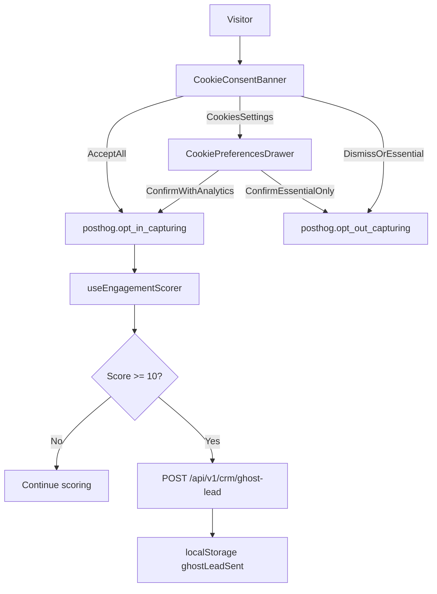
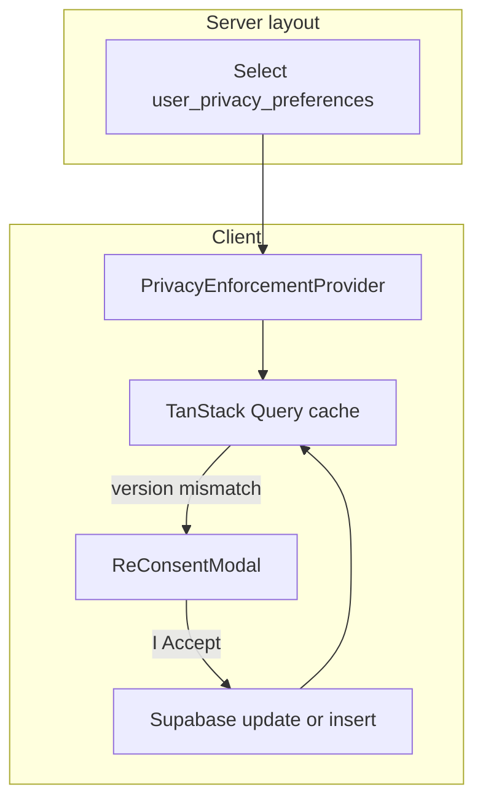

# Cookie consent, PostHog tracking, ghost leads, and legal re-consent

This document describes the **implemented** privacy layer for Revsnap: (1) browser-side cookie and analytics consent, (2) **authenticated** legal policy state in Postgres and the **re-consent engine** for published Privacy Policy / Terms versions, and (3) **what to do when a Salesforce org is ready** to turn marketing “ghost leads” into real CRM records.

**Two complementary tracks**

| Track | Audience | Storage | Purpose |
| ----- | -------- | ------- | ------- |
| **Cookie / analytics consent** | Mostly anonymous and logged-in browser sessions | `localStorage` (`revsnap_privacy_v1`) + PostHog opt-in state | Gate product analytics, engagement scoring, ghost-lead eligibility. |
| **Legal policy acceptance** | Authenticated app users only | Postgres `user_privacy_preferences` | Single source of truth for **which published Privacy/Terms version** the user has accepted; drives the non-dismissible re-consent overlay when the deploy bumps `NEXT_PUBLIC_PRIVACY_VERSION`. |

These are **not** the same as each other: bumping `CONSENT_VERSION` (analytics banner) does not automatically change legal acceptance; bumping `NEXT_PUBLIC_PRIVACY_VERSION` triggers the in-app re-consent flow for users whose stored version does not match. Product and legal should decide when to change one, the other, or both in the same release.

Related references:

- [README.md](../README.md) — env vars and high-level analytics section
- [API_VERSIONING.md](./API_VERSIONING.md) — `/api/v1/crm/ghost-lead` is part of the versioned surface
- [SECURITY_CONTROLS.md](./SECURITY_CONTROLS.md) — auth, RLS on `user_privacy_preferences`, secrets, and API hardening patterns for any future CRM writes

---

## Goals (what we built)

1. **Whole-app consent** — A single cookie/analytics choice applies across marketing and authenticated app chrome (mounted from the root layout).
2. **PostHog only after optional analytics is on** — `posthog-js` starts **opted out** (no capture, no persistence) until the user chooses **Accept all cookies** or confirms **product analytics** in the preference center; essential-only choices keep analytics off.
3. **Events + autocapture, no session replay** — Custom events for consent and engagement; PostHog autocapture after optional analytics is enabled; session replay disabled in init.
4. **Engagement scoring** — Lightweight client-side score used only after optional analytics is enabled; **one** server call when the score crosses the threshold.
5. **Ghost lead hook** — A small, **public** `POST /api/v1/crm/ghost-lead` endpoint that today **does not** call Salesforce; it validates input, logs a safe payload, and returns `200`. It exists so CRM integration can be added **without** changing the browser flow.
6. **Legal policy versioning (SOC2)** — Persisted per-user consent flags and **accepted policy version** in Postgres; client-side re-consent modal when the deployed version string does not match the database (no Edge Middleware redirect for this check).

---

## Architecture (solution design)

### Browser: PostHog initialization

| Piece                                                                                                                       | Role                                                                                                                                                                                                                                                                              |
| --------------------------------------------------------------------------------------------------------------------------- | --------------------------------------------------------------------------------------------------------------------------------------------------------------------------------------------------------------------------------------------------------------------------------- |
| `[instrumentation-client.ts](../instrumentation-client.ts)`                                                                 | Calls `initPosthogBrowser()` once in the browser when supported by Next.js.                                                                                                                                                                                                       |
| `[src/lib/analytics/init-posthog-browser.ts](../src/lib/analytics/init-posthog-browser.ts)`                                 | Single guarded `posthog.init()`: `opt_out_capturing_by_default`, `opt_out_persistence_by_default`, `autocapture: true`, `disable_session_recording: true`. Uses `NEXT_PUBLIC_POSTHOG_PROJECT_TOKEN` and `NEXT_PUBLIC_POSTHOG_HOST` (or same-origin `/ingest` when host is unset). |
| `[src/components/analytics/ConsentAndEngagementProvider.tsx](../src/components/analytics/ConsentAndEngagementProvider.tsx)` | Also calls `initPosthogBrowser()` as a fallback; syncs `opt_in` / `opt_out` from `isAnalyticsOptIn()`; dedupes `opt_in` via `has_opted_in_capturing()`; fires `analytics_consent_accepted` once after optional analytics is enabled (Accept all or confirm with analytics on). |

### Browser: consent UI and local state

| Piece                                                                                 | Role                                                                                                                                                            |
| ------------------------------------------------------------------------------------- | --------------------------------------------------------------------------------------------------------------------------------------------------------------- |
| `[CookieConsentBanner.tsx](../src/components/analytics/CookieConsentBanner.tsx)`      | Bottom banner: **Cookies settings** (opens drawer), **Accept all cookies**, dismiss (essential only); `role="region"` + `aria-label`.                            |
| `[CookiePreferencesDrawer.tsx](../src/components/analytics/CookiePreferencesDrawer.tsx)` | Left preference panel: required vs optional (product analytics); first-visit opens with optional off; **manage** re-opens with toggles prefilled from storage. **Allow all**, **Confirm my choices**. |
| `[cookie-consent-context.tsx](../src/components/analytics/cookie-consent-context.tsx)` | `useCookieConsent().openPreferences({ mode })` — `firstVisit` (banner) vs `manage` (re-consent, prefill when `consent === 'settled'`). |
| `[CookiePreferencesCard.tsx](../src/components/analytics/CookiePreferencesCard.tsx)` | Account settings entry: **Manage cookie preferences** (`mode: 'manage'`). |
| `[PrivacyCookiePreferencesCta.tsx](../src/components/analytics/PrivacyCookiePreferencesCta.tsx)` | Public Privacy Policy page CTA to open the same drawer. |
| `[TopBar.tsx](../src/components/layout/TopBar.tsx)` | Dashboard: cookie icon opens `openPreferences({ mode: 'manage' })`. |
| `[src/lib/analytics/privacy-storage.ts](../src/lib/analytics/privacy-storage.ts)`     | `localStorage` key `revsnap_privacy_v1`: `consent` (`none` \| `settled`), `cookiePreferences.analytics`, `consentDate`, `consentVersion`, engagement fields. Legacy `accepted` / `declined` values migrate on read to `settled` + preferences. |
| `[src/lib/analytics/consent-constants.ts](../src/lib/analytics/consent-constants.ts)` | `CONSENT_VERSION` string (bump when legal copy or scope changes).                                                                                               |

Root layout mounts the provider: `[src/app/layout.tsx](../src/app/layout.tsx)`.

**In-app re-consent** — After the first choice, users can reopen the preference center from the dashboard **TopBar** (cookie icon), **Account settings**, or the **Privacy Policy** page. `openPreferences({ mode: 'manage' })` prefills optional toggles from `revsnap_privacy_v1` when the choice is already `settled`; if not settled yet, behavior matches the first-visit drawer (optional off).

---

## Legal policy versioning and re-consent engine (authenticated app)

This is the **SOC2-oriented** “active preferences” layer: durable record in Postgres, strict RLS, and an enforcement UI that does not rely on middleware redirects.

### Behavior

1. **`NEXT_PUBLIC_PRIVACY_VERSION`** — Public env string (e.g. `v1.0`) naming the **currently published** Privacy Policy / Terms bundle for the app. Bump it in the **same release** as legal publishes an update that requires acknowledgment.
2. **Server prefetch** — Dashboard and billing layouts load the user’s row from `user_privacy_preferences` as early as possible and pass it to the client provider so the UI does not wait on an extra client round-trip to decide whether to show the modal.
3. **Client enforcement** — [`PrivacyEnforcementProvider`](../src/components/privacy/PrivacyEnforcementProvider.tsx) uses TanStack Query (cached key `['privacy-preferences', userId]`) and compares `accepted_policy_version` to `NEXT_PUBLIC_PRIVACY_VERSION` (**string equality**). If the env var is **empty**, the overlay is **skipped** (useful for local experiments; production should always set the var).
4. **Modal** — [`ReConsentModal`](../src/components/privacy/ReConsentModal.tsx): full-viewport backdrop with `backdrop-blur-md`, **non-dismissible** (no close control; backdrop does not complete the flow). User must click **I Accept**; the client writes `accepted_policy_version` via the Supabase browser client (RLS applies). On success, query cache updates and the modal unmounts **without** a full page reload.
5. **Scope** — Wrapped routes: [`src/app/(dashboard)/layout.tsx`](../src/app/(dashboard)/layout.tsx) (main app shell) and [`src/app/billing/layout.tsx`](../src/app/billing/layout.tsx) (billing sits outside the dashboard route group and needs its own wrapper).

### Database: `user_privacy_preferences`

Defined in [`supabase/migrations/020_user_privacy_preferences.sql`](../supabase/migrations/020_user_privacy_preferences.sql).

| Column | Meaning |
| ------ | ------- |
| `user_id` | PK, FK to `auth.users`. |
| `marketing_opt_in` | Default `false`. |
| `telemetry_opt_in` | Default `true` (product default at row creation; align with lawful basis in your privacy notice). |
| `accepted_policy_version` | `text`, **nullable** — `NULL` means the user has not yet accepted the **current** in-app required version (see [Backfill and existing users](#backfill-and-existing-users)). |
| `updated_at` | Maintained on update (trigger). |

**Seeding (new signups):** `public.handle_new_user()` inserts a row for each new auth user with `accepted_policy_version` copied from [`app_legal_publish.privacy_terms_version`](#database-app_legal_publish) (row `id = 1`). That value **must** match `NEXT_PUBLIC_PRIVACY_VERSION` in the same deploy (see [Legal release process](#legal-release-process)).

**Historical backfill:** [`020_user_privacy_preferences.sql`](../supabase/migrations/020_user_privacy_preferences.sql) inserted rows for existing `auth.users` with `accepted_policy_version` **NULL**; those users still see the re-consent modal until they accept or you run a [grandfathering](#backfill-and-existing-users) update (legal permitting).

**RLS:** Authenticated users may **SELECT**, **INSERT**, and **UPDATE** **only** their own row (`auth.uid() = user_id`). Details: [SECURITY_CONTROLS.md](./SECURITY_CONTROLS.md) (Authorization and Row-Level Security).

### Database: app_legal_publish

Defined in [`supabase/migrations/030_app_legal_publish.sql`](../supabase/migrations/030_app_legal_publish.sql).

| Column | Meaning |
| ------ | ------- |
| `id` | Always `1` (single-row table). |
| `privacy_terms_version` | Published legal bundle id (e.g. `v1.0`); **signup** copies this into `user_privacy_preferences.accepted_policy_version`. |

**RLS:** `anon` and `authenticated` may **SELECT** only (public read). **No** client writes; updates happen via migrations (or service role). If row `id = 1` is missing or empty, **new signups fail** (`handle_new_user` raises).

### Legal release process

When legal publishes a new Privacy Policy / Terms bundle that requires in-app acknowledgment:

1. Add a migration that **`UPDATE public.app_legal_publish SET privacy_terms_version = '<new>' WHERE id = 1`** (use the same string everywhere).
2. Set **`NEXT_PUBLIC_PRIVACY_VERSION`** to that string on Vercel / `.env.local` in the **same** release.
3. **Existing users:** enforcement is **string equality** against the env var. Anyone with an older value (or `NULL`) in `user_privacy_preferences` sees the re-consent modal until they click **I Accept**.
4. **New users** created after the migration get the new version from `app_legal_publish` and skip the modal until the next bump.

### Backfill and existing users

| Situation | Behavior |
| --------- | -------- |
| User row from **020 backfill** with `accepted_policy_version IS NULL` | Still sees legal modal when `NEXT_PUBLIC_PRIVACY_VERSION` is set (e.g. `v1.0`), until they accept **or** you grandfather (below). |
| **New signups** after **030** | `accepted_policy_version` is seeded from `app_legal_publish`; if it matches env, **no** redundant modal right after cookie consent. |
| **Grandfathering** (optional, legal sign-off) | One-time SQL, e.g. `UPDATE user_privacy_preferences SET accepted_policy_version = (SELECT privacy_terms_version FROM app_legal_publish WHERE id = 1) WHERE accepted_policy_version IS NULL;` to align legacy `NULL` rows with the current published id without each user clicking through. |

Choose explicitly: **strict** (keep `NULL` until each user accepts) vs **grandfather** (bulk update once).

### Architecture (legal track)

### Helper modules

| Path | Role |
| ---- | ---- |
| [`src/lib/privacy/version.ts`](../src/lib/privacy/version.ts) | `getRequiredPrivacyVersion()`, `isPrivacyVersionSatisfied()`. |
| [`src/lib/privacy/server.ts`](../src/lib/privacy/server.ts) | Server-only read of the current user’s row for layouts. |

### Browser: engagement scoring and ghost lead trigger

`[src/hooks/useEngagementScorer.ts](../src/hooks/useEngagementScorer.ts)` runs only when **optional product analytics** is enabled in storage and `NEXT_PUBLIC_POSTHOG_PROJECT_TOKEN` is set.

| Signal                                          | Points  | Notes                                                                                                        |
| ----------------------------------------------- | ------- | ------------------------------------------------------------------------------------------------------------ |
| Tab visible, **30s** wall clock                 | +1      | `setInterval` while `document.visibilityState === 'visible'`.                                                |
| Scroll depth **≥ 50%** (once)                   | +2      | Milestone stored in `revsnap_privacy_v1`.                                                                    |
| Scroll depth **≥ 90%** (once)                   | +3      | Same.                                                                                                        |
| Click any link to `**/signup`** (capture phase) | +5 once | Emits PostHog `signup_intent_clicked`; works from landing, login, invite flows without wrapping each `Link`. |

When **score ≥ 10** and `ghostLeadSent` is false, the hook **POST**s once to `**${API_BASE}/crm/ghost-lead`** (see `[src/lib/api/base.ts](../src/lib/api/base.ts)`), then sets `ghostLeadSent` on success. PostHog may emit `ghost_lead_submitted` after a successful response.

### Server: ghost lead route (v1 placeholder)

`[src/app/api/v1/crm/ghost-lead/route.ts](../src/app/api/v1/crm/ghost-lead/route.ts)`

- **Auth:** None by design (anonymous marketing visitors).
- **Body (Zod):** `posthog_distinct_id`, `consent_date`, `consent_version`, optional `engagement_score`.
- **Behavior:** `console.info('[crm/ghost-lead]', JSON.stringify(safeLog))` then `**200 { ok: true }`**.
- **Does not:** Read cookies for PII, log raw IP as a field, accept arbitrary PostHog property bags, or call Salesforce.

### Infrastructure: first-party PostHog proxy

`[next.config.ts](../next.config.ts)` rewrites `/ingest/*` to PostHog ingest and static hosts. Defaults target **US**; **EU** projects should set `POSTHOG_INGEST_HOST` and `POSTHOG_ASSETS_HOST` on Vercel (see README). `skipTrailingSlashRedirect: true` is set per PostHog’s Next.js guidance.

---

## Environment variables (recap)

| Variable                                      | Required                         | Purpose                                                |
| --------------------------------------------- | -------------------------------- | ------------------------------------------------------ |
| `NEXT_PUBLIC_POSTHOG_PROJECT_TOKEN`           | For analytics to run             | PostHog project API key.                               |
| `NEXT_PUBLIC_POSTHOG_HOST`                    | No                               | If empty, browser uses `https://<your-domain>/ingest`. |
| `POSTHOG_INGEST_HOST` / `POSTHOG_ASSETS_HOST` | For EU (or custom)               | Server rewrite targets; not exposed to the client.     |
| `NEXT_PUBLIC_PRIVACY_VERSION`                 | Yes in prod (e.g. `v1.0`)        | Published legal bundle id; when bumped, users must re-accept until DB matches. Unset skips overlay (dev only). **Must match** `app_legal_publish.privacy_terms_version` after migration 030. |

Full template: `[.env.example](../.env.example)`.

---

## Operational notes

- **No Salesforce dependency today** — Ghost lead submission succeeds without any connected org; it only logs and returns `200`.
- **Consent without PostHog token** — Banner still appears; choosing optional analytics stores preferences locally but the SDK and scorer stay inactive without a token.
- **Compliance / product** — `CONSENT_VERSION` ([`consent-constants.ts`](../src/lib/analytics/consent-constants.ts)) should be incremented when **banner / analytics** copy or processing meaningfully changes. **Legal / Terms** updates that require acknowledgment are driven by **`NEXT_PUBLIC_PRIVACY_VERSION`**, **`app_legal_publish`** (signup seed), and the re-consent modal (automated for authenticated app routes). Bump **both** the env var and the DB row in the same release ([Legal release process](#legal-release-process)).
- **In-app cookie changes** — Account settings, TopBar, and `/privacy` call `openPreferences({ mode: 'manage' })` so users can withdraw or grant optional analytics without clearing site data.
- **Future: identify / alias** — After login, if analytics consent remains granted, you may call `posthog.identify(userId)` and optionally `alias` the anonymous distinct id; only do this with a clear lawful basis and product policy.

---

## When the Salesforce org is ready: integrating ghost leads

Today, **ghost leads are not Salesforce leads**. The endpoint is a **stable integration point**. When you are ready to write into Salesforce, treat the following as a checklist (order can overlap with legal/security review).

### 1. Decide the CRM object and semantics

Pick **one** primary behavior (document it in this file or in a short `docs/CRM_GHOST_LEAD.md` if this grows):

| Option                                        | When to use                                                                                          |
| --------------------------------------------- | ---------------------------------------------------------------------------------------------------- |
| **Standard `Lead`**                           | Marketing wants classic Lead queues; you can accept sparse fields and optional “source” text.        |
| **Custom object** (e.g. `Ghost_Lead__c`)      | You need fields that do not map cleanly to `Lead`, or want strict separation from human-owned Leads. |
| `**CampaignMember` / Task / Platform Event`** | You mainly want attribution or async processing by another system.                                   |

Anonymous visitors **do not** supply email, name, or company in the current payload — **required Lead fields** must be satisfied with placeholders, defaults, or a **server-side mapping** from a future expanded payload (only after privacy review).

### 2. Choose the Salesforce identity used by the server

The ghost-lead route runs **without** an end-user session. You need a **server-to-Salesforce** path that does **not** reuse an arbitrary visitor’s OAuth token.

Typical patterns:

| Pattern                                    | Description                                                                                                                                                                        |
| ------------------------------------------ | ---------------------------------------------------------------------------------------------------------------------------------------------------------------------------------- |
| **Integration user**                       | A dedicated Salesforce user (or Connected App + JWT bearer) whose refresh token or JWT credentials live in **Vercel env** / Vault; the route uses that identity to insert records. |
| **Named credential / External credential** | If you later move orchestration to Salesforce-first flows; still server-side secrets.                                                                                              |

**Do not** store integration secrets in the browser or in the ghost-lead JSON body.

Align with [SECURITY_CONTROLS.md](./SECURITY_CONTROLS.md): least privilege, auditability, no secret logging.

### 3. Extend the request contract (if needed) — carefully

If marketing requires **email** or **company**, you must:

1. **Collect** those fields only with appropriate consent and copy (likely separate from analytics consent).
2. **Validate** with strict Zod bounds (length, format).
3. **Never** log full PII in plain `console.info`; use redaction or structured logging to a compliant sink.

Prefer **minimal** additions: e.g. optional `email`, `company`, `utm_source` with strict max lengths.

Update:

- `[src/app/api/v1/crm/ghost-lead/route.ts](../src/app/api/v1/crm/ghost-lead/route.ts)` — schema + handler.
- `[src/hooks/useEngagementScorer.ts](../src/hooks/useEngagementScorer.ts)` — only if the client must send new fields (keep optional fields backward compatible).

### 4. Implement Salesforce write in the route (or delegate)

Inside `POST` handler after validation:

1. Map validated body → Salesforce field set (Lead or custom object).
2. Call Salesforce **REST Composite** or **sObject create** using your HTTP client and integration auth.
3. On **success**: return `200` (optionally include a non-sensitive `salesforce_id` if the client needs it — usually unnecessary).
4. On **duplicate / idempotency**: use a deterministic **external id** or store `posthog_distinct_id` in a Supabase table to avoid duplicate inserts on retries.
5. On **failure**: return `**502` or `503`** with a generic JSON error so the client can **retry** (today the client only retries if `ghostLeadSent` stays false after a non-OK response).

Reuse patterns from product Salesforce code under `src/lib/core/salesforce/` **only** if you extract a **server-only** helper that does not assume a user’s org from cookies — ghost lead is **not** the same as “user’s connected org” for regression testing.

### 5. Rate limiting and abuse controls

Because the route is public:

- Add **per-IP** or **per-distinct-id** rate limits (Upstash Redis is already used elsewhere; see [UPSTASH_REDIS.md](./UPSTASH_REDIS.md)).
- Consider a **lightweight shared secret** in a header (rotated) if the endpoint is abused — tradeoff: harder to call from pure browser clients unless injected at build time (usually avoid for anonymous marketing).

### 6. Observability and audit

- Replace or supplement `console.info` with structured logs (Vercel / Axiom / etc.).
- Optionally insert a row into **Supabase** (`ghost_leads` table) for SOC2-style audit: payload hash, `posthog_distinct_id`, timestamps, Salesforce id, outcome — **no raw PII** unless policy allows.

### 7. Documentation and versioning

- Update [API_VERSIONING.md](./API_VERSIONING.md) if the request/response contract becomes externally visible beyond the web app.
- If CLI or partners must never call this route, say so explicitly in API docs.

### 8. QA checklist (Salesforce-enabled)

- Sandbox Connected App / integration user can create the chosen object with the mapped fields.
- Duplicate submit with same `posthog_distinct_id` does not create duplicate CRM rows (or is acceptable and documented).
- Failure path leaves `ghostLeadSent` false so the client can retry once fixed.
- Production Vercel env has Salesforce client id/secret or JWT config; **never** committed to git.

---

## File index (implementation)

| Area                     | Path                                                                                                            |
| ------------------------ | --------------------------------------------------------------------------------------------------------------- |
| PostHog init             | `instrumentation-client.ts`, `src/lib/analytics/init-posthog-browser.ts`                                        |
| Consent UI + opt in/out  | `src/components/analytics/CookieConsentBanner.tsx`, `src/components/analytics/CookiePreferencesDrawer.tsx`, `src/components/analytics/cookie-consent-context.tsx`, `src/components/analytics/CookiePreferencesCard.tsx`, `src/components/analytics/PrivacyCookiePreferencesCta.tsx`, `src/components/analytics/ConsentAndEngagementProvider.tsx`, `src/components/layout/TopBar.tsx` |
| Engagement + client POST | `src/hooks/useEngagementScorer.ts`                                                                              |
| Privacy storage          | `src/lib/analytics/privacy-storage.ts`, `src/lib/analytics/consent-constants.ts`                                |
| Legal prefs + re-consent | `src/components/privacy/PrivacyEnforcementProvider.tsx`, `src/components/privacy/ReConsentModal.tsx`, `src/lib/privacy/version.ts`, `src/lib/privacy/server.ts` |
| DB migrations (legal)    | `supabase/migrations/020_user_privacy_preferences.sql`, `supabase/migrations/030_app_legal_publish.sql`         |
| Authenticated layouts    | `src/app/(dashboard)/layout.tsx`, `src/app/billing/layout.tsx`                                                  |
| API route                | `src/app/api/v1/crm/ghost-lead/route.ts`                                                                        |
| Rewrites                 | `next.config.ts`                                                                                                |
| Root mount               | `src/app/layout.tsx`                                                                                            |

---

## Changelog (doc history)

| Date       | Change                                                                                |
| ---------- | ------------------------------------------------------------------------------------- |
| 2026-05-10 | `app_legal_publish` + migration 030: signup seeds `accepted_policy_version` from DB; legal release + backfill docs. |
| 2026-05-10 | In-app re-consent: `cookie-consent-context` + `openPreferences({ mode })`, TopBar cookie icon, Account settings card, Privacy page CTA; drawer prefill for `manage` when storage is `settled`. |
| 2026-05-10 | Cookie preference center: left `CookiePreferencesDrawer`, banner Accept all / Cookies settings / dismiss (essential only); `privacy-storage` `settled` + `cookiePreferences.analytics`; `CONSENT_VERSION` `2`. |
| 2026-05-03 | Initial product doc; Salesforce integration checklist. Added SOC2 legal track: `user_privacy_preferences`, `NEXT_PUBLIC_PRIVACY_VERSION`, re-consent UI, dashboard/billing layouts, migration 020. |

