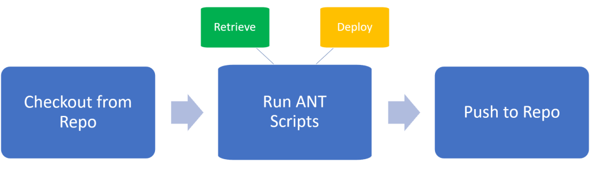

#### Introduction

Azure DevOps is a very powerful application that has a git-based repo and pipelines to automate tasks that is relevant to any IT process. In this blog, we are diving into the use of Azure Pipelines for Salesforce Developers to carry out deployment activities. You can use this blog to understand how you could push your metadata in your repo into a salesforce org. This blog uses Azure Repo to store the metadata and ANT based deployments. You could also use Github/Bitbucket repo to link into Azure pipeline and run the deployments from there as well. Instead of ANT based deployments, sfdx can also be leveraged, but that might need different pipeline tasks to support it. So let us get started to retrieve and deploy the metadata using ADO pipelines.

#### Prerequisites

We'll start with the assumption that you are having good experience with [Salesforce ANT Migration Tool](https://resources.docs.salesforce.com/224/latest/en-us/sfdc/pdf/salesforce_migration_guide.pdf) because the Azure Pipeline that we'll build will use this migration tool at the backend. You can start by cloning this repo from my Github [_her_e](https://github.com/arohitu/ant-retrievedeploy.git). Sign up for an [Azure developer edition](https://azure.microsoft.com/en-us/services/devops/?nav=min) to try this out from you personal azure dev org. You could also if your project (at work) allows, create a new repo or branch within the repo with the files from Github and set up the pipeline to do the deployments.

#### Process Diagram

- 
    

From the above diagram, one can understand how the pipeline is configured to run. These are the steps/tasks in the pipeline file. Let us see what each step does:

1. Checkout from the repo: This task checkouts the entire repo into the virtual machine environment. (Azure Pipelines works on a virtual machine)
2. Run ANT Scripts. This is a standard pipeline task that is created to work in the following way:
    1. Retrieve - to just retrieve from you source org.
    2. Deploy - to deploy the metadata from the repo to the target org.
    3. Both - to do a retrieve and deployment with a single run of pipeline.
3. Push to Repo: This task commits and pushes the files retrieved from source org to the repo from the local of the Azure virtual machine.

The pipeline that I've created here is a dynamic one that accepts the ANT target from a variable that user can set just before running the pipeline so that he can choose between retrieve/deploy/both. Now if you are good with the build.xml, you know with multiple targets that use a different set of username/password or by using multiple pipelines linked to each other, you can automate the complete deployment process of retrieve and deploy from one org to another. In the example I've in my GitHub, you many notice, am retrieving from and deploying to the same org. I have explained how this could be done between orgs in the video.

#### The Master File

Now lets look at the pipleine file in detail. I've explained the below yml file in detail in the video.

```
# SFDC Retrieve and Deploy sample

trigger: none

pool:
  vmImage: 'ubuntu-latest'

steps:
- checkout: self

- script: |
    echo "Build Type: $(BUILD_TYPE)"
  displayName: 'Confirming Variables'

- task: Ant@1
  inputs:
    buildFile: 'MyDevWorks/build.xml'
    options: 
    targets: 'retrieve'
    publishJUnitResults: false
    javaHomeOption: 'JDKVersion'
  displayName: 'Retrieving from Source Org'
  condition: or(eq(variables['BUILD_TYPE'], 'retrieve'),eq(variables['BUILD_TYPE'], 'both'))

- task: Ant@1
  inputs:
    buildFile: 'MyDevWorks/build.xml'
    options: 
    targets: 'deployCode'
    publishJUnitResults: false
    javaHomeOption: 'JDKVersion'
  displayName: 'Deploy to Target Org'
  condition: or(eq(variables['BUILD_TYPE'], 'deploy'),eq(variables['BUILD_TYPE'], 'both'))

- script: |
    echo ***All Extract Successfull!!!***
    echo ***Starting copying from VM to Repo****
    git config --local user.email "myemail@gmail.com"
    git config --local user.name "Rohit"
    git config --local http.extraheader "AUTHORIZATION: bearer $(System.AccessToken)"
    git add --all
    git commit -m "commit after extract"
    git remote rm origin
    git remote add origin https://<<<YOUR_REPO_TOKEN>>>@<<YOUR_REPO_URL>
    git push -u origin HEAD:master
  displayName: 'Push to Repo'
```

#### Summing Up

With this setup, if your project employs a DevOps strategy, you can easily create Pull Requests to your target branch. You don't need to get into the pain of retrieving the metadata using ANT on your local, commit it on local, push to remote using Github for Desktop/TortoiseGit/SourceTree apps.

Always on Cloud. Retrieve and Deploy just by using a browser.

https://youtu.be/OtPA06aBBu8

#Giveback #StaySafe
