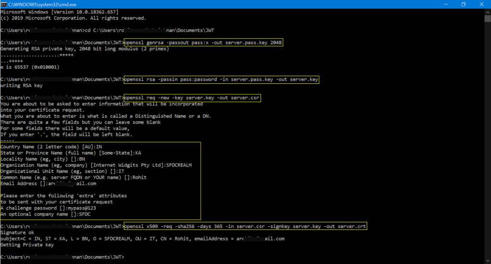
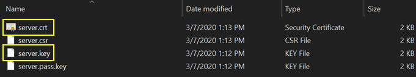
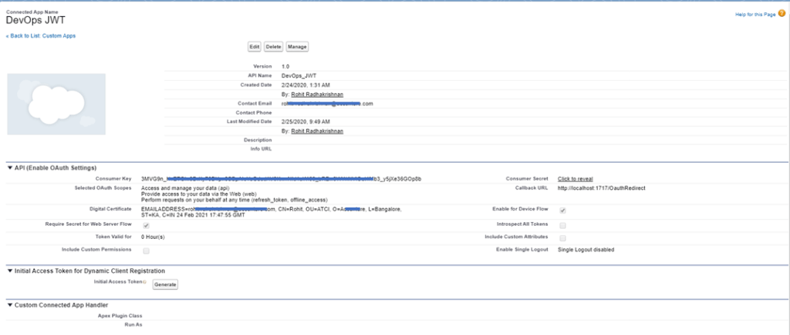
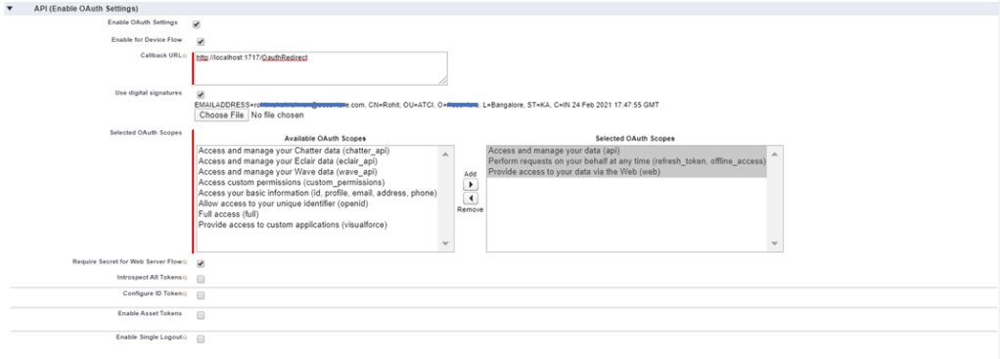
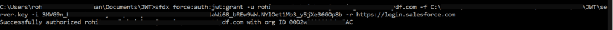

Being late into understanding SFDX, I wasn’t sure what were its capabilities and on a normal development project, I don't think there is enough opportunity to work with SFDX. Luckily, I got a chance to work with few of the DevOps setup for my client and got hands on to the Salesforce Developer Experience – the SFDX.

I’m not going into details of what is SFDX and its capabilities as those are covered by fellow bloggers. Instead, will focus on how you could authenticate SFDX with an org of any choice. And again, there are blogs on this as well. So what's the next focus!?

Here on this blog, let's forget about terms like scratch org, developer hub etc. Instead will make sure sfdx works for any “type” of org. I’m using my developer edition and the rules applies for a production or sandbox instance. Hmm… that's a lot of prologue. Lets get started.

#### **Prerequisities**

The below tools must be installed on your machine:

- SFDX
- OpenSSL

#### Flow in this tutorial


#### Setup SSL Certificate

This setup is required only for the purpose of this tutorial. As what we could generate is a self-signed certificate. A self-signed certificate is not recommended for use in a production instance. For a real project and application, you should go with a CA signed certificate. Don’t worry about the jargons, these are explained almost everywhere on internet. You could contact the ‘Digital Security’ team to procure a CA signed certificate. They would provide you with the required certificate and its key.

Install the openssl if you don't have in your system using the below link and choose the version for your OS and don't choose light version. After the installation, restart your machine and verify you have the openssl path variable set. This is the part I struggled a lot as getting an openssl binary was toughest part of this journey.

https://slproweb.com/products/Win32OpenSSL.html

Create a folder 'JWT' in a directory of your choice, navigate to that directory on the command line and run the below commands one after the other.

```bash
openssl genrsa -passout pass:x -out server.pass.key 2048
openssl rsa -passin pass:password -in server.pass.key -out server.key
openssl req -new -key server.key -out server.csr
```

At this point, you need to enter few details which will be taken into consideration, while generating the certificate. After you complete entering the details, it will again prompt on the cli path. Enter the below command and hit enter.

```bash
openssl x509 -req -sha256 -days 365 -in server.csr -signkey server.key -out server.crt
```



Now you can see four files in the folder of which two files are in need: server.key and server.crt. We will upload the server.crt file while we create a connected app and pass the server.key along when we make the connection - in this case through the sfdx command.



#### Setup Connected App

Time to login to salesforce. Login to your developer edition and create a connected app. Check the 'Enable OAuth Settings' & 'Use Digital Signatures'. Your app should have details as below screenshots. Upload the server.crt file under the digital signature.





#### Run SFDX Commands

All set. Now its time to test the connection using the sfdx auth command. Run the below sfdx command. I've kept the server.key file in the location: C:\\JWT\\server.key

```bash
sfdx force:auth:jwt:grant -u <username> -f C:\JWT\server.key -i <cosumerkey> -r https://login.salesforce.com
```



As you see from the above image, the SFDX got authenticated using the JWT. The command used the key with which the certificate was generated and connected to sfdc using the consumer key app that uses that certificate. Be very careful with the key file as it holds the pass to your org.

#### Walkthrough

https://www.youtube.com/watch?v=OiLszJ44R64
