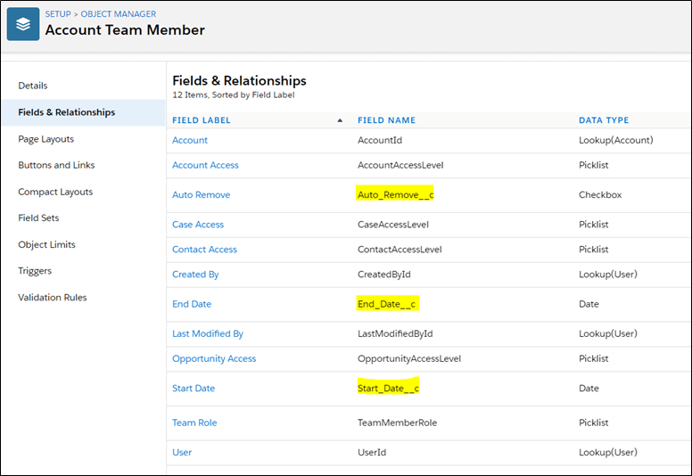
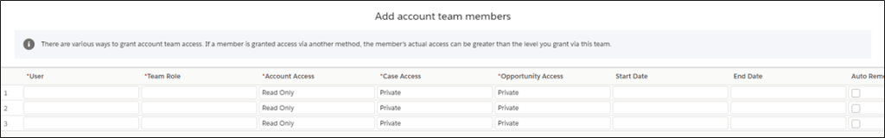
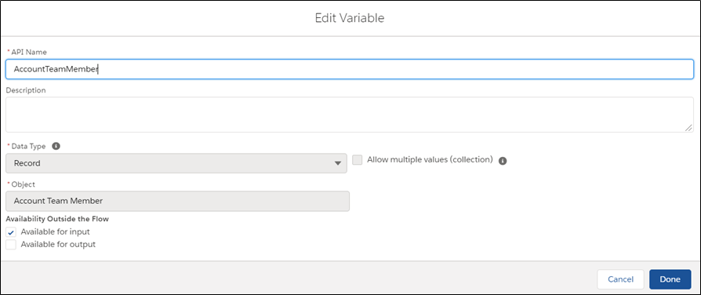
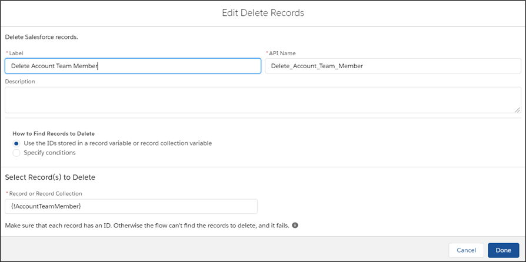
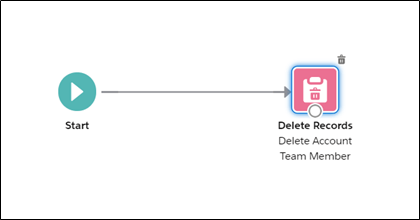
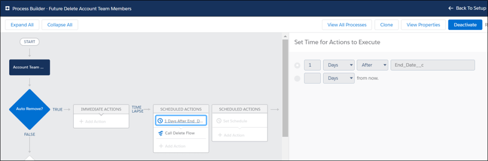
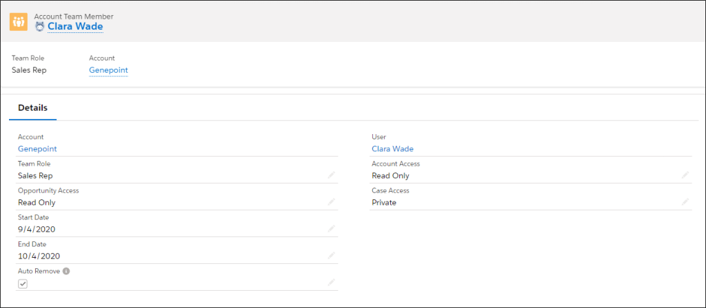
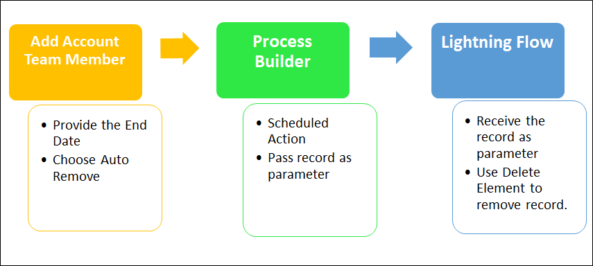
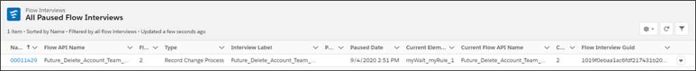

Teams – a powerful feature in salesforce by which two or members collaborate and work together on Account/Opportunity/Cases and help each other to close deals much faster or service a customer issue effectively. This may involve complex relationships and Account Team is no exception to it. Starting from Winter’20, Salesforce allows us to create custom field, buttons, links validation rules, triggers, process builders, lightning flows on Account Team Member object. We could add the custom fields on the Account multi-line editor as well.

With the general availability of these features, let us investigate a scenario which many customers were looking for: Remove an Account Team Member after a specific period. This was not possible earlier since system could not validate a date on which a specific member was supposed to be removed from the Account Team. This blog explains how we could do this without writing a single piece of code.

#### Scenario

Mark is a sales rep who is working with Genepoint – a loyal customer who deals with biotech is about to close a deal this Friday. In order to speed up the selling process, he has added Clara who would help in assessment and product demo as Account Team Member and wanted to make sure Clara once the deal is closed on Friday should be removed from the Account Team. Clara can focus on other customers she had been serving. Also, after Friday, due to an agreement with the customer, Clara should not be part of the Account when the opportunity is in Negotiation stage. Mark does not want to miss removing Clara from the team between his busy schedule. Let us see in this case how the new Winter’20 features would help Mark.

#### A Bit of Points & Clicks

Julian who is the architect is well aware of the Winter’20 capabilities of Account Team Members and has created the below custom field on [Account Team Member](https://developer.salesforce.com/docs/atlas.en-us.api.meta/api/sforce_api_objects_accountteammember.htm) object.

After the fields were created, these were added to the Account Team Member Layout and to the Multi-Line editor.

The fields End Date and Auto Remove will drive the functionality behind this scenario. Let us dive deeper.

While adding the Account Team Member, a user can select the start date and end date for which the member is valid through. Now if the user wants to remove the member automatically at the end of the period, he selects the Auto Remove checkbox and set it to true.

Julian has setup few configurations using points and clicks that make sure if Auto Remove is checked that member gets removed by the system. A Lightning Flow and a Lightning Process builder have been put in place.

**Lightning Flow.**

Lightning Flow comprises of very simple setup:

- A variable that holds the Account Team Member record to be deleted is setup as below.

- An element in lightning flow that would delete the record setup as show below.

Finally, he makes the flow connections the simplest way.

**Process Builder**

With the Winter’20 release, Julian could use Account Team Member object in Lightning process builder. He creates a new process builder as below.

He makes sure the process builder has a scheduled action that calls the Lightning flow after 1 Day of End Date as per the business.

Julian activates the Flow and Process Builder. All set.

#### Back to Business

Mark can now select the Auto Remove checkbox along with the End Date field when he adds Clara to the Account. Clara will be removed after 1 day of the end date. Mark doesn’t have to set a reminder and can completely focus on selling.

#### Focused Rep – More Sales

The complete flow could be better understood from the flow diagram below.

Julian confirms the process has run successfully by looking at the Paused Flow Interview page from the setup menu.

Genepoint is happy as they know Mark has done an excellent work with Clara closing the deal on time and respected the contractual agreements as well.

**Bonus**: To kickstart the build, Please clone the below code from the repo.

https://github.com/arohitu/AutoRemoveAccTeamMembers.git
