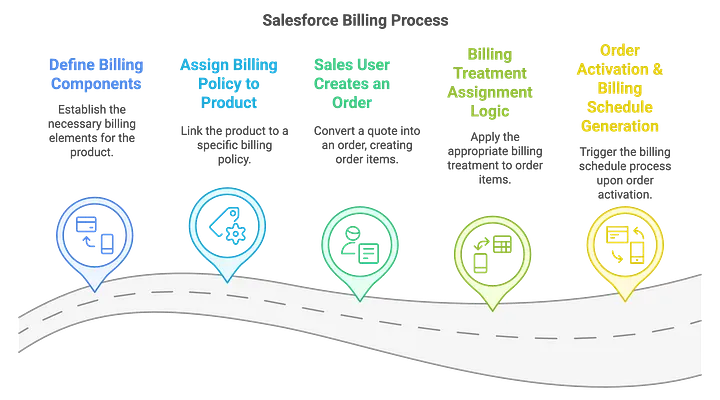
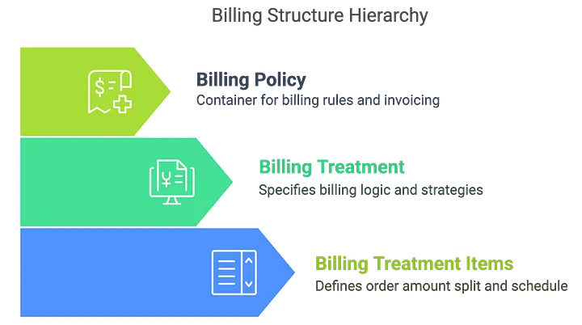
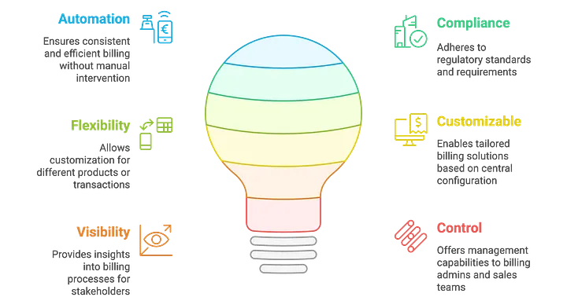

This article breaks down how a billing configuration flows from setup to execution in Salesforce Revenue Cloud, covering Billing Policies, Treatments, and Treatment Items, all the way to Billing Schedule generation upon order activation.

## Step 1: Define Billing Components

The process begins with a billing administrator defining the core components that govern how products are invoiced.

### Billing Policy
A Billing Policy acts as a container for billing rules and can host multiple Billing Treatments. It defines the high-level approach to invoicing a customer for a product.

### Billing Treatment
This component specifies the detailed billing logic, such as the schedule, type, and strategy. You can create multiple treatments for different business models (e.g., Milestone, Monthly, Usage-based).

### Billing Treatment Items
These define exactly how the order amount is split and scheduled.
-   **Percentage**: A percentage of the order value (e.g., 30% upfront).
-   **Flat Amount**: A fixed amount for billing (e.g., $500).
-   **Remainder**: Captures the remaining amount after other percentages or flat amounts have been applied.

## Step 2: Assign Billing Policy to a Product

Once the components are defined, the Billing Policy is linked directly to a product record.
-   Navigate to the **Product** record.
-   Set the `BillingPolicyId` field to the desired Billing Policy.

This simple step connects the product to its predefined billing configuration.

## Step 3: Create an Order

When a sales user converts a Quote to an Order, the products on the quote become **Order Line Items** (OrderProducts). Each Order Line Item automatically inherits the Billing Policy from its parent product.

## Step 4: Assign the Billing Treatment

The system then determines which specific Billing Treatment to apply based on the 'Billing Treatment Selection' field on the Billing Policy.

### 1. Default
The system automatically applies the default Billing Treatment defined in the Billing Policy.

### 2. Manual
A sales user can manually override the default by selecting a specific Billing Treatment on the `OrderProduct.BillingTreatmentId` field. If one isn't chosen manually, the system falls back to the policy's default, and then the org-level default.

### 3. Legal Entity
The system selects the Billing Treatment that matches the Legal Entity of the order. If no match is found, it follows a fallback logic: policy default, then org-level default. If no treatment is found, the billing calculation will fail.

The outcome of all three paths is a valid Billing Treatment assigned to the Order Line Item.

## Step 5: Activate the Order & Generate the Billing Schedule

Upon Order Activation, a Salesforce flow triggers the Order-to-Billing Schedule process.
The system reads the Billing Treatment Items assigned to the Order Line Item and creates two key records:
-   **Billing Schedule Group**
-   **Billing Schedule**

These output objects are then used to drive automated invoice generation and revenue recognition downstream.

The end result is a fully automated, compliant, and flexible billing process where custom logic can be applied per product or transaction, all driven by a central, scalable configuration.

[Learn more about Revenue Lifecycle Management on Salesforce](https://www.salesforce.com/uk/sales/revenue-lifecycle-management/)
