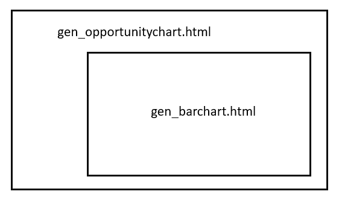
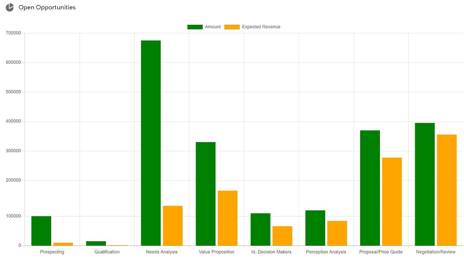

Data visualization is the graphical representation of information and data. By using visual elements like charts, graphs, and maps, data visualization tools provide an accessible way to see and understand trends, outliers, and patterns in data. Executives and Managers in any firm are interested to visualize the data in a way that would provide insights to them. One such visualization library that is very popular and open source is ChartJS. It is a simple yet flexible JavaScript charting for designers & developers. In this blog, let us take a look on how we could use ChartJs to draw charts on a lightning web component.

In the blog, I will demonstrate how you can get data from salesforce object using apex and feed it to the bar chart. Also, will use an aggregate query to get the data summed up and will show data in two datasets. To build the UI, I've used two LWCs. One being a parent and another its child.



Most of the data work will be handled by the parent component and will pass as an attribute (chartConfiguration) to the child. In this blog, we are trying to show an Opportunity Bar Chart with Expected Revenue & Amount for various stages.

1. Download the ChartJS file from [here](https://cdnjs.cloudflare.com/ajax/libs/Chart.js/2.8.0/Chart.bundle.min.js) and load it as a static resource with the name 'ChartJS'.
2. Create a Lightning Web Component with name 'gen\_barchart' copy the below code.

**gen\_barchart.js**

```jscript
import { LightningElement, api } from 'lwc';
import chartjs from '@salesforce/resourceUrl/ChartJs';
import { loadScript } from 'lightning/platformResourceLoader';
import { ShowToastEvent } from 'lightning/platformShowToastEvent';

export default class Gen_barchart extends LightningElement {
    @api chartConfig;

    isChartJsInitialized;
    renderedCallback() {
        if (this.isChartJsInitialized) {
            return;
        }
        // load chartjs from the static resource
        Promise.all([loadScript(this, chartjs)])
            .then(() => {
                this.isChartJsInitialized = true;
                const ctx = this.template.querySelector('canvas.barChart').getContext('2d');
                this.chart = new window.Chart(ctx, JSON.parse(JSON.stringify(this.chartConfig)));
            })
            .catch(error => {
                this.dispatchEvent(
                    new ShowToastEvent({
                        title: 'Error loading Chart',
                        message: error.message,
                        variant: 'error',
                    })
                );
            });
    }
}
```

I have used platformResourceLoader to load the script from the static resource on a renderedCallback() lifecycle hook.

**gen\_barchart.html**

```xml
<template>
    <div class="slds-p-around_small slds-grid slds-grid--vertical-align-center slds-grid--align-center">
        <canvas class="barChart" lwc:dom="manual"></canvas>
        <div if:false={isChartJsInitialized} class="slds-col--padded slds-size--1-of-1">
            <lightning-spinner alternative-text="Loading" size="medium" variant="base"></lightning-spinner>
        </div>
    </div>
</template>
```

In the HTML I have added a canvas tag, as per the ChartJS documentation the Chartjs library uses that canvas to draw the chart.

3\. Create an apex class to pull the data from salesforce. In this example I've used a SOQL to pull data from Opportunity and aggregated the the Amount and ExpectedRevenue field.

**GEN\_ChartController.cls**

```java
public class GEN_ChartController {
    @AuraEnabled(cacheable=true)
    public static List<AggregateResult> getOpportunities(){
        return [SELECT SUM(ExpectedRevenue) expectRevenue, SUM(Amount) amount, StageName stage 
               FROM Opportunity WHERE StageName NOT IN ('Closed Won') GROUP BY StageName LIMIT 20];
    }
}
```

4\. Create another LWC as the parent that does the data work for us.

**gen\_opportunitychart.js**

```jscript
import { LightningElement, wire } from 'lwc';
import getOpportunities from '@salesforce/apex/GEN_ChartController.getOpportunities';

export default class Gen_opportunitychart extends LightningElement {
    chartConfiguration;

    @wire(getOpportunities)
    getOpportunities({ error, data }) {
        if (error) {
            this.error = error;
            this.chartConfiguration = undefined;
        } else if (data) {
            let chartAmtData = [];
            let chartRevData = [];
            let chartLabel = [];
            data.forEach(opp => {
                chartAmtData.push(opp.amount);
                chartRevData.push(opp.expectRevenue);
                chartLabel.push(opp.stage);
            });

            this.chartConfiguration = {
                type: 'bar',
                data: {
                    datasets: [{
                            label: 'Amount',
                            backgroundColor: "green",
                            data: chartAmtData,
                        },
                        {
                            label: 'Expected Revenue',
                            backgroundColor: "orange",
                            data: chartRevData,
                        },
                    ],
                    labels: chartLabel,
                },
                options: {},
            };
            console.log('data => ', data);
            this.error = undefined;
        }
    }
}
```

From the above block of code, you can see the multiple elements in the dataset. This is how you keep adding dataset to show on the chart. The chartconfiguration as provided here defines the type of chart, data, labels and any options.

**gen\_opportunitychart.html**

```xml
<template>
    <lightning-card title="Open Opportunities" icon-name="utility:chart">
        <template if:true={chartConfiguration}>
            <c-gen_barchart chart-config={chartConfiguration}></c-gen_barchart>
        </template>
</lightning-card>
</template>
```

**gen\_opportunitychart.js-meta.xml**

```xml
<?xml version="1.0" encoding="UTF-8"?>
<LightningComponentBundle xmlns="http://soap.sforce.com/2006/04/metadata">
    <apiVersion>50.0</apiVersion>
    <isExposed>true</isExposed>
    <targets>
        <target>lightning__Tab</target>asasas
        <target>lightning__AppPage</target>
    </targets>
</LightningComponentBundle>
```

5\. Create a Lightning App page to preview the chart.

The chart will be rendered as shown below:



You can download the files from the github repo [here](https://github.com/arohitu/ChartJSLWC.git).

#Giveback #StaySafe
