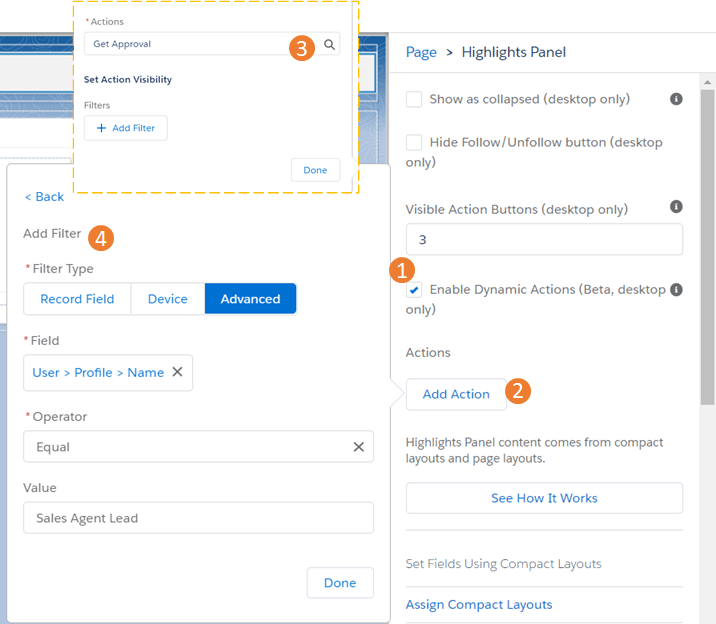

#### **Introduction**

In Salesforce ecosystem, we all love the word ‘dynamic’ as this brings in a lot of flexibility to the business to reuse anything that is dynamic. Quick Actions in salesforce is a great feature after we were forced to replace the JavaScript buttons when we all migrated from classic to lightning. Let it be the object specific quick actions or be it the global quick actions. Quick actions enable users to do more in Salesforce and in the Salesforce mobile app. With custom quick actions, we can make our users’ navigation and workflow as smooth as possible by giving them convenient access to information that is most important.

#### **Scenario**

Lets dive deeper with a use case. Consider we have a record page for Discount Request object with a quick action that initiates an approval process in a backend system. This action was meant for sales agents with a specific profile. The same layout was being shared with all the agents as well and they were also able to see and click the quick action. Now we have been tackling this with some validation rule on the Lightning component that integrates the approval logic. Alternatively, we were using a different record page for those profiles with and without the quick action. So how do we approach it with minimum component and a low code design?

#### **The Solution**

With Dynamic Actions, starting from Summer'20, we can prevent the other set of users not to see that action on their layout even if both set of users use the same layout/record page. So how do we do this? Let us follow the below steps:

1. Navigate to any record page and choose the highlights panel. Select the option “Enable Dynamic Actions”.
2. Choose ‘Add Action button’
3. From the Search field choose your Action.
4. Add the filter.

I have chosen the quick action to be only visible by the Sales Agent Lead Profile.

With this setup, now we display the quick action only to the Sales Agent Lead Profile The other sales agent profile who share the same record page however does not see the button.

#### **Final Thoughts**

With the rise of Citizen Developers and a low code approach across industries and customers, this feature adds a lot of flexibility to reuse the existing layouts and record page without the need to further add more component or to have logic in custom components. One limitation with Dynamic Action is that currently this is supported on record pages for custom objects alone.
