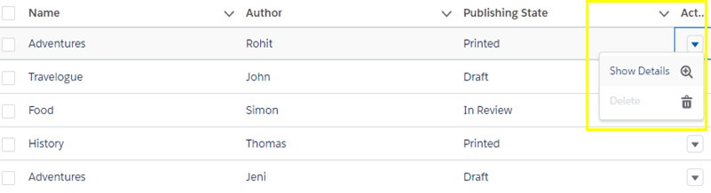
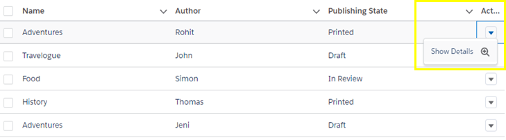
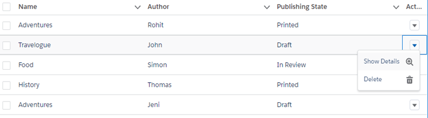

Salesforce has made developer’s life easy by introducing lightning:datatable from API version 41.0. Even since then there have been a lot of enhancement to the component with more and more attributes. In this blog, we will look at, how, using ‘onrowaction’ attribute we could create actions on the fly for the row that the user has chosen. These actions are user created and hence we can include the required business logic to perform on the specific rows.

#### Salesforce Way

The below diagram shows how salesforce has implemented it in their documentation. As per the documentation, we can see they have made the actions if not applicable in disabled state.

<figure>



<figcaption>

Fig. 1

</figcaption>

</figure>

#### How Actions work on lightning:datatable?

The below code defines the columns for this lightning data table.

```jscript
var rowActions = helper.getRowActions.bind(this, cmp);
//Defining the Columns
cmp.set('v.columns', [
    { label: 'Name', fieldName: 'name', type: 'text' },
    { label: 'Author', fieldName: 'author', type: 'text' },
    { label: 'Publishing State', fieldName: 'published', type: 'text' },
    { label: 'Action', type: 'action', typeAttributes: { rowActions: rowActions } }
]);
```

The last column has a parameter : typeAttributes: { rowActions: rowActions } – because of this rowActions, the rowActions variable is invoked and it calls the helper method binding the row and the component. The row action helper at this point runs the javascript code as explained above that checks the row’s ‘Published State’ property and dynamically displays the options for that row.

To understand how the actions work and how to generate run-time actions, I’ve made a minor tweak to the javascript code from the documentation as below. From the code, it’s evident that the actions are displayed from an array that we have defined. Clearly one can see that it’s the variables in the array that explains what actions are showed up. The variables in the array must be of type ‘object’ (For Eg: var myaction = {};), This is for us to add properties to the variables and we use the below parameters for that “action” object.

- Label
- IconName
- Name
- Disabled

```jscript
getRowActions : function (cmp, row, doneCallback) {
    var actions = [];
    var showdetailAction = {
        'label': 'Show Details',
        'iconName': 'utility:zoomin',
        'name': 'show_details'
    };
    actions.push(showdetailAction);
    var deleteAction = {
        'label': 'Delete',
        'iconName': 'utility:delete',
        'name': 'delete'
    };
    if (row['published'] === 'Printed') {
        deleteAction['disabled'] = 'true';
    } 
}
```

The above code checks if the published column for that row has ‘Printed’. If then we add a parameter disabled and sets as true for that action object. This behavior is as explained by Fig. 1.

#### Our Way

We will now see how we can prevent the actions to appear on the drop down if any action is not applicable for that row. For us to change this behavior and show only the action that is only enabled on the table, change the lines 14 till 16 as below on the above code snippet

```jscript
if (row['published'] !== 'Printed') {
    actions.push(deleteAction);
}
```

This way we are preventing the addition of the action object into action array that is not required to be shown on the drop down as explained by below image.



Either way for any value for ‘Publishing State’ other than ‘Printed’ will have below view.



#### Consideration

One thing to be considered here is that the data is loaded to the lightning datatatable and the row actions are displayed with the value from DOM. So, incase you want the actions to reflect as per the server values for that row and column, it is important to keep the data as well updated before the binding happens. I’ll try to cover this scenario in another blog. For any use case with user updating it from the same lightning component, we can manage it via inline editing attribute for the lightning:datatable.

#### References

https://github.com/arohitu/LightningDataTableWithDynamicAction.git

https://developer.salesforce.com/docs/component-library/bundle/lightning:datatable/example
