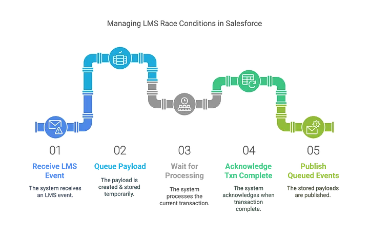

I recently integrated a third-party configurator (an LWC) inside Salesforce’s first-party configurator to manage complex product attribute updates. My initial approach was straightforward: whenever the configurator fired an event (`valueChanged`), my LWC immediately responded with another event. However, I soon encountered unexplained errors. After investigating further, I discovered these were LMS race conditions—and the fix was to defer event publication until the first-party configurator’s internal processes completed.

This post provides a technical breakdown of why Lightning Messaging Service (LMS) race conditions happen and how to avoid them, with a clear example using Revenue Cloud. We will cover:

1.  A brief overview of LMS Architecture
2.  Why LMS race conditions occur
3.  General strategies to avoid them
4.  A specific Revenue Cloud example

## LMS Architecture

Lightning Message Service (LMS) is Salesforce’s publish/subscribe mechanism for exchanging data between Lightning Web Components, Aura components, and Visualforce pages. While powerful, its asynchronous nature can lead to race conditions if not handled carefully.

-   **Message Channels**: Defined in metadata (e.g., `@salesforce/messageChannel/MyChannel__c`). These act like topics that publishers and subscribers use to communicate.
-   **MessageContext**: A wired context object in an LWC that grants access to the `publish` and `subscribe` operations.
-   **Publish/Subscribe Flow**:
    1.  A publisher constructs a payload and calls `publish(messageContext, channel, payload)`.
    2.  All active subscribers on that channel receive the payload in their callback.

LMS is asynchronous, which is beneficial in most scenarios but can cause timing issues when chaining events too quickly. You cannot reliably publish an event immediately upon receiving another event on the same channel.

## Why Race Conditions Occur

A race condition arises when multiple LMS events overlap or interleave in unexpected ways:

-   **Immediate Chain Publishing**: A subscriber callback publishes a new event before the system has finished processing the transaction that originally triggered the event.
-   **Unstable States**: Some internal processes (e.g., Revenue Cloud’s configuration rules) need to finalize their calculations before accepting new instructions.

The result can be stale data, partial updates, or discarded events if the system is busy, leading to unexpected errors.



## General Strategies to Avoid Race Conditions

1.  **Defer the Second Event**
    -   Instead of immediately publishing within the same subscription callback, store the payload in memory.
    -   Publish it **after** the system indicates it is ready (e.g., via a property update or callback that signals completion).

2.  **Use Distinct Phases**
    -   Wait for an explicit "done" or "recalculation complete" signal before sending another event.

3.  **Leverage Known UI or Server Hooks**
    -   While a short asynchronous delay (e.g., `setTimeout`) can sometimes work, a more deterministic approach is to rely on known component lifecycle updates.

## Revenue Cloud Example

In Salesforce Revenue Cloud, the first-party configurator updates its internal data model and eventually refreshes the `optionGroups` property. Only after that update can you safely publish a follow-up event. Here’s the core logic:

```javascript
import { publish, MessageContext } from 'lightning/messageService';
import MY_CHANNEL from '@salesforce/messageChannel/MyChannel__c';

// ... class definition

_optionGroups;
queuedPayloads = [];
waitingForApiToResolve = false;

@api
get optionGroups() {
  return this._optionGroups;
}
set optionGroups(value) {
  this._optionGroups = value;

  // If we have events waiting, publish them now
  if (this.waitingForApiToResolve) {
    this.publishQueuedEvents();
    this.waitingForApiToResolve = false;
  }
}

// Method called after receiving an LMS event
handleMessage(message) {
  if (message.action === 'valueChanged') {
    // Instead of publishing back immediately, queue the payload
    this.queuedPayloads.push(buildPayload(message));
    this.waitingForApiToResolve = true;
  }
}

publishQueuedEvents() {
  this.queuedPayloads.forEach(payload => {
    publish(this.messageContext, MY_CHANNEL, payload);
  });
  // Clear the queue
  this.queuedPayloads = [];
}
```
- The `handleMessage` method captures the incoming `valueChanged` event.
- Instead of re-publishing, the new payload is added to `queuedPayloads` and a flag `waitingForApiToResolve` is set.
- The main configurator finishes its processing and updates the component's `optionGroups` property.
- The `optionGroups` setter is triggered, which then calls `publishQueuedEvents` to send the queued events, ensuring CPQ is ready to handle them without conflicts.

## Conclusion

LMS-based race conditions often occur when events are chained too rapidly, especially in complex applications like Revenue Cloud where background pricing or configuration rules are running. To avoid these issues, defer subsequent events until you receive a definitive indicator—such as the `optionGroups` update—that the system’s prior transaction is complete. This ensures data consistency and stable communication between your components.
