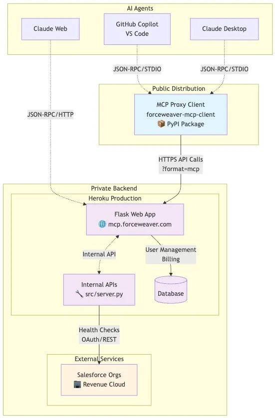
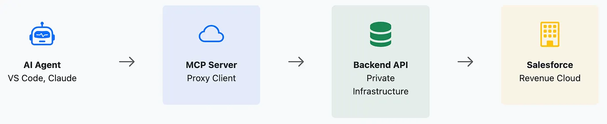
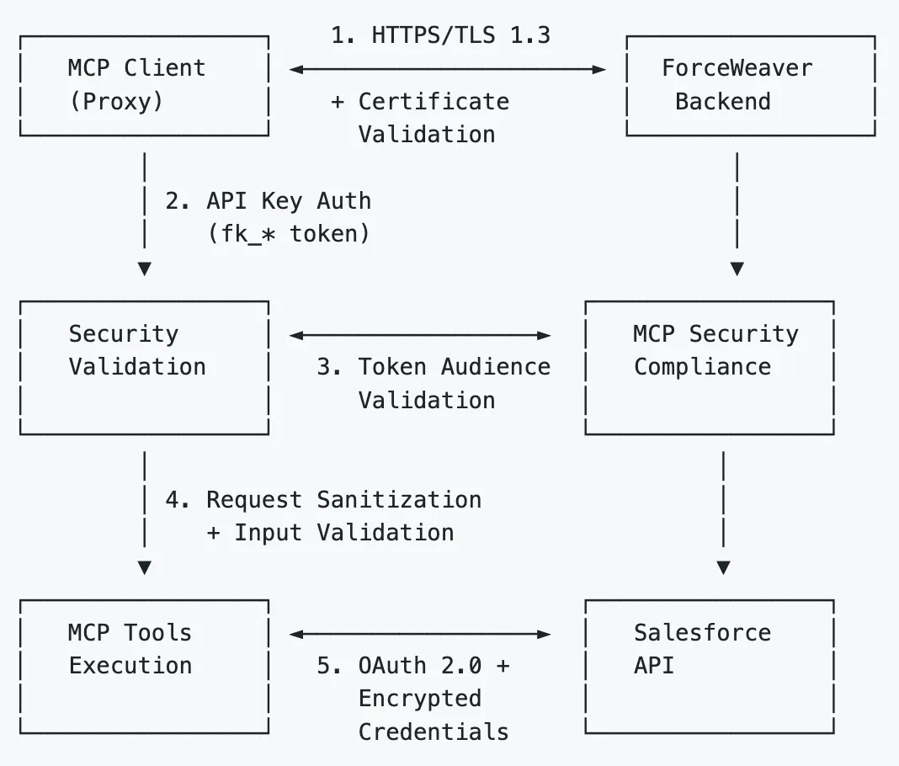
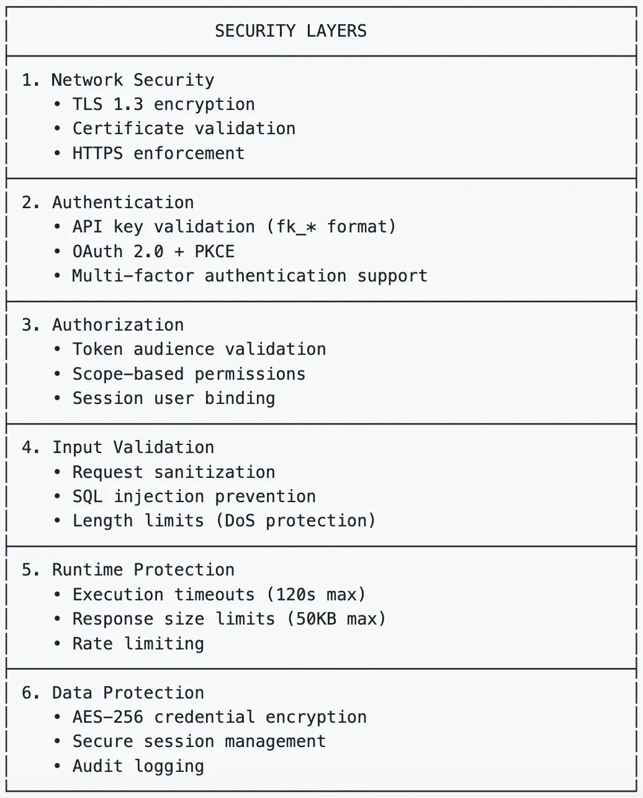

Forceweaver (conceptual) is an enterprise-grade MCP (Model Context Protocol) server designed to provide AI agents with secure health-checking tools for Salesforce Revenue Cloud. While MCP enables powerful integration between AI agents and external services, this capability introduces significant security risks. This document outlines how Forceweaver was built to address these threats using a dual-architecture design that protects intellectual property while ensuring enterprise-grade security.

The security implementation is based on the official MCP Security Best Practices specification and research from firms like Trail of Bits and Microsoft Defender for Cloud.

## The Dual-Architecture Solution

Forceweaver uses a dual-architecture strategy to separate the public-facing server from the private backend infrastructure. This design balances open integration with security and IP protection.



- **Public MCP Server**: A lightweight, open-source proxy server distributed via PyPI.
  - It handles all MCP protocol communication.
  - It contains no proprietary business logic or sensitive algorithms.
  - Its open-source nature allows for full security auditing.
- **Private Backend Infrastructure**: A secure core running on Heroku.
  - It contains all API management, proprietary algorithms, user management, and billing systems.
  - This protects core intellectual property by keeping it off the client server.
  - It allows for applying enterprise-grade security controls and monitoring.

## Secure Communication Flow

The system uses a three-tier communication model to ensure security at each step.



- **Tier 1: AI Agent to MCP Server** — Communication via JSON-RPC 2.0 over STDIO, ensuring low latency and no network dependencies.
- **Tier 2: MCP Server to Backend** — All HTTPS REST calls secured with TLS 1.3.
- **Tier 3: Backend to Salesforce** — OAuth 2.0 with PKCE, encrypted credentials (AES-256), and zero plaintext persistence.

## Security Implementation: Mitigating MCP Threats

Forceweaver implements a Defense-in-Depth security model to address all major threats identified in the MCP specification.



### Confused Deputy Attack Prevention

```python
# app/mcp_security_compliance.py snippet
def prevent_confused_deputy(self, client_id: str, redirect_uri: str, user_consent: bool = False) -> bool:
    """
    Prevent Confused Deputy attacks in OAuth flows
    """
    # Validate redirect URI against whitelist
    if not self.validate_redirect_uri(redirect_uri):
        return False

    # Require explicit user consent
    if not user_consent:
        logger.error(f"Confused Deputy prevention: missing user consent")
        return False

    return True
```

### Token Passthrough Prevention

```python
# app/mcp_security_compliance.py snippet
def validate_token_audience(self, token: str, expected_audience: str = "forceweaver-mcp") -> bool:
    """
    Validate that token was issued TO this MCP server
    """
    # Check Forceweaver token format
    if re.match(self.FORCEWEAVER_TOKEN_PATTERN, token):
        return True

    # Reject any other token formats
    logger.error("Token validation failed: invalid token format for MCP server")
    return False
```

### Session Hijacking Prevention

- User-bound sessions tied cryptographically to specific user IDs.
- Secure random generation, 1-hour expiry, auto-clear on termination.

### Input Validation & Sanitization

- Schema-based request validation.
- SQL/XSS prevention via strict sanitization.
- 1000-character input limits.
- Whitelisting check types like `bundle_analysis` and `sharing_model`.

## Core Features and Tools

- `revenue_cloud_health_check`
- `get_detailed_bundle_analysis`
- `list_available_orgs`
- `get_usage_summary`

## Integration and Configuration

### Installation

```bash
pip install forceweaver-mcp-server
```

### VS Code + GitHub Copilot

```json
{
  "servers": {
    "forceweaver": {
      "type": "stdio",
      "command": "python3",
      "args": ["-m", "src"],
      "env": {
        "FORCEWEAVER_API_URL": "https://mcp.forceweaver.com",
        "FORCEWEAVER_API_KEY": "YOUR_API_KEY_HERE",
        "SALESFORCE_ORG_ID": "ORG_ID_HERE"
      }
    }
  }
}
```

### Claude Desktop

```json
{
  "mcpServers": {
    "forceweaver": {
      "command": "python3",
      "args": ["-m", "src"],
      "env": {
        "FORCEWEAVER_API_URL": "https://mcp.forceweaver.com"
      }
    }
  }
}
```

## Conclusion

The Model Context Protocol requires rigorous security design. The Forceweaver implementation shows that a dual-architecture model can provide a secure, scalable, and commercially viable MCP server.

- Security must be part of initial design — not retrofitted.
- Open-source clients build trust; private backends protect IP.
- Continuous monitoring is mandatory for production environments.

For full documentation, visit **https://mcp.forceweaver.com/docs**.

**GitHub Repository**: https://github.com/arohitu/forceweaver-mcp-server

**References:**
- https://modelcontextprotocol.io/quickstart/server
- https://code.visualstudio.com/docs/copilot/chat/mcp-servers
- https://modelcontextprotocol.io/specification/2025-06-18/architecture
