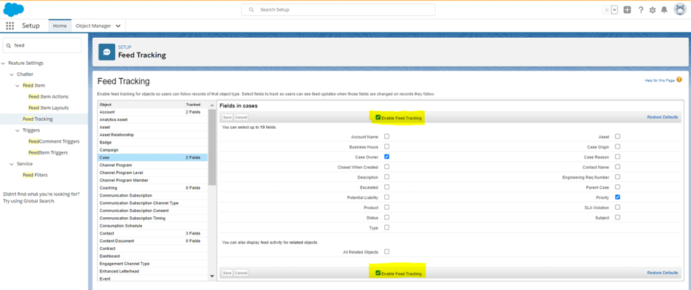
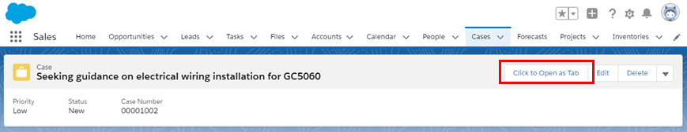
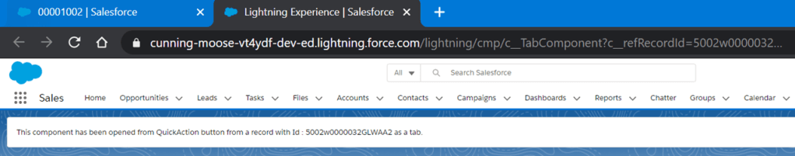

Most of us might have opened a lightning component from a quick action button by embedding the component in the quick action. Its a nice feature that helped us to pop up UI elements from a record page. However the component was appearing in a modal. In this blog, lets try and see how we can manage to show the component in a new tab.

#### **Text Book Lessons**

We would be using a quick action from case object. The reason I've chosen case object is because, few objects viz., case, user profiles and work order objects, if feed tracking is enabled, quick actions appear as chatter tab. So the first task is to disable the feed tracking on case object.





The next theory that we try to understand is regarding the [isUrlAddressable](https://developer.salesforce.com/docs/component-library/bundle/lightning:isUrlAddressable/documentation) component. This helps you to enables you to generate a user-friendly URL for a Lightning component with the pattern `/cmp/componentName` instead of the base-64 encoded URL you get with the deprecated `force:navigateToComponent` event. If you’re currently using the force:navigateToComponent event, you can provide backward compatibility for bookmarked links by redirecting requests to a component that uses lightning:isUrlAddressable.

Finally we need to understand [lightning:navigation](https://developer.salesforce.com/docs/component-library/bundle/lightning:navigation/documentation). This component helps to navigate to a given pageReference or to generate a URL from a pageReference.

#### The solution

Lets look at how this works. We create a Lightning Component (LC) that uses the lightning:navigation command to create a url from the pageReference variable. The pageReference variable defined on the controller will hold the name of the LC that needs to be opened in a new tab and also any parameters that we need to append to the URL (usually record Id). We need to use pageReference Type as 'Lightning Component'.

_QuickActionComponent.cmp_

```xml
<!-- Component used on the Quick Action -->
<aura:component implements="force:lightningQuickAction, force:hasRecordId" >
    <lightning:navigation aura:id="navService"/>
    <aura:attribute name="pageReference" type="Object"/>
	<aura:handler name="init" action="{!c.navigateToLC}" value="{!this}" />
    Record Id:::: {!v.recordId}
</aura:component>
```

_QuickActionComponent_.js

```jscript
({
    navigateToLC : function(component, event, helper) {
        var pageReference = {
            type: 'standard__component',
            attributes: {
                componentName: 'c__TabComponent'
            },
            state: {
                c__refRecordId: component.get("v.recordId")
            }
        };
        component.set("v.pageReference", pageReference);
        const navService = component.find('navService');
        const pageRef = component.get('v.pageReference');
        const handleUrl = (url) => {
            window.open(url);
        };
        const handleError = (error) => {
            console.log(error);
        };
        navService.generateUrl(pageRef).then(handleUrl, handleError);
    } 
})
```

_TabComponent.cmp_

```xml
<!-- Component that is opened in a new tab.-->
<aura:component implements="lightning:isUrlAddressable">
    <aura:attribute name="refRecordId" type="String" />
    <aura:handler name="init" value="{!this}" action="{!c.init}" />
    
    <div class="slds-box slds-theme_default">
        <p>This component has been opened from QuickAction button from a record with Id : {!v.refRecordId} as a tab.</p>
    </div>
    
</aura:component>
```

_TabComponent._js

```jscript
({
	init : function(component, event, helper) {
		var pageReference = component.get("v.pageReference");
        component.set("v.refRecordId", pageReference.state.c__refRecordId);
	}
})
```

All set. Lets click on the quick action. You can see the lightning component opened in a new tab, the url has parameter of the case record Id and its displayed on the component.


