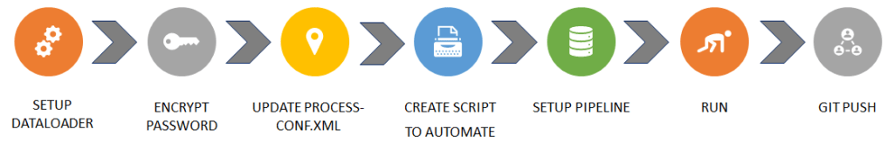
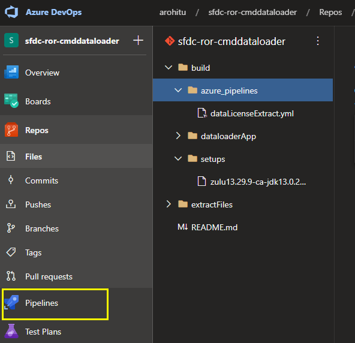
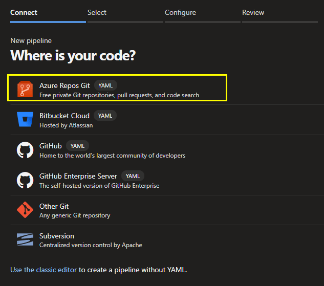
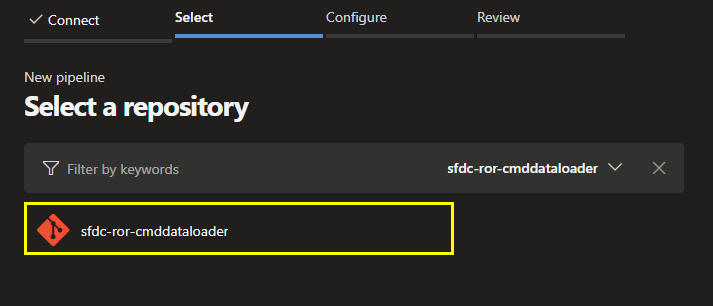
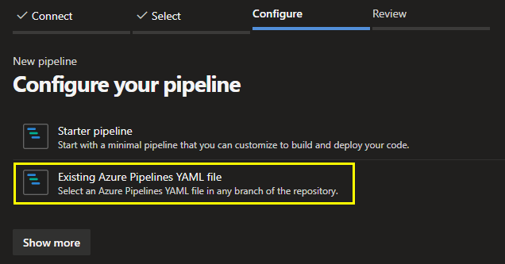
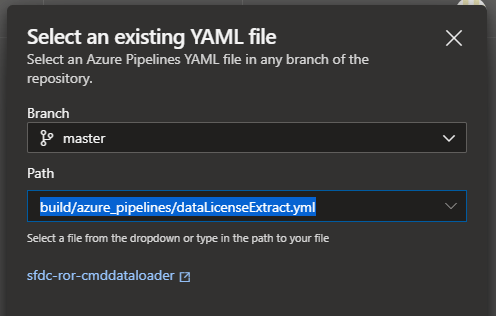
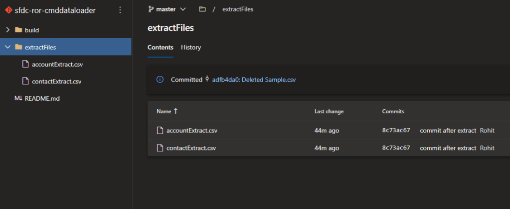

Data export has been a hot topic ever since the inception of salesforce and there are a lot of tools that help you to automate this task. There are tools available to automate the process as well. Probably these tools all generate either on a local drive or even might be cloud servers. How about the data extract that could be available on your repo! Yes, you heard it right. Its possible. It has been possible since long but then after Azure DevOps (ADO) pipelines popular in the market this has become much easier to implement. The same setup that I’ll be explaining could be modified a bit to run it from Docker or Jenkins as well. However, lets focus our discussion on setting up this task on ADO.

#### Process Flow



#### Setup Dataloader

The dataloader comes with its Command Line part of it. Command Line dataloader is the way by which one could run the dataloader via the command line. This way it used a process-conf.xml file that holds the task details to be performed. Install the latest version of dataloader from your salesforce org and the zulu OpenJDK. Salesforce Dataloader uses this JDK library and the path variable must be set for this in your machine to run and test it locally. For the ADO setup, I’ll explain further down as how we could install this JDK when we run the job.

Encrypt your password using the encrypt.bat file as outlined in the official documentation. Also, setup the process-conf.xml file in the samples folder. In this example, I’ve used two beans (that’s how its is called in the command line dataloader), one for Account extract and another for Contact extract.

#### Create YML Script

Now its time to create the YML file. This file is for the ADO job to pickup and do the actions as we have mentioned in it. Create an empty yml file and add the below code and save it.

```
# Starter pipeline
# Start with a minimal pipeline that you can customize to build and deploy your code.
# Add steps that build, run tests, deploy, and more:
# https://aka.ms/yaml
trigger: none
pool:
  vmImage: 'windows-latest'
  
steps:
- task: JavaToolInstaller@0
  inputs:
    versionSpec: '11'
    jdkArchitectureOption: 'x86'
    jdkSourceOption: 'LocalDirectory'
    jdkFile: 'build/setups/zulu13.29.9-ca-jdk13.0.2-win_x64.zip'
    jdkDestinationDirectory: '/builds/binaries/externals'
    cleanDestinationDirectory: true
- script: |
    mkdir extractFiles
    cd build/dataLoaderApp/bin
    echo ******Starting Customer Extract.....*******
    echo -----------------------------------
    echo Extracting Account...
    echo -----------------------------------
    call process.bat "D:/a/1/s/build/dataLoaderApp/samples/conf" "accountExtract"
    echo --------------------------------------------------------
    echo Account extraction completed successfully!
    echo -------------------------------------------------------- 
  displayName: 'Account Extract'
- script: |
    cd build/dataLoaderApp/bin
    
    echo ------------------------
    echo Extracting Contact...
    echo ------------------------
    call process.bat "D:/a/1/s/build/dataLoaderApp/samples/conf" "contactExtract"
    echo ----------------------------------------------
    echo Contact  extraction completed successfully!
    echo ---------------------------------------------- 
  displayName: 'Contact Extract'
- script: |
    echo ***All Extract Successfull!!!***
    echo ***Starting copying from VM to Repo****
    git config --local user.email "youremail@email.com
    git config --local user.name "Rohit"
    git config --local http.extraheader "AUTHORIZATION: bearer $(System.AccessToken)"
    git add extractFiles/\*.csv
    git commit -m "commit after extract"
    git remote rm origin
    git remote add origin <Repo URL>
    # Replace the username with password in the url in the format https://<password>@dev.azure.com/..../../.../
    git push -u origin HEAD:master
  displayName: 'Push to Repo'
```

#### Setup ADO Pipeline

Now its time to move on to git and setup the pipeline. Limiting to the scope of this blog, am not going into details of ADO and pipelines, lets focus on the dataloader automation part. ADO can work with any git repo and in this tutorial, we’ll use azure repo itself.

There is a free version of Azure that you could sign up for and in this tutorial, I’ll use my personal azure instance.

Get yours by visiting [here](https://dev.azure.com/). Choose Sign up, create an account. After that login to your azure and follow the below steps:

1. Create a new repo.
2. Initialize the repo with readme file
3. Clone the repo to your local.
4. Merge the below files/folder.
    
    1. YML file
    
    1. Dataloader folder
    
    1. Zulu OpenJDK zip.
5. Commit the changes.
6. Push to Remote.

Now you have the required files on your branch/repo and its time to create a pipeline job. Choose the pipeline account and click on pipeline.



Follow the below steps:

- Choose New Pipeline.
- Choose ‘Azure Repos Git’



- Select your repo.



- Choose existing pipelines YAML file.



- Enter YML file path



- Choose Continue at the bottom
- At his point you can preview the YML file. C
- Choose Save.
- Click on Run Pipeline to run the job.

You can see the job status on choosing the job. Once the job ran successfully, you can see the extracted files in the extractFiles folder on the repo.



#### Conclusion

You saw how the files got extracted and was committed to the repo. An ADO job assigns an agent that you specify in the yml and runs the scripts/tasks on that vm environment. In this example we have used the vm image as windows. This is because command line dataloader works only on a windows environment. This job was manually run and for you to schedule it, for e.g., to run first of every month, you need to add triggers with a CRON expression. I will have this covered in the upcoming video.

```
schedules:
- cron: "0 10 1 * *"
  displayName: First of Month 10AM Build
  branches:
    include:
    - master

```

Cheers.

https://youtu.be/7IF0afApQoI

#GiveBack
