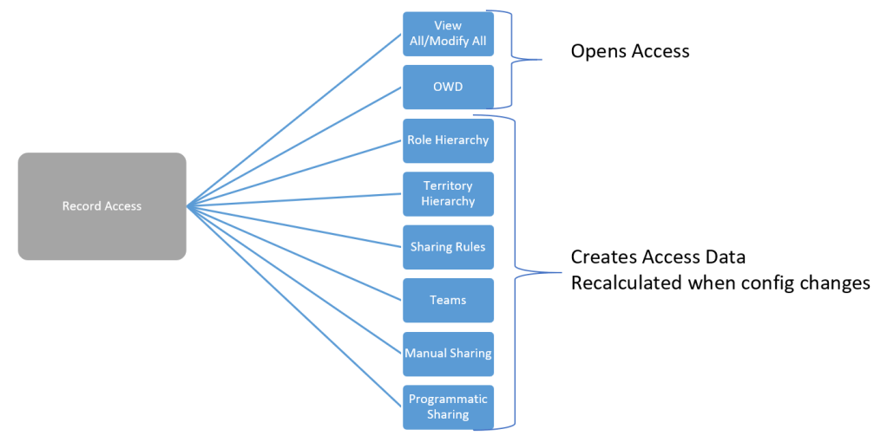
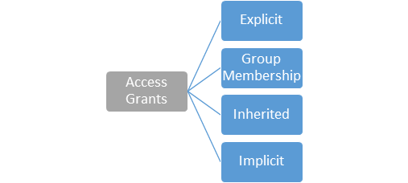
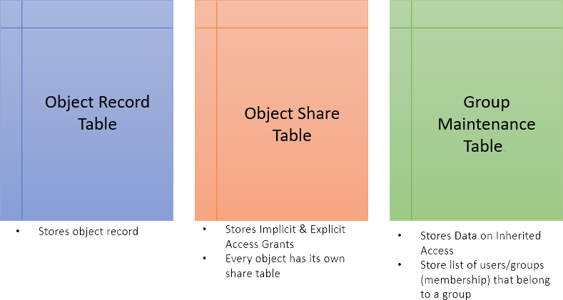
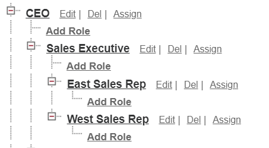
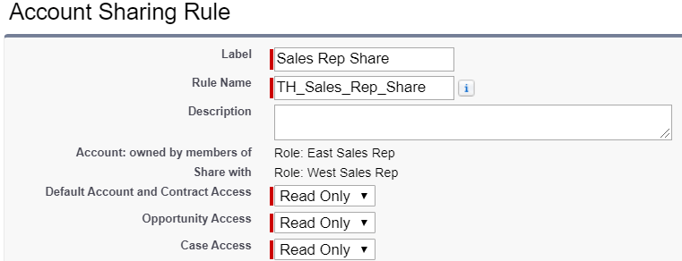
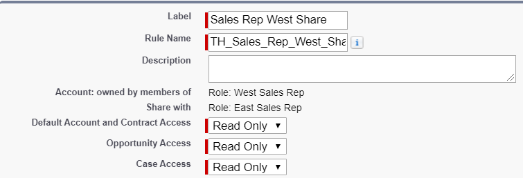

Salesforce database is a topic that is not much discussed between the trailblazers. The reason for this could be that salesforce being a SaaS application, will maintain the database on its own and nobody really bothered to go in detail to understand how the data is stored and how access to that data is controlled. In this guide, you will understand the details of the Database Architecture a little bit in depth to understand where the data is stored and how the data access is provided.

Data Storage is quite easy to understand as salesforce uses Object record table to store the data. However the data access is maintained through a complex multi table setup which we will see as outlined below.

Data Access in salesforce falls into two categories:

- Object Access
- Record Level Access

Object Access includes the field level access and is controlled using Profiles and Permission sets. Restricting or Opening Up access to an object is controlled using the CRUD, View All & Modify All permissions.

Record Level access determines which records of an object a user can see and uses the following tools.

#### Access Grants

When a user demands access to a record, Salesforce doesn’t look at the sharing rule/hierarchies to provide access in real time, rather it calculates record access data and store on group maintenance table whenever a configuration change occurs. This way it provides a quick scanning on these tables to retrieve access data to determine record access at runtime. Such scans happen every time a user tries to access a record on UI, run a report, access list view or access record via API and this makes salesforce so powerful at its access grants. When an object Salesforce uses access grants to define how much access a user or group has to that object’s records. Each access grant gives a specific user or group access to a specific record. It also records the type of sharing tool — sharing rule, team, etc. — used to provide that access. Salesforce uses four types of access grants:

**Explicit Grants:** Used when records are directly shared to a group or user. This can happen on the below scenarios.

- Owner of a record
- Sharing rule that shares a record to a public group, queue, role or a territory
- Assignment rule shares a record to a user or group.
- Territory assignment rule.
- Manual Sharing
- Account/Opportunity/Case Team
- Programmatic Sharing (\*Previously Apex Sharing)

**Group Membership Grants:** This type of grant is provided when a user becomes part of a public group, queue, role, or territory.

**Inherited Grants:** Used when a user inherits access through a role or territory hierarchy or is a member of a group that inherits access through a group hierarchy.

**Implicit Grants**: Referred as built-in sharing and is non-configurable type of grant. Users can view a parent account record if they have access to its child opportunity, case, or contact record and vice versa.

#### Database Architecture

Salesforce Stores **Access Grants** in the below three tables.

#### Group Maintenance Tables

This table store the data supporting group membership and inherited access grant. The below video will explain how a group maintenance table will be used to provide the required access.

In the video, the scenario being explained has the two roles East Sales Rep & West Sales Rep are at same hierarchy and using sharing rule the records have been shared to each other. This setup a group maintenance table with the group name and users. In this case groups would be system defined groups; which is for the roles.

With the above setup in place in the org, now lets take a look at the video.

https://youtu.be/EEscCmcg1DM
