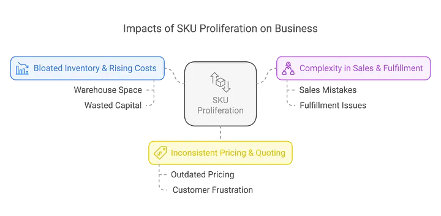
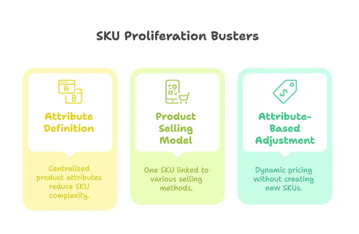

## The Hidden Chaos of SKU Proliferation

Meet Alex, a pricing manager at a fast-growing enterprise. His company sells mobile phones, laptops, and smart devices, each available in multiple configurations — different storage options, colors, and payment models (one-time purchase vs. subscription). What started as a simple, organized product catalog soon turned into an inventory nightmare.

Every slight variation meant a new Stock Keeping Unit (SKU). A single mobile phone now had dozens of SKUs just for different colors and storage capacities. Multiply that by every product in the catalog, and suddenly, inventory tracking, pricing, and quoting became a tangled mess. The fulfillment team was struggling with storage space, the finance team found it hard to forecast demand, and Alex? He was drowning in SKU spreadsheets, trying to keep everything in check.

Sound familiar? This is the reality of **SKU proliferation**, a challenge many businesses face. But what if there was a way to keep product flexibility without SKU chaos?

Enter **Salesforce Revenue Cloud’s Product Catalog Management (PCM).**

## The Problem: Why SKU Proliferation is a Business Killer

SKU proliferation happens when businesses introduce too many variations of their products — often without realizing its long-term impact. Here’s why it’s a silent killer for businesses:

### 1. Bloated Inventory & Rising Costs

The more SKUs you have, the more warehouse space you need. Overstocking slow-moving variants leads to wasted capital, while understocking popular items causes missed sales opportunities.

### 2. Complexity in Sales & Fulfillment

Imagine a sales rep trying to quote the right SKU for a customer. With hundreds of options, mistakes happen. Fulfillment teams also struggle — wrong picks, delayed shipments, and higher return rates become common.

### 3. Inconsistent Pricing & Quoting

Different teams use different tools. SKU-based pricing quickly becomes outdated, leading to misquotes, lost deals, and customer frustration.

Clearly, SKU proliferation isn’t just an inventory problem — it’s a business-wide challenge.

## The Solution: How Salesforce Revenue Cloud’s PCM Tames SKU Proliferation

**Salesforce Revenue Cloud’s Product Catalog Management (PCM)** is designed to eliminate SKU clutter while keeping products highly configurable. Let’s look at how it solves SKU proliferation using three key features: *Attributes, Product Selling Model, and Attribute-Based Adjustment.*

### Attributes: One Product, Many Configurations

Instead of creating a separate SKU for every variation, Revenue Cloud introduces Attributes, allowing businesses to define product attributes centrally.

For example, Alex’s company sells a mobile phone with attributes like storage (64GB, 128GB, 256GB), color (black, red, blue), and display size. Instead of creating a new SKU for every combination, Revenue Cloud allows the product to inherit attributes dynamically.

> **Even better?**
>
> * If this phone is sold in a bundle (e.g., Apple Phones bundle), its color can be auto-set to Red, without needing a separate SKU.
> * Customers can choose the variant they want at the time of purchase, reducing catalog complexity.

**No more SKU explosion. One product, infinite configurations.**

### Product Selling Model: One Product, Multiple Selling Methods

Traditionally, companies create separate SKUs for:

* One-time purchase
* Subscription-based (monthly, yearly, term-based)
* Evergreen (auto-renewal)

With the Product Selling Model, one product SKU can be linked to multiple selling models. At quote time, the sales team simply picks the selling model — without SKU duplication.

> **Real-life impact?**
>
> * A laptop can be sold as one-time or subscription-based without needing two separate SKUs.
> * A cloud software license can exist as a single product, even if sold with different billing models.

**No more SKU redundancy. One product, multiple selling models.**

### Attribute-Based Adjustment: Dynamic Pricing Without SKU Duplication

Another challenge with SKU proliferation is pricing complexity. Often, businesses create separate SKUs just to handle price variations based on attributes like storage, color, or contract terms. Salesforce Revenue Cloud solves this with Attribute-Based Adjustment.

> **How it works:**
>
> * Businesses can mark attributes as price-impacting.
> * Instead of creating multiple SKUs with different price points, the system calculates price adjustments dynamically at runtime.
> * Sales reps can configure the product and see the adjusted price instantly during quoting.

**No more SKU-based price lists. One product, flexible pricing.**

## The Result: SKU Efficiency Without Losing Sales Flexibility

After implementing Salesforce Revenue Cloud PCM, Alex’s company saw major improvements:

* **50% reduction in SKU count** — cleaner, more manageable catalogs.
* **30% decrease in inventory costs** — less storage, less waste.
* **Faster quoting** — sales teams could configure deals in seconds instead of hours.
* **Better forecasting** — real-time visibility into product demand.

By leveraging Attributes, Product Selling Models, and Attribute-Based Adjustments, businesses can keep product catalogs simple while maintaining all the flexibility customers expect.

## Conclusion: Smart Product Management for Scalable Growth

SKU proliferation isn’t just a technical issue — it’s a business-wide challenge impacting sales, operations, and finance. But with Salesforce Revenue Cloud’s Product Catalog Management, companies can finally strike a balance: offering variety while keeping operations streamlined.

What’s your experience with SKU proliferation? Let’s discuss how businesses can move towards smart product catalog management!

[Learn more about Salesforce Revenue Lifecycle Management](https://www.salesforce.com/uk/sales/revenue-lifecycle-management/)