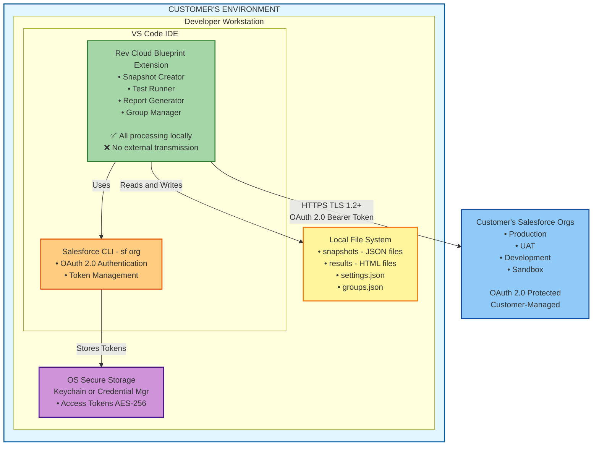
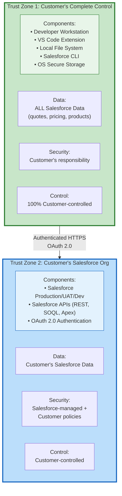
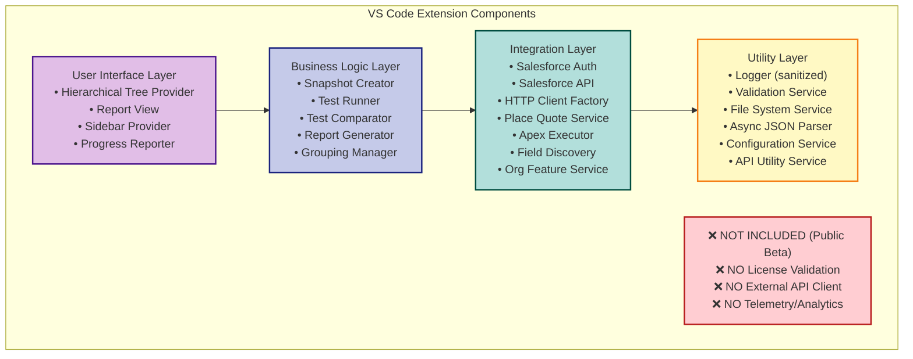
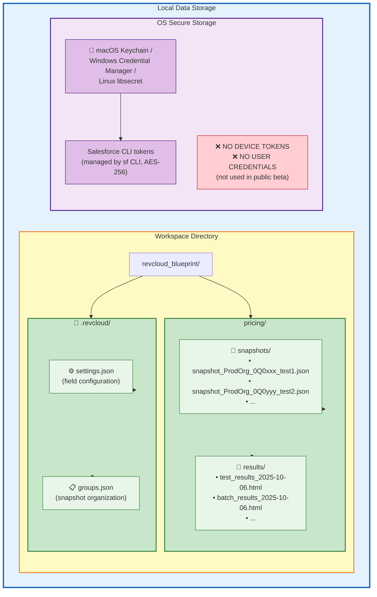
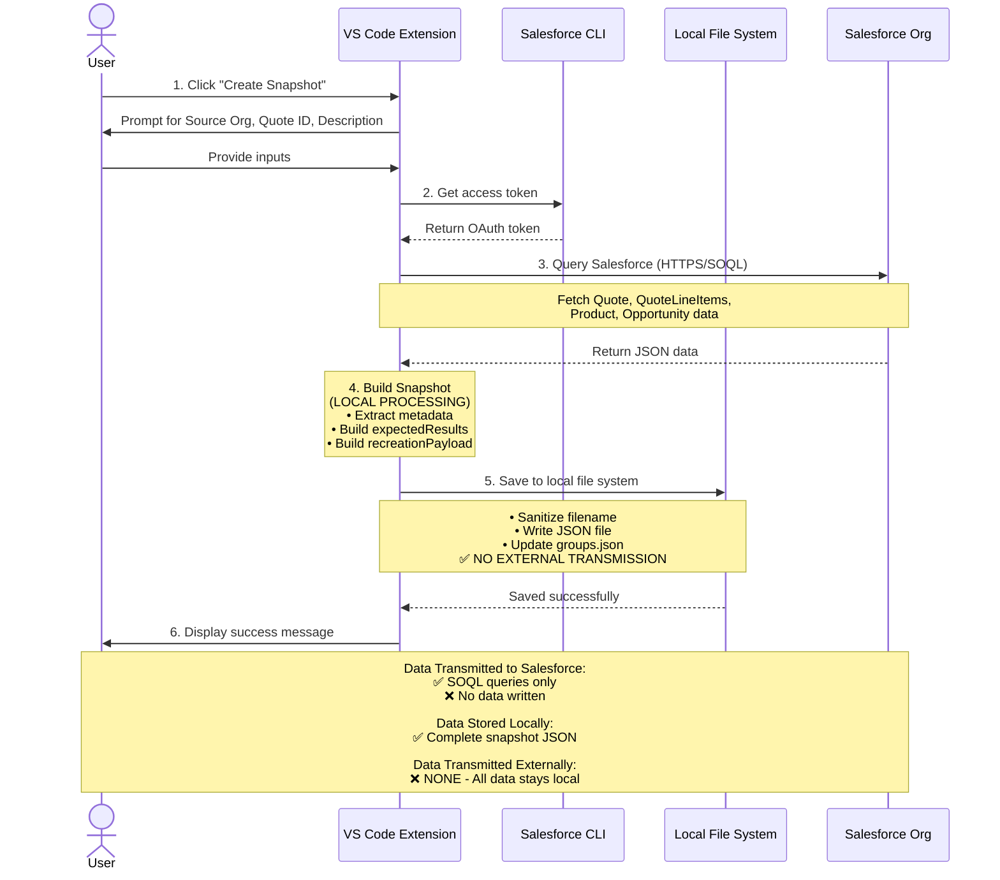
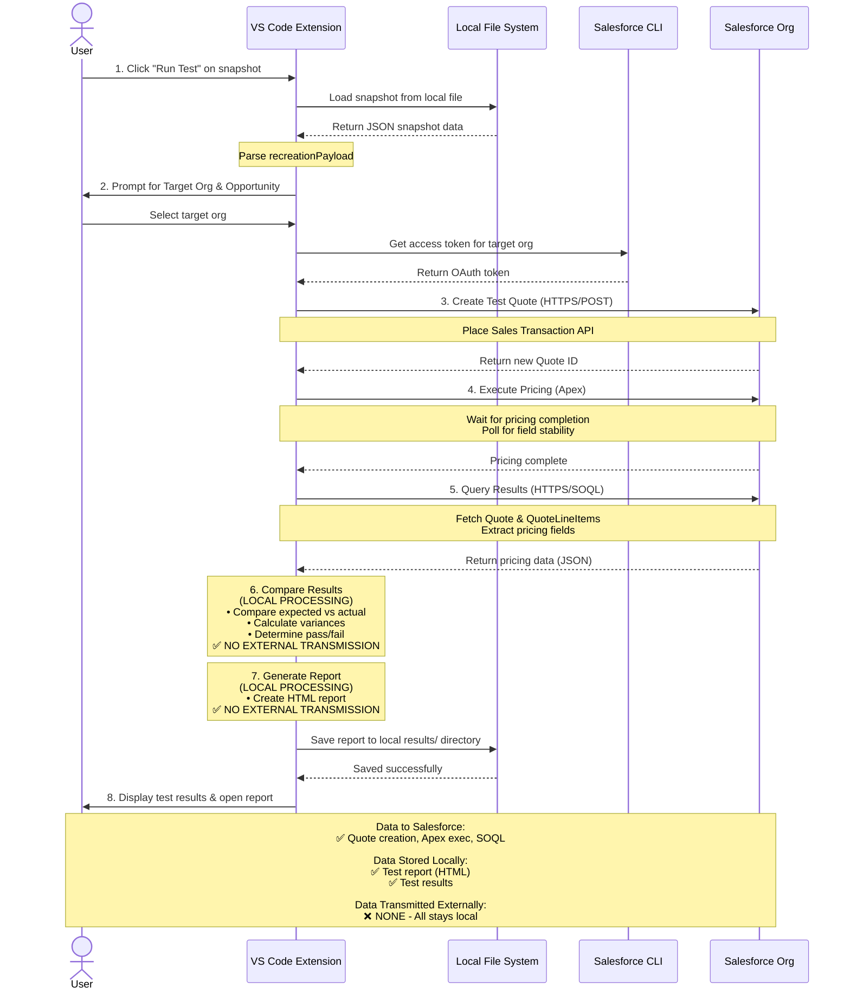
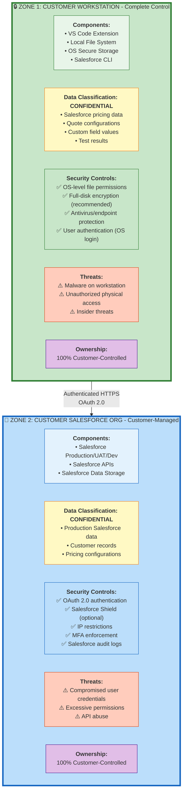
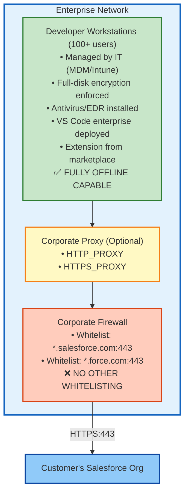
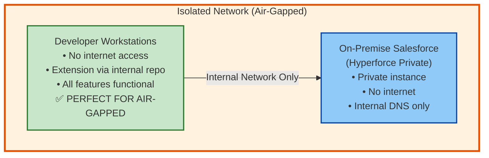

# Network Architecture & Data Flow Diagram

**Rev Cloud Blueprint Extension - Public Beta**

**Version:** 1.0 (Public Beta)  
**Date:** October 6, 2025  
**Purpose:** Security review and enterprise deployment planning

---

## Table of Contents

1. [Overview](#1-overview)
2. [High-Level Architecture](#2-high-level-architecture)
3. [Detailed Component Diagram](#3-detailed-component-diagram)
4. [Data Flow Diagrams](#4-data-flow-diagrams)
5. [Network Communication Matrix](#5-network-communication-matrix)
6. [Security Zones](#6-security-zones)
7. [Deployment Scenarios](#7-deployment-scenarios)

---

## 1. Overview

### 1.1 Architecture Principles

Rev Cloud Blueprint follows a **fully local, offline-first, privacy-by-design** architecture:

- ✅ **Fully Local Processing**: All Salesforce data processed on user's workstation
- ✅ **Direct Connections**: Extension communicates only with customer's Salesforce org
- ✅ **No Cloud Dependencies**: No external servers, APIs, or cloud services
- ✅ **Zero Data Exfiltration**: Salesforce data never transmitted to external servers
- ✅ **Complete User Control**: Customer maintains absolute control over their data

### 1.2 Public Beta Status

**Current Phase:** Public Beta (All Features Free)

- ✅ No user registration or authentication
- ✅ No license validation or device tokens
- ✅ No external API calls (except to customer's Salesforce org)
- ✅ No analytics or telemetry  
- ✅ **100% Offline Capable** (after Salesforce authentication)

### 1.3 Key Components

| Component | Location | Purpose | Data Handled |
|-----------|----------|---------|--------------|
| **VS Code Extension** | User's Workstation | Core testing functionality | Salesforce Data (local) |
| **Salesforce CLI** | User's Workstation | Authentication provider | Access Tokens |
| **Local File System** | User's Workstation | Snapshot storage | Salesforce Data (local) |
| **OS Secure Storage** | User's Workstation | Token storage | Access Tokens (encrypted) |
| **Salesforce Org** | Customer's Cloud | Data source/target | Salesforce Data |

**No External Components** - No license servers, analytics servers, or cloud storage

---

## 2. High-Level Architecture

### 2.1 System Context Diagram



**Key Points:**
- ✅ **NO EXTERNAL SERVERS OR APIs** (Fully Local, Offline-First)
- ✅ All customer data remains within customer's environment
- ✅ Only connection is to customer's own Salesforce org

### 2.2 Trust Boundaries



**Key Points:**
- ✅ **NO EXTERNAL TRUST ZONES** (No third-party services)
- ✅ Both zones are 100% customer-controlled
- ✅ Single authenticated connection between zones

---

## 3. Detailed Component Diagram

### 3.1 Extension Internal Architecture



### 3.2 Data Storage Architecture



**Storage Locations:**
- **Local Files**: All snapshots, reports, and configuration stored in user's workspace directory
- **Secure Storage**: Salesforce access tokens stored in OS-level encrypted storage (Keychain/Credential Manager)
- **NOT Stored**: No device tokens, user credentials, or license data (public beta)

---

## 4. Data Flow Diagrams

### 4.1 Snapshot Creation Flow



### 4.2 Test Execution Flow



---

## 5. Network Communication Matrix

### 5.1 Outbound Connections

| Source | Destination | Protocol | Port | Purpose | Data Transmitted | Frequency |
|--------|-------------|----------|------|---------|------------------|-----------|
| **Extension** | Customer's Salesforce Org | HTTPS | 443 | Query data, create quotes | SOQL queries, API requests | On-demand |

### 5.2 Inbound Connections

| Destination | Source | Protocol | Port | Purpose |
|-------------|--------|----------|------|---------|
| **Extension** | None | N/A | N/A | No inbound connections |

### 5.3 NO External Communications

**What's NOT in use (Public Beta):**

| Service | Status | Notes |
|---------|--------|-------|
| **License API** | ❌ Not Used | No license validation in public beta |
| **Analytics API** | ❌ Not Used | No telemetry or usage tracking |
| **Update Server** | ❌ Not Used | VS Code Marketplace handles updates |
| **CDN** | ❌ Not Used | No external resources |
| **Cloud Storage** | ❌ Not Used | All data stored locally |

---

## 6. Security Zones

### 6.1 Zone Classification



**Key Security Points:**
- ✅ **NO EXTERNAL SECURITY ZONES** (No third-party services or vendors)
- ✅ Both zones are 100% customer-controlled
- ✅ All data remains within customer's infrastructure
- ✅ Single authenticated connection between zones (HTTPS/OAuth 2.0)

---

## 7. Deployment Scenarios

### 7.1 Standard Enterprise Deployment



### 7.2 Air-Gapped Environment



**Public Beta Advantage for Air-Gapped:**
- ✅ No license validation required (no internet needed)
- ✅ No external dependencies
- ✅ All features available offline
- ✅ Perfect for high-security environments

---

## 8. Firewall Configuration

### 8.1 Required Firewall Rules

**Outbound Rules:**
```
# Salesforce API access (required)
ALLOW tcp/443 to *.salesforce.com
ALLOW tcp/443 to *.force.com

# NO OTHER RULES NEEDED
# (No license servers, analytics, or external services)
```

**Inbound Rules:**
```
# No inbound connections required
DENY all inbound connections
```

### 8.2 Comparison: Public Beta vs Future Licensed

| Firewall Rule | Public Beta | Future Licensed |
|---------------|-------------|-----------------|
| **Salesforce (*.salesforce.com:443)** | ✅ Required | ✅ Required |
| **License API (sfapp.forceweaver.com:443)** | ❌ Not Needed | ✅ Optional (for Pro/Enterprise) |
| **Total Outbound Rules** | 1 | 2 (1 optional) |

---

## 9. Monitoring & Logging

### 9.1 Local Logging Only

**Log Destinations:**
- VS Code Output Channel (local only)
- No external log aggregation
- No persistent log files

**What's Logged:**
- API request/response status codes
- Test execution progress
- Error messages (sanitized)

**What's NOT Logged:**
- Access tokens
- Salesforce data
- User information

### 9.2 No External Monitoring

**NOT in Use (Public Beta):**
- ❌ External log aggregation
- ❌ Application performance monitoring (APM)
- ❌ Error tracking services
- ❌ Analytics platforms
- ❌ Telemetry services

---

## 10. Summary: Maximum Security Through Simplicity

### 10.1 Security Benefits of Public Beta Architecture

**Advantages:**

1. **Zero External Attack Surface**
   - No servers to hack
   - No databases to breach
   - No APIs to exploit
   - No cloud infrastructure to compromise

2. **Complete Data Control**
   - Customer owns 100% of data
   - No third-party data sharing
   - No data exfiltration possible
   - No regulatory complexity

3. **Simplified Compliance**
   - No GDPR obligations (no personal data)
   - No SOC 2 requirements (no cloud services)
   - No vendor risk assessments
   - No sub-processor agreements

4. **Perfect for Regulated Industries**
   - Banking/Finance (PCI DSS compatible)
   - Healthcare (HIPAA compatible)
   - Government (air-gapped capable)
   - Defense (no external dependencies)

### 10.2 Network Footprint Comparison

| Aspect | Public Beta | Typical SaaS Tool |
|--------|-------------|-------------------|
| **External Servers** | 0 | 5-10+ |
| **Third-Party Services** | 0 | 3-7 |
| **Outbound Connections** | 1 (Salesforce only) | 10-20+ |
| **Data Exfiltration Risk** | ❌ Zero | ⚠️  High |
| **Vendor Dependencies** | 0 | 5-10 |
| **Firewall Rules** | 1 | 10-20+ |

---

## 11. Contact Information

**Security Inquiries:**
- Email: arohitu@gmail.com
- Subject: [SECURITY] Rev Cloud Blueprint

**Architecture Questions:**
- Email: arohitu@gmail.com
- Subject: [ARCHITECTURE] Rev Cloud Blueprint

**General Support:**
- Bug Reports: https://form.jotform.com/252443148591055
- GitHub: https://github.com/arohitu/revcloud-blueprint-extension

---

## 12. Document Control

| Version | Date | Author | Changes |
|---------|------|--------|---------|
| 1.0 | October 6, 2025 | Forceweaver Architecture Team | Initial release (Public Beta version) |

**Classification**: Public  
**Distribution**: Unrestricted  
**Next Review**: When monetization is implemented (estimated Q1 2026)

---

**© 2025 Forceweaver. All rights reserved.**

This document reflects the public beta architecture with zero external dependencies. When monetization is implemented, an updated version will be provided showing optional license validation API (Salesforce data will continue to remain local).
