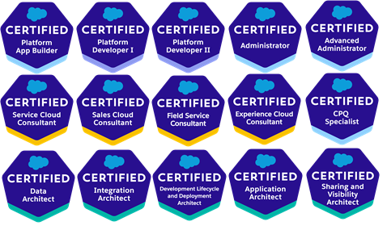

Certified Application Architect | Lightning Champion | e-Racer | Blogger

Salesforce Enthusiast & an aspiring CTA with over 10 years of experience working with customers in Oil & Gas, Utility, Finance and Insurance sectors. Excellent leadership and team management skills with experience in Application Design & Development using Salesforce.com.  
Proven mentor and team builder who is able to architect solutions for complex client requirements, manage end to end implementations and deliver results.

###### What I Do

**Salesforce Devotee**

**Gaming Ninja**

**IoT Geek**

**Formula 1 Addict**

##### My Encounters

**Tech Arch Delivery Specialist at Accenture** (2015 - )  
Manage technical delivery of custom development, integrations, and data migration elements.  
Define coding standards, lead code reviews to ensure quality and appropriate design patterns are followed. Prepare Architect structure and design documentation for the applications.

**IT Analyst at Tata Consultancy Services** (2011 - 2015)  
Analysis of Requirements and find out implementation techniques. Prepared High-Level Requirement Document with Use Cases. Development of Apex Classes, Triggers, Visualforce pages, Workflow Rules & Visual Workflows.

