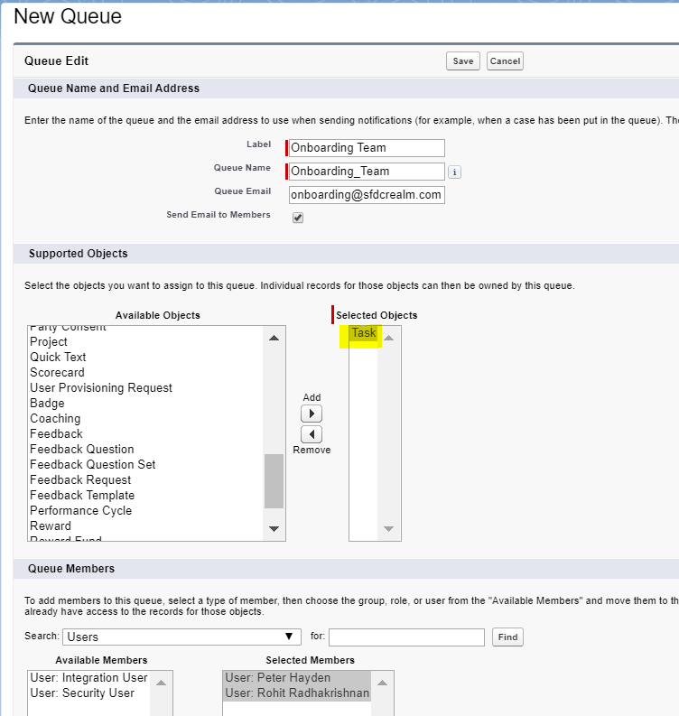
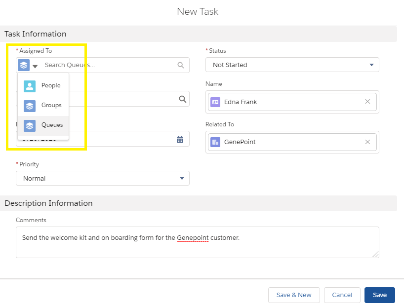
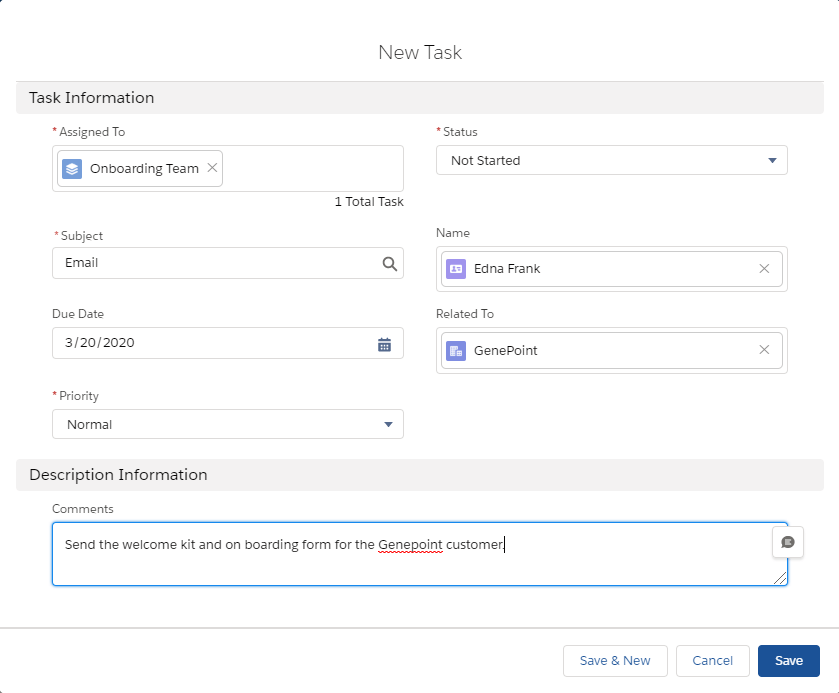
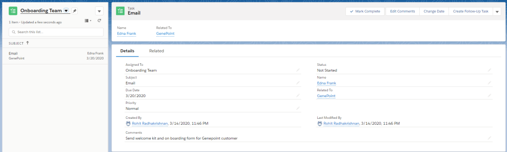
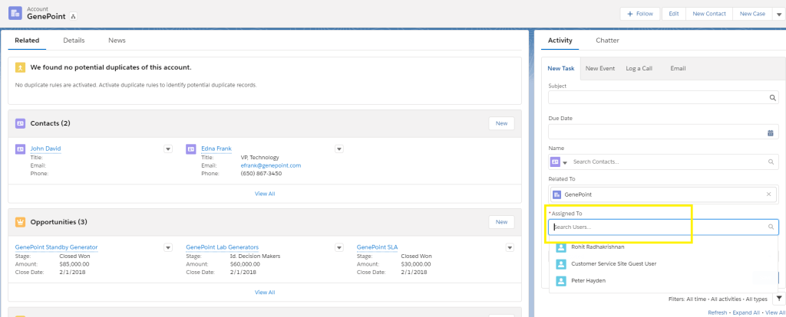

During my salesforce journey, I’ve come across multiple scenarios where customer provides a way of open work culture within a team and with salesforce it was always easy with the use of queues. For e.g., A Case record when assigned to a queue can bring in an entire team’s attention and can manage efficiently. I once got a requirement of having a task to be assigned to a queue. Background is that the task was created whenever a new customer was onboarded, and the service team wanted to send out an email on welcome/onboarding formalities. The task was assigned to a specific person and it resulted in missed tasks when the task assignee was unavailable for some reason.

#### What is New?

Starting Spring ’20, salesforce now allows a user to share their workload by setting up queues for tasks. Users can assign tasks to a queue, and then individuals in the queue can take ownership of those tasks from a list view.

Let's see how we can setup a task that is assigned to queue with the below screenshots.

Step 1: Create a queue with Task as supported object. Add the required users to the queue.

Step 2: Create a new Task. From the image below, we can see the new options of assigned a task to a user/group/queue. This is also supported via APEX logic by which WhoId field is assigned with the Queue Id. For this demo, lets choose Queue and create the record as explained in the next image.

The below diagram shows how this could be viewed when logged in as a user in the queue from the tasks tab and the Onboarding team list view. Now it's up to the user if he wants to assign that to himself or another user (with required permission).

#### Limitation

However, this feature of assigned to a queue was not possible if a user tried to create a task via the Lightning page component. The option to choose between user/group/queue was not available from the sidebar as shown below. Hope salesforce will bring a fix to that or a workaround.

With this Spring '20 feature, a user can assign tasks to a queue, those tasks are available to members of the queue, which means everyone can contribute without waiting for work to be delegated or reassigned. More Productivity More Happy Customers.
